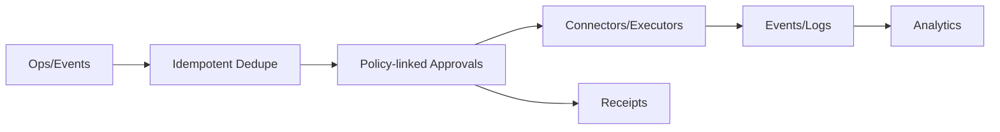

# Orchestration Service — Artifacts Pack

## Ops Plane Diagram

## Links
- Matrix: `marketing/research/matrix/crud.md`
- Battlecard: `marketing/battlecards/crud.md`
- Shortlist: `marketing/research/shortlists/crud.md`
- SERP log: `marketing/research/serp/crud.csv`

## Velocity & Pricing Notes (snapshot)
- iPaaS (Zapier/Make/Workato): tiered/usage; breadth-focused
- IGA (SailPoint/Entra): enterprise; governance-first
- ServiceNow: enterprise workflow; catalog/approvals

## Analyst/Market Notes
- Breadth vs depth: iPaaS breadth does not equal identity command-depth or policy coupling
- Reliability: idempotency + receipts differentiate vs per-step retry or trigger dedupe

## Proof Hooks
- Duplicate-event dedupe → resume with partials
- Approval path bound to policy → receipt contains policy snapshot
- Retry shows only remaining items; receipts link steps across ops
