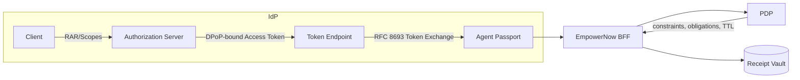

# IdP — Artifacts Pack

## Agent Passport Standards Flow

## Links
- Shortlist: `marketing/research/shortlists/idp.md`
- SERP log: `marketing/research/serp/idp.csv`
- Competitors: `marketing/research/competitors/idp/`

## Velocity & Pricing Notes (snapshot)
- Microsoft Entra ID: enterprise; Conditional Access ecosystem
- Curity Identity Server: enterprise; standards-forward (RAR/TE/DPoP)
- Auth0/Okta CIC: tiers; developer-friendly; extensibility

## Analyst/Market Notes
- Differentiator: Agent Passports add plan JWS + schema pins + receipts vs. vanilla OIDC
- Standards anchors: RFC 8693 (TE), RFC 9449 (DPoP), RFC 9396 (RAR), OIDC pairwise IDs

## Proof Hooks
- Token Exchange issuance → Agent Passport
- DPoP-bound token → PoP semantics on calls
- Pairwise IDs and RAR scopes → constrained, purpose-bound access
