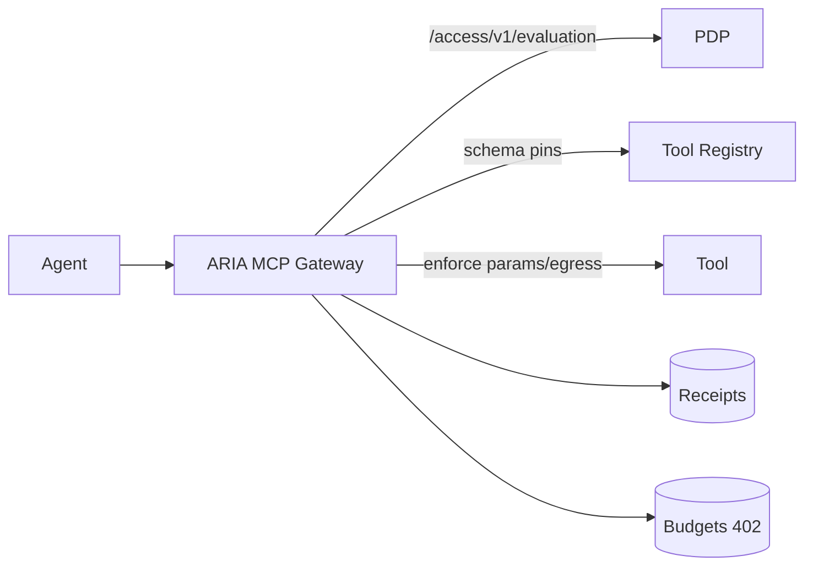

# ARIA MCP Gateway — Artifacts Pack

## Tool Boundary Enforcement Diagram

## Links
- Shortlist: `marketing/research/shortlists/mcp.md`
- SERP log: `marketing/research/serp/mcp.csv`
- Competitors: `marketing/research/competitors/mcp/`

## Velocity & Pricing Notes (snapshot)
- Cloudflare AI Gateway: usage; routing/observability/controls
- Portkey: tiers/usage; SDK + routing
- Helicone: OSS + tiers; observability-first

## Analyst/Market Notes
- Observability and routing are necessary but not sufficient for governance; pre-execution enforcement requires plan JWS, schema pins, budgets (402), and cryptographic receipts

## Proof Hooks
- Deny receipts on off-plan params/egress
- Budget exceed → 402 with deterministic UX
- Tool schema pins verified against registry with rollout window
