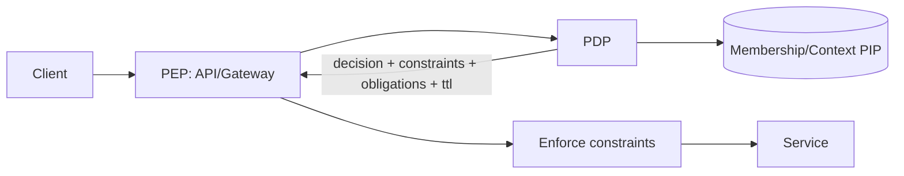

# PDP — Artifacts Pack

## Decision Flow (Mermaid)

## Links
- Matrix: `marketing/research/matrix/pdp.md`
- Battlecard: `marketing/battlecards/pdp.md`
- Shortlist: `marketing/research/shortlists/pdp.md`
- SERP log: `marketing/research/serp/pdp.csv`

## Velocity & Pricing Notes (snapshot)
- OPA: OSS; Styra DAS for managed
- Cerbos: OSS + commercial; hosted and enterprise
- Axiomatics: Commercial; enterprise PDP
- AWS AVP: Metered AWS service

## Analyst/Market Notes
- FGA vs ABAC/contracted PDP: graph stores (SpiceDB/Keto) excel at relationship checks; constraints/obligations require contract workarounds
- Managed PDPs lower ops but rarely expose standardized AuthZEN envelopes

## Proof Hooks
- AuthZEN contract payload (constraints, obligations, TTL)
- Conservative merge behavior (intersection/minimum)
- Decision receipts (hash chain) linked to enforcement
