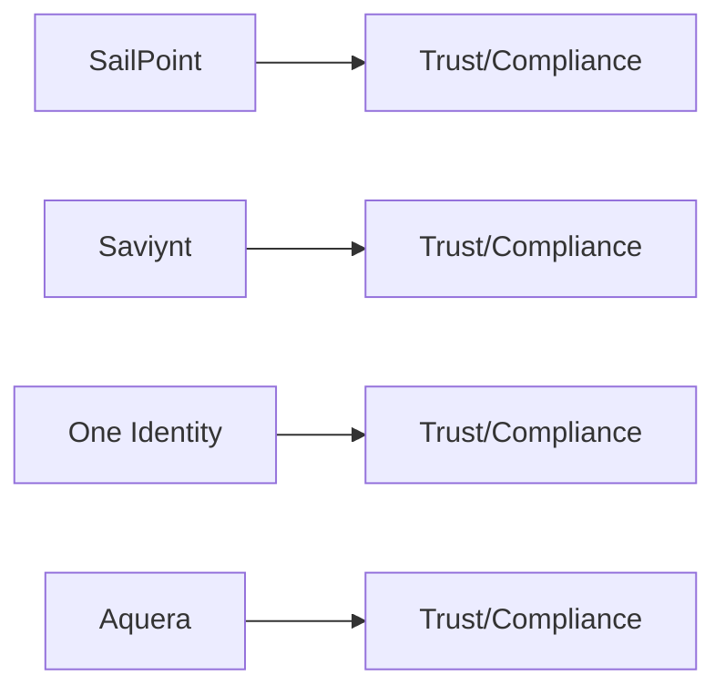

# Data Collector — Compliance Posture

## Overview

## Attestations and Trust Links (collect and verify)
- SailPoint:
  - Trust/Compliance center (SOC/ISO claims)
- Saviynt:
  - Security/Compliance resources
- One Identity:
  - Trust/Compliance resources
- Aquera:
  - Security/Compliance posture statements; SOC2/ISO claims (verify)

## Notes
- Scope: SOC 2 Type II, ISO 27001; confirm platform vs connectors and data handling.
- Evidence: preserve URLs, quote claims, record dates/report IDs.
- Mapping: collector pipelines may be self-hosted or SaaS; confirm where attestations apply.
