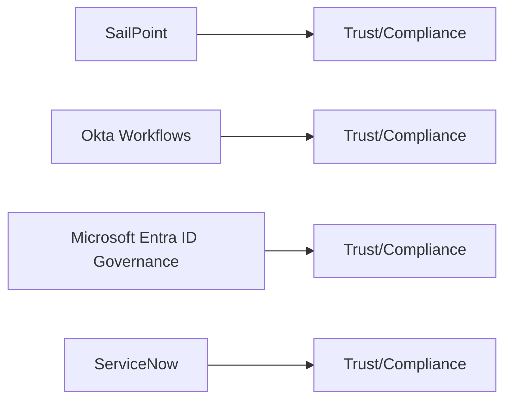

# CRUD Service — Compliance Posture

## Overview

## Attestations and Trust Links (collect and verify)
- SailPoint:
  - Trust Center / Compliance hub
- Okta Workflows (Okta):
  - Okta Trust Center: https://trust.okta.com/
- Microsoft Entra ID Governance (Microsoft):
  - Microsoft Trust Center: https://www.microsoft.com/trust-center
- ServiceNow:
  - ServiceNow Trust / Compliance: https://www.servicenow.com/company/trust.html

## Notes
- Scope: SOC 2 Type II, ISO 27001; confirm SaaS vs self-hosted implications and data residency.
- Evidence: preserve URLs, quote claims, record dates/report IDs.
- Mapping: identity ops reliability features are product-level; compliance claims typically apply to vendor platforms hosting the services.
