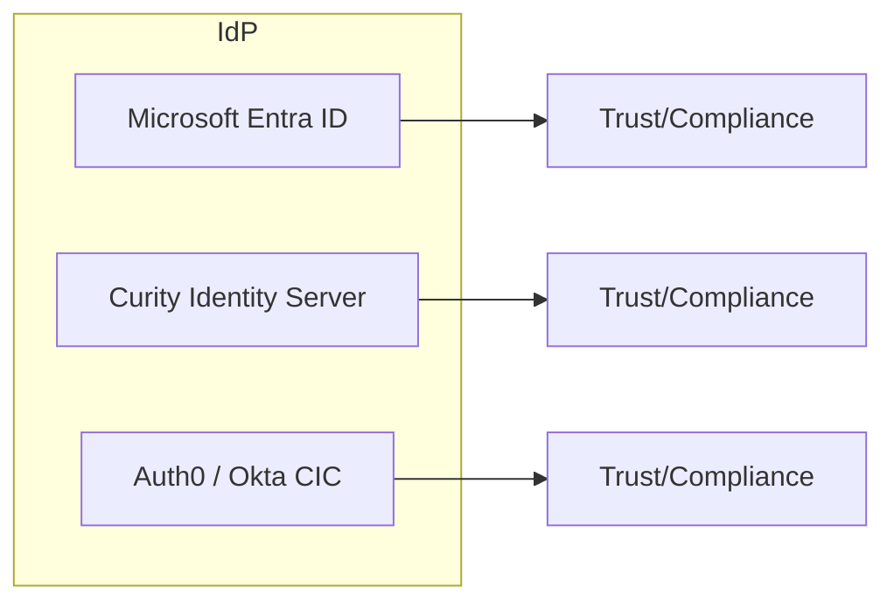

# IdP — Compliance Posture

## Overview

## Attestations and Trust Links (collect and verify)
- Microsoft Entra ID (Microsoft):
  - Trust Center: https://www.microsoft.com/trust-center
  - Compliance offerings (SOC/ISO): https://learn.microsoft.com/azure/compliance/
- Curity Identity Server:
  - Security/Compliance: https://curity.io (collect vendor statements / certifications)
- Auth0 / Okta Customer Identity Cloud:
  - Okta Trust Center: https://trust.okta.com/
  - Auth0 security: https://auth0.com/security

## Notes
- Scope: SOC 2 Type II, ISO 27001; product and platform applicability often differs—confirm per vendor.
- Evidence collection: preserve URLs, quote exact claims, record effective dates and report IDs.
- Mapping: track which certifications apply to the IdP control plane vs customer-managed deployments.
