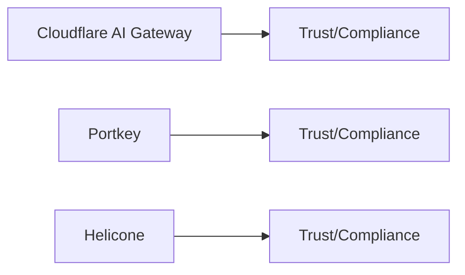

# ARIA MCP Gateway — Compliance Posture

## Overview

## Attestations and Trust Links (collect and verify)
- Cloudflare AI Gateway (Cloudflare):
  - Cloudflare Trust Hub / Compliance: https://www.cloudflare.com/trust-hub/
- Portkey:
  - Vendor security/compliance resources
- Helicone:
  - OSS + hosted; vendor security/compliance resources

## Notes
- Scope: SOC 2 Type II, ISO 27001; confirm applicability to gateway products and hosted plans.
- Evidence: preserve URLs, quote claims, record dates/report IDs.
- Mapping: observability/routing vs enforcement; attestations cover platform operations, not necessarily governance features.
