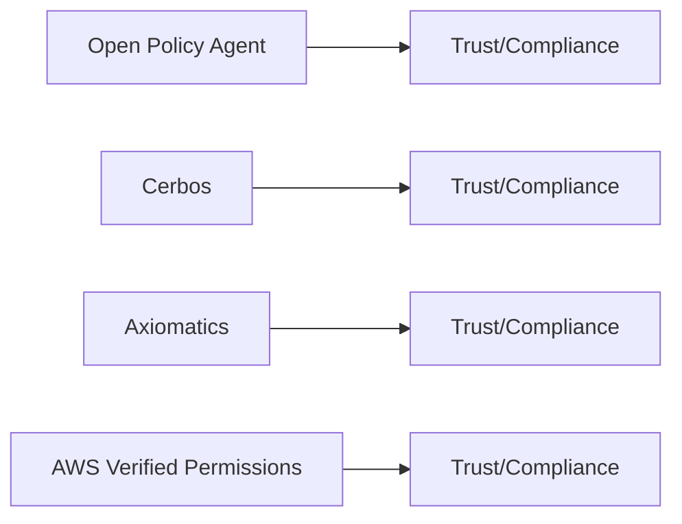

# PDP — Compliance Posture

## Overview

## Attestations and Trust Links (collect and verify)
- OPA (CNCF project):
  - CNCF Security/TOC statements and project governance
- Cerbos:
  - Vendor security/compliance page (collect SOC/ISO claims if available)
- Axiomatics:
  - Vendor trust/compliance resources
- AWS Verified Permissions (Cedar):
  - AWS Compliance Programs: https://aws.amazon.com/compliance/programs/
  - AVP docs: https://docs.aws.amazon.com/verified-permissions/

## Notes
- Scope: SOC 2 Type II, ISO 27001; platform vs self-hosted differences apply.
- Evidence collection: preserve URLs, quote exact claims, record effective dates and report IDs.
- Mapping: document whether certifications cover managed PDP (AVP) vs. customer deployments (OPA/Cerbos) and Axiomatics offerings.
