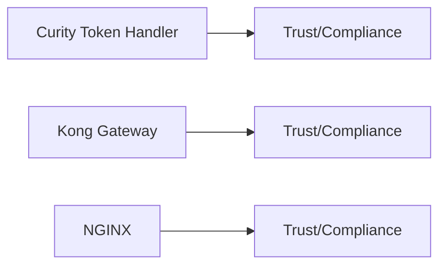

# ARIA Shield — Compliance Posture

## Overview

## Attestations and Trust Links (collect and verify)
- Curity:
  - Security/Compliance resources (collect statements/certifications)
- Kong:
  - Kong Security/Compliance resources
- NGINX (F5):
  - F5/NGINX Security/Compliance resources

## Notes
- Scope: SOC 2 Type II, ISO 27001; verify for gateway products and cloud offerings.
- Evidence: preserve URLs, quote claims, record dates/report IDs.
- Mapping: ARIA Shield is our product; these entries cover adjacent gateway vendors referenced in the Shield landscape.
