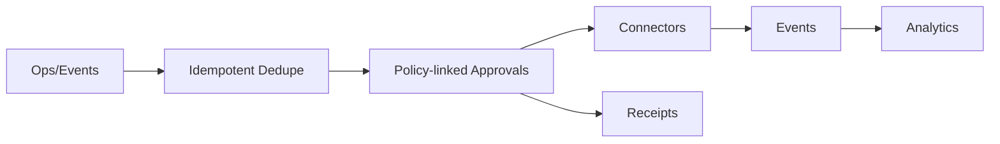

# CRUD Service — Head-to-Head Matrix (Identity Operations)

| Vendor                                | Idempotency                        | Approvals                              | Retries / SLOs                                   | Connectors (breadth)      | Eventing                 | Receipts / audit |
| ------------------------------------- | ---------------------------------- | -------------------------------------- | ------------------------------------------------ | ------------------------- | ------------------------ | --------------- |
| **CRUD Service (target)**             | **Yes** — event/corr IDs, partials | **Yes** — policy-linked multi-step     | **Yes** — per-step retry, compensation, metrics  | 40+ deep enterprise ops   | Kafka/webhooks/SSE       | **Yes**         |
| SailPoint Identity Security Cloud     | Connector-level                     | Yes — lifecycle approvals              | Connector-level                                   | Enterprise governance     | Platform events          | No (PDP chain)  |
| Okta Workflows                        | Flow semantics                       | Yes — self-service owner approvals     | Platform-managed                                  | Okta + marketplace        | Okta events/logs         | No (PDP chain)  |
| Microsoft Entra ID Governance         | Lifecycle workflows                  | Yes — access reviews                   | Platform-dependent                                 | Microsoft ecosystem       | Platform telemetry       | No (PDP chain)  |
| ServiceNow Flow Designer              | Depends on target                    | Yes — catalog/tasks                    | Yes — Retry Policy for intermittent failures      | Spokes/ecosystem          | Record/workflow          | No (PDP chain)  |
| Make (Integromat)                     | Partials via incomplete exec + ACID  | Build-your-own                         | Error handlers + default retry for rate/conn      | 2.5k–2.8k+                | Webhooks/schedules       | No (PDP chain)  |
| n8n                                   | Whole-run retry typical              | Build-your-own                         | Retries restart entire run by default             | 400+ nodes                | Webhooks/schedules       | No (PDP chain)  |
| Zapier                                | Trigger dedupe; action varies        | Emulate via paths/forms                | Auto retries vary by app/transport                | 7k–8k+ apps               | Triggers/polls; MCP for AI | No (PDP chain)  |
| Workato                               | Upsert/guards via recipes            | Build-your-own                         | Backoff + persistent cache (audit stream)         | Hundreds+                 | Triggers/webhooks        | No (PDP chain)  |
| UiPath                                | Queue Unique Reference dedupe        | Yes — Action Center (human-in-loop)    | Auto Retry for app exceptions; business no auto   | Integration Service + Builder + Marketplace | Time/queue triggers; unattended | No (PDP chain)  |

> Interpretation: EmpowerNow’s ops plane centers on idempotency, approvals bound to policy, eventing to analytics, and cryptographic receipts—reducing MTTR and audit time vs. governance‑only or no‑code flow tools.

