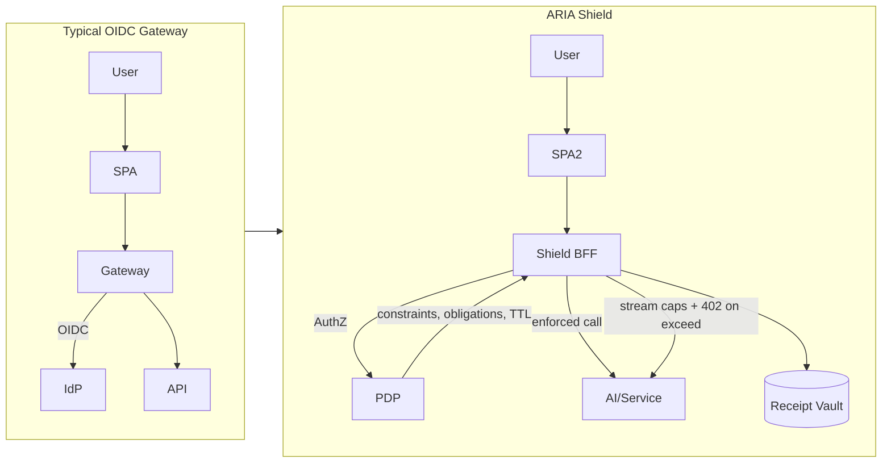

# ARIA Shield — Head-to-Head Matrix (Zero-Token SPA, Budgets, Receipts)

| Product                                   | Zero-Token SPA | Budgets (HTTP 402) | Streaming Caps | Cryptographic Receipts | PDP Route Mapping | Evidence |
| ----------------------------------------- | -------------- | ------------------ | -------------- | ---------------------- | ----------------- | -------- |
| **EmpowerNow ARIA Shield (target)**       | **Yes**        | **Yes**            | **Yes**        | **Yes**                | **Yes**           | — |
| Curity Token Handler                      | Yes (cookies)  | No                 | No             | No                     | Possible (GW)     | [Curity Token Handler](https://curity.io/product/token-handler/) |
| Kong Gateway + OIDC/Plugins               | Backend OIDC   | No                 | No             | No                     | Yes (plugins)     | [Kong OIDC Plugin](https://docs.konghq.com/hub/kong-inc/openid-connect/) |
| NGINX (Gateway) + OIDC                    | Backend OIDC   | No                 | No             | No                     | Yes (auth routes) | [NGINX OIDC Guide](https://docs.nginx.com/nginx/admin-guide/security-controls/configuring-oauth-authentication/) |

> Interpretation: Gateways with OIDC secure sessions but lack runtime governance primitives: spend budgets with 402 semantics, streaming output caps, and cryptographic receipts. ARIA Shield adds these enforcement points while keeping tokens out of the browser.

## Visual: Enforcement Points vs. OIDC-Only Gateways

## Adjacent Note
- Amazon Bedrock provides model routing and guardrails (content filtering/observability). It is adjacent to ARIA Shield’s governance scope and does not provide plan JWS/schema pins, budget 402 semantics, or cryptographic receipt chains.
- See `marketing/research/competitors/mcp/vendor_bedrock.json` and `source_content/________aria_versus_aws_bedrock.md`.

## See also
- `docs/website_copy/product_bff.md` (ARIA Shield product page)
- `docs/website_copy/primers/primer_shield_zero_token_spa.md`
- `marketing/battlecards/shield.md`

