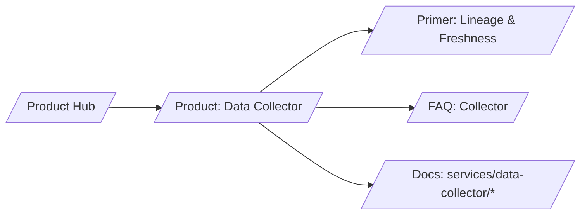

# SERP Strategy — Data Collector (Inventory & Usage)

## Keyword tiers

- T1 (business intent)
  - identity data collection
  - AI usage analytics
  - inventory graph for governance
- T2 (mid)
  - lineage for identity data
  - freshness SLA data pipelines
  - ClickHouse Kafka identity analytics
- T3 (long‑tail technical)
  - field‑level lineage identity
  - near‑real‑time delta sync
  - budget trends AI usage

## H1/H2 patterns that win

- H1: “Make policy accurate with fresh, lineage‑backed identity & usage data”
- H2s: “What is lineage?”, “Freshness SLAs”, “Usage → budgets”, “Analytics stack”

## Content angles and schema

- Angle: accuracy + audit speed; budget visibility
- Schema.org: TechArticle, FAQ

## Snippet guidance

- Show lineage chain and freshness SLA examples
- Include short ClickHouse query examples (optional)

## Internal link map

## Measurement

- Increase in organic traffic for “lineage” + “freshness” terms
- Demo CTA CTR ≥ 3%
