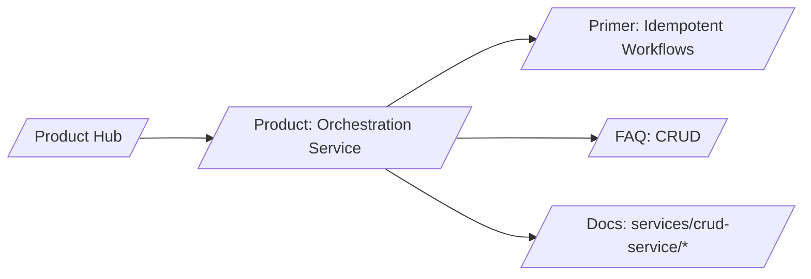

# SERP Strategy — Orchestration Service (Identity Operations)

## Keyword tiers

- T1 (business intent)
  - identity provisioning service
  - approvals workflow for identity
  - reduce MTTR identity operations
- T2 (mid)
  - idempotent provisioning
  - identity approvals best practices
  - retry policies identity workflows
- T3 (long‑tail technical)
  - dedupe by event id pattern
  - partial failure retry identity ops
  - receipts audit identity workflows

## H1/H2 patterns that win

- H1: “Ship reliable identity workflows with idempotency and approvals”
- H2s: “Why idempotency”, “Approval paths”, “Retry & SLOs”, “Observability & receipts”

## Content angles and schema

- Angle: brittle scripts → ops plane with SLOs
- Schema.org: HowTo, FAQ

## Snippet guidance

- Show dedupe flow (event_id)
- Before/after on MTTR

## Internal link map

## Measurement

- Target click‑through on “idempotent” queries ↑
- Time‑on‑page ≥ 2:00
