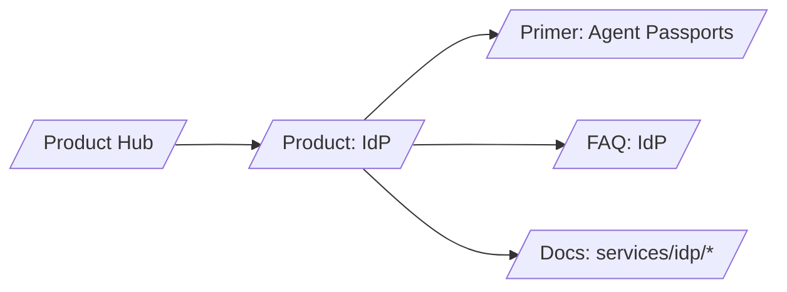

# SERP Strategy — IdP (Agent Passports)

## Keyword tiers

- T1 (business intent)
  - agent identity management
  - agent passports
  - AI governance identity
- T2 (mid)
  - OAuth token exchange for agents
  - delegated identity chains
  - pairwise subject oauth
- T3 (long‑tail technical)
  - RAR RFC 9396 example
  - pairwise subject best practices
  - DPoP RFC 9449 agent

## H1/H2 patterns that win

- H1: Outcome‑led — “Replace API keys with purpose‑bound Agent Passports”
- H2s: “What are Agent Passports?”, “How Token Exchange + RAR works”, “Delegation & actor chains”, “Security (DPoP, pairwise)”

## Content angles and schema

- Angle: problem→value→proof→how; emphasize proof (claims/pins/receipts)
- Schema.org: Product, FAQ

## Snippet guidance

- Use short comparisons vs JWT access tokens
- Include a minimal RAR object and pairwise subject example
- Link to reference anchors rather than inline tables

## Internal link map

## Measurement

- Target CTR on “Replace API keys …” snippets ≥ 4%
- FAQ rich‑results coverage ≥ 60%
