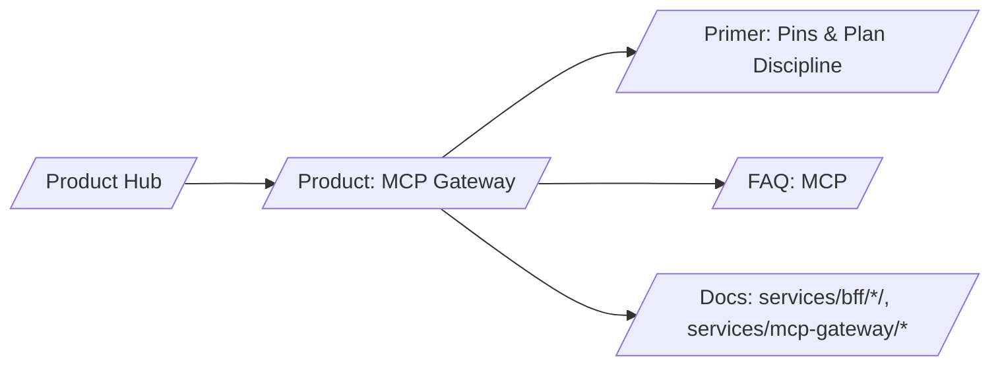

# SERP Strategy — ARIA MCP Gateway (Tool‑Boundary Enforcement)

## Keyword tiers

- T1 (business intent)
  - mcp gateway governance
  - tool boundary enforcement
  - AI agent tool governance
- T2 (mid)
  - schema pinning mcp
  - plan jws discipline
  - params/egress allowlists
- T3 (long‑tail technical)
  - CURRENT pin rollout window
  - plan step fingerprint example
  - receipt contents policy snapshot

## H1/H2 patterns that win

- H1: “Stop off‑plan calls and schema drift at the tool boundary”
- H2s: “Plan discipline”, “Schema pins”, “Allowlists”, “Receipts”

## Content angles and schema

- Angle: prevention > observation; integrity + audit
- Schema.org: Product, FAQ

## Snippet guidance

- Show plan step JWS payload and pin example
- Include deny/permit outcomes with reasons

## Internal link map

## Measurement

- Organic clicks on “schema pinning mcp” + “plan jws”
- POC request rate from page ≥ 2%
