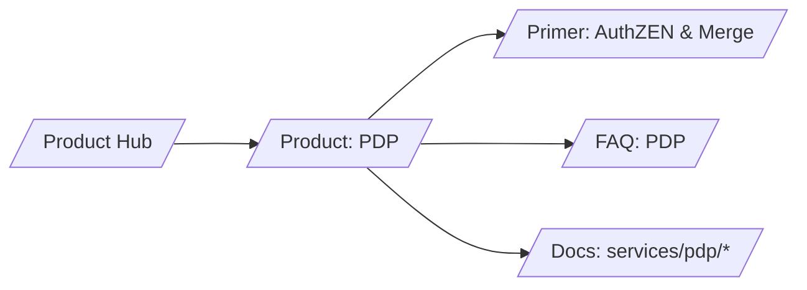

# SERP Strategy — PDP (AuthZEN Decisions)

## Keyword tiers

- T1 (business intent)
  - policy decision platform for AI
  - authorization engine for agents
  - explainable authorization
- T2 (mid)
  - AuthZEN implementation
  - conservative merge model
  - policy obligations vs constraints
- T3 (long‑tail technical)
  - AuthZEN evaluation example
  - obligations vs constraints semantics
  - decision TTL caching

## H1/H2 patterns that win

- H1: “Make every decision consistent and explainable with AuthZEN”
- H2s: “What is AuthZEN?”, “Conservative merge”, “Membership PIP”, “Latency & TTL”

## Content angles and schema

- Angle: standard contract → safer merge → explainability
- Schema.org: TechArticle, FAQ

## Snippet guidance

- Short JSON snippets (request/response shapes)
- One diagram showing PEP→PDP with constraints/obligations
- Link to reference anchors; avoid full tables

## Internal link map

## Measurement

- Non‑brand SEO share for “AuthZEN” terms ↑
- Rich‑result FAQ coverage ≥ 50%
