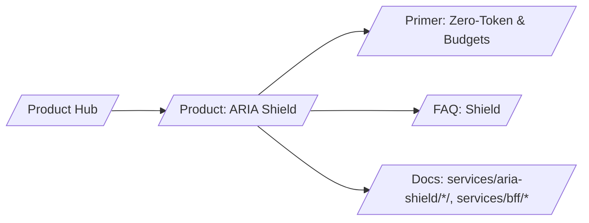

# SERP Strategy — ARIA Shield (Zero‑Token SPA & Budgets)

## Keyword tiers

- T1 (business intent)
  - zero token spa
  - AI budget enforcement
  - streaming limits for LLMs
- T2 (mid)
  - sse streaming caps policy
  - httpOnly cookies SPA security
  - 402 budget exceeded semantics
- T3 (long‑tail technical)
  - call_id idempotent budget hold
  - SSE early stop policy
  - receipts streaming enforcement

## H1/H2 patterns that win

- H1: “Keep tokens out of the browser. Enforce budgets and streaming limits.”
- H2s: “Zero‑token SPA”, “Budget holds & 402”, “Streaming caps”, “Receipts”

## Content angles and schema

- Angle: risk ↓ + spend ↓ with provable enforcement
- Schema.org: Product, FAQ

## Snippet guidance

- Show simple flow for cookie session and budget 402 behavior
- Include a streaming cap code fragment

## Internal link map

## Measurement

- SERP wins for “zero token spa”, “budget enforcement”
- Demo CTR ≥ 4%
