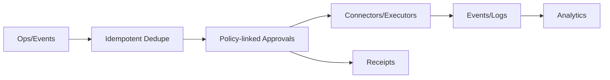

# CRUD Service — Competitor Shortlist and SERP Seed

Focus: idempotent workflows, policy‑linked approvals, retries/SLOs, connector breadth, and receipts/audit linkage. Includes IGA/IDaaS engines and iPaaS/no‑code automation.

## Shortlist
- SailPoint Identity Security Cloud — IGA provisioning + lifecycle approvals
- Okta Workflows — no‑code automation for identity; approvals/connectors
- Microsoft Entra ID Governance — lifecycle workflows, reviews, entitlement mgmt
- ServiceNow Flow Designer — enterprise workflow; retry policy; approvals/catalog
- Make (Integromat) — iPaaS with error handlers, incomplete executions
- n8n — OSS automation; whole‑run retries typical; 400+ nodes
- Zapier — large catalog (7k–8k+ apps); trigger dedupe; MCP for AI
- Workato — enterprise iPaaS; backoff + persistent retry for audit streams

## Diagram — Ops plane vs. no‑code/iPaaS

## Notes
- Competitors JSON: `marketing/research/competitors/crud/`
- SERP log: `marketing/research/serp/crud.csv`
- Matrix: `marketing/research/matrix/crud.md`
