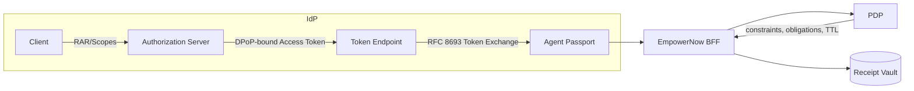

# IdP — Competitor Shortlist and SERP Seed

This shortlist focuses on standards for agent identity and authorization: OAuth Token Exchange (RFC 8693), DPoP (RFC 9449), RAR (RFC 9396), and pairwise identifiers (OIDC). Vendors prioritized by standards depth and enterprise posture.

## Shortlist
- Microsoft Entra ID — enterprise IdP; DPoP; Conditional Access ecosystem
- Curity Identity Server — standards-forward; RAR, Token Exchange, DPoP
- Auth0 by Okta — developer-friendly; DPoP guidance; extensibility
- Okta CIC — broad market reach; pairwise ID; marketplace integrations
- Keycloak (OSS) — community adoption; emerging DPoP support

## Capabilities focus (taxonomy keys)
- `pairwise_id`, `token_exchange_rfc8693`, `rar_rfc9396`, `dpop_rfc9449`
- EmpowerNow differentiators (IdP Agent Passports): `plan_jws`, `schema_pins`, `receipt_chain`

## Diagram — Standards flow for Agent Passports

## Notes
- See competitor JSONs in `marketing/research/competitors/idp/`
- See SERP log `marketing/research/serp/idp.csv` for sources and angles
- Map EmpowerNow Agent Passports to standards to anchor claims in proofs
