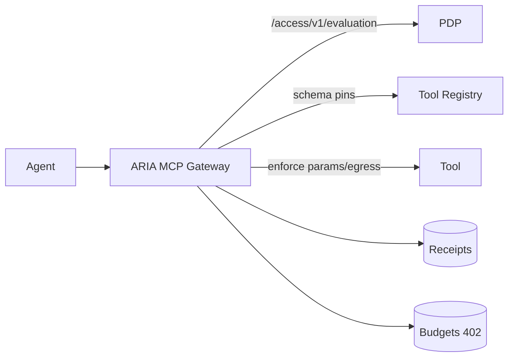

# ARIA MCP Gateway — Competitor Shortlist and SERP Seed

Focus: params/egress allowlists, schema pins + grace windows, plan JWS discipline, budget enforcement (402), cryptographic receipts.

## Shortlist
- Cloudflare AI Gateway — routing/observability/controls
- Portkey — gateway features; routing/observability
- Helicone — OSS gateway; logging/metrics
- Adjacent: Amazon Bedrock (platform guardrails), Kong/Nginx (non‑MCP)

## Diagram — Tool Boundary Enforcement

## Notes
- Competitors JSON: `marketing/research/competitors/mcp/`
- SERP log: `marketing/research/serp/mcp.csv`
