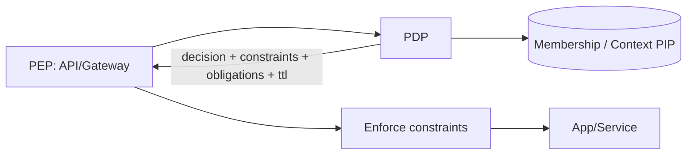

# PDP — Competitor Shortlist and SERP Seed

Focus: AuthZEN-style decision contract (decision + constraints + obligations + TTL), conservative merge, explainability/replay, PIP/Membership integration.

## Shortlist
- Cerbos — obligations-like outputs; commercial OSS
- Open Policy Agent (OPA) — general policy engine; arbitrary JSON outputs
- AWS Verified Permissions (Cedar) — managed PDP; allow/forbid focus
- Axiomatics (XACML) — obligations/advice in response; combining algorithms
- AuthZed SpiceDB / Ory Keto — FGA graph store; consistency tokens (not constraints/obligations)
- Istio/Envoy policy layer — enforcement layer; integrates with external PDP

## Diagram — Decision flow and response contract

## Notes
- See competitor JSONs in `marketing/research/competitors/pdp/`
- See SERP log `marketing/research/serp/pdp.csv`
- Matrix reference: `marketing/research/matrix/pdp.md`
