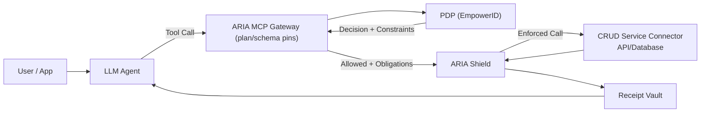

---

# EmpowerNow — Investor Deck (Draft)

### 1) Title / Category Claim

**EmpowerNow — The Universal Agent Governance & Integration Layer**

* No-Code AI Integration (**Automation Studio**)
* Policy & Constraints (**Authorization Studio**)
* Passports / Token Exchange (**Authentication Studio**)
* Identity Inventory & Lineage (**Inventory Studio**, supporting)
* Runtime Enforcement (**ARIA Shield • ARIA MCP Gateway**) — **Built by EmpowerID** (IGA/PAM since 2005; $20M+ revenue; global brands)*
  * *EmpowerID customers cited for team credibility; EmpowerNow is a new, neutral product.*

---

### 2) The $100B Problem (Why Now)

* **Runaway AI spend.** Duplicate calls, retries, agent sprawl, and opaque vendor pricing → **unbudgeted costs** with no per-call guardrails.
* **New AI attack surface.** Prompt-injection, data exfiltration, tool overreach/on-behalf-of abuse, and tool-chain supply-chain risk.
* **Agents need tools to do real work**—but tool access must be **least-privilege** with **crystal-clear auditability**.
* Governance is **platform-specific**; there’s **no cross-platform enforcement or receipts**.
  → Rollouts stall without a layer that **creates tools safely**, **caps/controls spend**, **blocks attacks**, and **proves** every action.

**Stat box (update live):** `AI $/day governed: ___` • `Spend blocked (402): ___%` • `Pilot→Prod ≤90d: ___%`

---

### 3) “Switzerland” Strategy → More Channels, Lower CAC, Bigger TAM
*Neutral = we enable every stack instead of competing with it.*

* **Neutral by design:** Like Switzerland hosts talks for all sides, we **integrate/OEM with all vendors’ agents**.
* **OEM to everyone = sell through everyone:** Okta/SailPoint/Microsoft/ServiceNow become **distribution partners**, not competitors.
* **Distribution arbitrage:** They keep the relationship; **we power agent security** across their estates.
* **The math (illustrative):** Direct only (win a slice) vs. **embedded across partner ecosystems (10–30× reach)**.

---

### 4) Live Demo (90s): **Author Once → Publish Many**

* Build once in **Automation Studio** (YAML) → publish to **MCP**, **OpenAI Functions**, **Microsoft Copilot**.
* **CRUD Service** turns any **API/DB** into **code-free connectors** that surface as **MCP agent tools**.
* Invoke from each: **Authorization Studio** applies constraints; **Gateway/Shield** block off-plan/over-budget; **Receipt** captured.
* **Takeaway:** unified governance **without** forcing a single platform.

---

### 5) Why Identity Experts Win

* **Enterprise trust:** 15+ years operating identity for global regulated brands *(EmpowerID heritage).*
* **From RBAC/ABAC to agents:** We already model **who can do what, for whom, under what constraints**—now applied to **tools**, **spend**, and **content** at runtime.
* **Distribution:** existing procurement paths → faster starts & references.
  *Footnote:* *Logos/clients are EmpowerID platform customers; EmpowerNow is a new product.*

---

### 6) **Agents ≠ Chat: Tools = Work** (CRUD Service = Tool Factory)

* **Agents create value only through tools.**
* **CRUD Service** generates **code-free integrations** so any system **API** or **database** becomes an **agent-safe MCP tool** with schema, auth, and guardrails.
* **Author once → publish many**: packaged for MCP/Functions/Copilot/etc. with **policy hooks** baked in.
* **Outcomes:** time-to-first-tool **<10 min**; **safe expansion** of agent capability; **consistent governance** across platforms.

---

### 7) What We Are (Layer-2 Middleware)

* **Create tools fast** — **Automation Studio** + **CRUD Service connectors** → MCP Tools/Resources/Prompts; adapters for non-MCP.
* **Decide & constrain** — **EmpowerID PDP / Authorization Studio** → standardized decision (constraints/obligations/TTL).
* **Enforce & prove** — **ARIA MCP Gateway** (pre-exec), **ARIA Shield** (inline), **Receipt Vault** (cryptographic audit chain).
* **Stay accurate** — **Inventory Studio** keeps identity & entitlements fresh for PDP/PIP.

---

### 8) Platform Coverage (Adapters = Moat)

* Initial GA targets: **Anthropic MCP**, **OpenAI Functions**, **Microsoft Copilot**, **Google Vertex**, **AWS Bedrock**, **LangChain/LangGraph**, **LlamaIndex**.
* Principle: **author once → publish many** (shared schema; per-platform manifests).
* DX goals: **5-minute** tool creation; **1-line** policy call; **drop-in** budget/content controls.

---

### 9) Proof & Momentum

* **Adapter cadence:** weekly releases; public changelog.
* **DX metrics:** time-to-first-tool **<10 min**; **publish to 3 platforms <1 hour**.
* **Commercial signals:** platform POCs; SI design-partner outreach; pilot→prod targets.

*(Add a small sparkline “weekly ship cadence” visual.)*

---

### 10) Business Model (Clear & Credible)

* **Governed endpoints** (critical tools/routes): **$500 / endpoint / month** (typical).
* **Decision usage** priced per 100k decisions; **Receipts** priced per 10k; **Catalog seats** for authors; **OEM/white-label** rev share.

---

### 11) Economic Framing (Realistic)

* Typical enterprise: ~**50 tools**, ~**20 critical endpoints** (each governs many agents).
* **Average account:** **20–50 endpoints × $500 = $10k–$25k / month** → **$120k–$300k ARR** (+ usage + seats).
* **Scale scenario:** 1,000 mid-tier accounts → **$120M–$300M core ARR** (pre-OEM/usage).

---

### 12) Studios Overview (No-Code; Demo-Ready)

* **Automation Studio → CRUDService (backend)**
  *No-code MCP tool & workflow designer* — turn any API/DB into **agent-safe tools** fast; publish across platforms with policy hooks.

* **Authorization Studio → PDP (backend)**
  *Policy UI for AuthZ (ABAC/constraints/obligations/TTL)* — issue **standardized decisions** for budgets/content/params across all agents.

* **Authentication Studio → IdP (backend)**
  *Agent Passports & token exchange (on-behalf-of / least-privilege)* — give agents **scoped identity** without long-lived tokens.

* **Inventory Studio → Data Collector (backend)** *(de-emphasized for AI)*
  *Identity & entitlement inventory/lineage* — keeps PDP **context fresh**; primarily IGA-vendor scenarios.

**Flow:** **Design (Automation) → Decide (Authorization/PDP) → Enforce (Gateway/Shield) → Prove (Receipts).**
**Monetization:** **Endpoints governed**, **decisions**, **receipts**, **author seats**.

---

### 13) Runtime Enforcement & Proof (What Auditors Love)

* **Contextual authorization:** **EmpowerID PDP** evaluates **who/what/for whom/under what constraints** per call (attributes, roles, resource, environment).
* **Pre-execution gating:** **ARIA MCP Gateway** validates **plan & schema pins**; blocks unsafe/off-policy calls **before** the model runs.
* **Inline enforcement:** **ARIA Shield** applies **budgets (402), streaming/content caps, parameter allow-lists** during execution.
* **Inline enforcement (spend + egress):** **ARIA Shield** applies **budgets (402)**, rate/stream caps, **parameter allow-lists**, and **egress filters** during execution.

**Architecture (can be placed here or in Appendix):**

*Gate → Decide → Enforce → Prove.*

---

### 14) Interface Moats (Patents)

* **Graph-Anchored ABAC** — policies as graph nodes → resolver → *standardized decision*.
* **Agent-Centric Workflow** — agent-ready next steps from YAML; universal auth; standardized audit logs.
* Locks **policy→decision** and **agent→next-step** interfaces that partners adopt.

---

### 15) **Team — Distributed Technical Bench (No Single Point of Failure)**

* **Patrick Parker — Founder & CEO (EmpowerID)**
  20+ yrs enterprise identity; architected EmpowerID to $20M+ revenue • RBAC→ABAC orchestration for regulated brands
* **Bradford Mandell — SVP Sales & Cofounder**
  Olin BSBA; Harvard exec ed • *Add proof:* “Closed **$XMM+** enterprise programs; multi-year SI/ISV alliances”
* **Ujwal Halkatti — Chief Operating Officer**
  12+ yrs at EmpowerID; product quality & customer success • Former Dir. Software Dev, SolarWinds; Dir. Product, Tek-Tools
* **Carles Dalmau — VP, Product Architecture**
  Enterprise security modeling & workflow orchestration; policy runtime design
* **Cristiana Vicovan — Director, Product Management**
  Former startup CTO; **CTO of the Year (Europe)**; ex-Oracle Cloud — bridges product & architecture

*One-liner:* **Distributed CTO model → velocity, resilience, and zero key-person risk.**

---

## Appendix (4 slides)

### A1) Competitive + Distribution Frame

* **Gateways/observability:** lack **enforcement + receipts**
* **Orchestration frameworks:** no identity policy/budget/content/audit
* **IGA/PAM:** lack **agent runtime governance + receipts + adapters**
* **DIY:** slow/brittle
  **Distribution wedges:** Installed base (EmpowerID), Platforms (OEM/white-label), SIs/GSIs (vertical kits), Marketplaces (AWS/Azure/GCP)

---

### A2) Neutral by Design (Trust)

Separate infra/contracts from EmpowerID; neutrality advisory board; open-source **receipt verifier**; customer-controlled keys.

---

### A3) KPIs to Instrument (Operating Cadence)

Pilot→prod **>60%** ≤90 days; **≥3 GA adapters in 2 quarters**; “publish to 3 platforms” **<1 hour**; GM **≥80%**; CAC payback **<12 mo** (direct).
Expansion levers: **endpoints/account**, **receipts/day**, **seats**, **partner-attached ACV**.

---

### A4) 12-Month Milestones / Early Validation / Team & Ask

Coverage: MCP + two of OpenAI/Copilot/Vertex/Bedrock GA • Partners: 1 platform LOI, 2 SI design-partners • Scale: 1 F100 at **1k+ agents/tools** • Trust: OSS verifier + neutrality board.
**Why distributed beats single-CTO:** no key-person risk; parallel tracks (adapters, PDP, studios); proven tenure (12+ yrs); add CTO title later for external clarity.
**Team & raise terms:** [as drafted].

---

# One-Pager (Handout)

**EmpowerNow — The Universal Agent Governance & Integration Layer**

**What:**
A neutral Layer-2 that lets enterprises **create tools once**, **enforce policy/budgets across platforms**, and **prove every action** with cryptographic receipts.

**Tools = Work (CRUD Service):**
**CRUD Service** turns any **API/DB** into an **agent-safe MCP tool**—code-free, schema-pinned, auth-aware, and **policy-ready**.

**Fine-Grained Control:**
**ARIA MCP Gateway** (pre-execution gating), **ARIA Shield** (inline enforcement), and **EmpowerID PDP** deliver **who/what/for whom/under what constraints** with **crystal-clear auditability**.

**Studios:**

* **Automation:** no-code tools; multi-platform publish (MCP, Functions, Copilot).
* **Authorization:** standardized decisions; **content/egress/params/budget** controls.
* **Authentication:** Agent Passports / Token Exchange (on-behalf-of; least privilege).
* **Inventory:** IGA identity inventory & lineage feeding PDP/PIP.

**Runtime:**

* **MCP Gateway:** plan/schema pins; blocks drift **before execution**.
* **ARIA Shield:** budgets (402), streaming caps, parameter allow-lists; **zero-token SPA** ready.
* **Receipt Vault:** decision_id + policy snapshot + schema/pin hashes → **immutable audit** & **cost attribution**.

**Neutrality & Moat:**
OEM/white-label by any vendor; independent from EmpowerID; **open-source verifier**; pending patents on **Graph-Anchored ABAC** and **Agent-Centric Workflow**.

**Pricing (indicative):**
**$500 / governed endpoint / month** + decision/receipt usage + author seats; OEM rev-share.
Typical account: **20–50 endpoints × $500 = $10k–$25k / month** → **$120k–$300k ARR** (+ usage + seats).

**12-Month Goals:**
**3+ adapters GA**, **1 platform LOI**, **2 SI partners**, **1 F100 at 1k+ agents/tools**, **OSS verifier live**.

**CTA:** Platform & SI intros • Lighthouse pilots • Data room access.

---

## Presenter micro-script (20s)

“Agents only create value through **tools**. **CRUD Service** is our **tool factory**, making any API or database an **MCP-ready tool** with policy hooks. **EmpowerID PDP** decides context; the **ARIA MCP Gateway** gates **before** the model runs; **ARIA Shield** enforces budgets, parameters, and egress **during** execution. Every action is **receipted**.”

---
