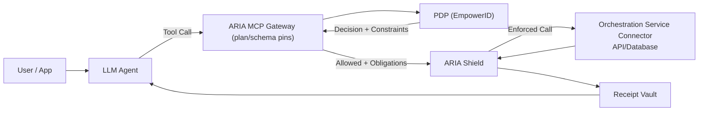

---

# EmpowerNow — Investor Deck (Tightened)

### 1) Title / Category Claim

## **EmpowerNow**

### **The Tool Factory for Enterprise AI Agents**

**Any API → Secure Agent Tool → 5 Minutes**

---

**The Reality:** Enterprises need thousands of agent tools. **Custom builds take weeks per integration.**

**Our Breakthrough:** **Orchestration Service** creates governed tools **in minutes, not months**.

**The Result:** Agents that actually work—**with authorization, budgets, and receipts built in**.

---

**From the team behind EmpowerID** • **$20M+ revenue** • **15 years** • **Fortune 500 trusted**

---

## Presenter Script (15 seconds)

“Agents without tools are useless. Tools without governance are dangerous. **Orchestration Service** solves both problems **in 5 minutes**. Watch us turn your Salesforce API into a secure agent tool that works across **MCP, Copilot, and OpenAI Functions**.”

---

### 2) The $100B Problem (Why Now)

* **Runaway AI spend** from retries/agent sprawl → **per-route/agent budgets (402)** and pre-exec guardrails required.
* **New MCP attack surface** → **plan & schema pin validation** to block prompt-injection/tool overreach **before** models run.
* **Agents need tools to do work** → tools must be **least-privilege** and **provably governed** (receipts).
* Today controls are **platform-specific**; there’s **no cross-platform enforcement or receipts**.
  → Enterprises need a neutral layer to **create tools safely**, **enforce constraints**, and **prove** every action.

---

### 3) Neutral OEM Strategy → More Channels, Lower CAC, Larger TAM

*Neutral = we enable every stack instead of competing with it.*

* **Partner to all, conflict with none:** OEM/white-label with agent platforms & IGA/PAM—**we plug in; we don’t rip/replace**.
* **Distribution arbitrage:** Platforms & SIs keep the relationship; **we power enforcement + receipts** across estates.
* **Illustrative math:** direct only (win a slice) vs. **embedded across partner ecosystems (10–30× reach)**.
  *Illustrative uplift depends on attach rates & SKU placement.*

---

### 4) Live Demo (90s): **Author Once → Publish Many**

* Build once in **Automation Studio** (YAML) → publish to **MCP**, **OpenAI Functions**, **Microsoft Copilot**.
* **Orchestration Service** turns any **API/DB** into **no-code MCP tools** (schema pins, policy hooks).
* Invoke from each: **PDP** applies constraints; **Gateway/Shield** enforce; **Receipt** captured.
* **Takeaway:** unified governance **without** forcing a single platform.

---

### 5) Why Identity Experts Win

* **Enterprise trust:** 15+ years running identity for global regulated brands *(EmpowerID heritage).*
* **From RBAC/ABAC to agents:** we already model **who/what/for whom/constraints**—now applied to **tools, spend, content** at runtime.
* **Distribution:** existing procurement paths → faster starts & references.
* **Operating ethos:** mechanisms and evidence—**pre-exec validation**, **runtime guardrails**, **cryptographic receipts**.
  *Footnote:* Logos/clients are EmpowerID platform customers; EmpowerNow is a new product.

---

### 6) **Agents ≠ Chat: Tools = Work** (Orchestration Service = Tool Factory)

* **Agents create value only through tools.**
* **Orchestration Service** generates **no-code integrations** so any **API/DB** becomes an **agent-safe MCP tool** with schema, auth, and guardrails.
* **Author once → publish many:** packaged for MCP/Functions/Copilot with **policy hooks** baked in.
* **Outcomes we’ll demo:** time-to-first-tool **<10 min**; safe expansion; consistent governance across platforms.

---

### 7) What We Are (Layer-2 Middleware)

* **Create tools fast** — **Automation Studio** + **Orchestration Service** → MCP Tools/Resources/Prompts; adapters for non-MCP.
* **Decide & constrain** — **EmpowerID PDP / Authorization Studio** → standardized decision (constraints/obligations/TTL).
* **Enforce & prove** — **ARIA MCP Gateway** (pre-exec), **ARIA Shield** (inline), **Receipt Vault** (cryptographic audit chain).
* **Stay accurate** — **Inventory Studio** keeps identity & entitlements fresh for PDP/PIP.

---

### 8) Platform Coverage (Adapters = Moat)

* Initial GA targets: **Anthropic MCP**, **OpenAI Functions**, **Microsoft Copilot**, **Google Vertex**, **AWS Bedrock**, **LangChain/LangGraph**, **LlamaIndex**.
* Principle: **author once → publish many** (shared schema; per-platform manifests).
* DX goals: **5-minute** tool creation; **1-line** policy call; **drop-in** budget/content controls.
  *Adapters: GA/Beta per platform—weekly ship cadence (see changelog).*

---

### 9) Proof & Momentum (Demo-able today)

* **Ship cadence:** weekly adapter releases; public changelog (sparkline).
* **What we can demonstrate live:**

  * **Tool creation** in under 10 minutes (test env).
  * **Pre-exec block** of off-policy MCP calls (plan/schema pins).
  * **Budget 402** with cost attribution.
  * **Receipt** showing `{ decision_id, policy_hash, tool_schema_hash, ttl_ms }`.
* **Commercial:** active POCs/design partners; SI enablement in progress.

---

### 10) Business Model (Clear & Credible)

* **Governed endpoints** (critical tools/routes): **$500 / endpoint / month** (typical).
* **Decision usage** per 100k; **Receipts** per 10k; **Catalog seats** for authors; **OEM/white-label** rev share.

---

### 11) Economic Framing (Realistic)

* Typical enterprise: ~**50 tools**, ~**20 critical endpoints** (each governs many agents).
* **Average account:** **20–50 endpoints × $500 = $10k–$25k / month** → **$120k–$300k ARR** (+ usage + seats).
* **Scale scenario:** 1,000 mid-tier accounts → **$120M–$300M core ARR** (pre-OEM/usage).

---

### 12) Studios Overview (No-Code; Demo-Ready)

* **Automation Studio → Orchestration Service (backend)**
  *No-code MCP tool & workflow designer* — turn any API/DB into **agent-safe tools**; publish with policy hooks.
* **Authorization Studio → PDP (backend)**
  *Policy UI (ABAC/constraints/obligations/TTL)* — **standardized decisions** for budgets/content/params.
* **Authentication Studio → IdP (backend)**
  *Agent Passports & token exchange (on-behalf-of / least-privilege)* — scoped identity without long-lived tokens.
* **Inventory Studio → Data Collector (backend)**
  *Identity & entitlement lineage* — keeps PDP **context fresh**; leveraged more in IGA.
  **Flow:** **Design (Automation) → Decide (PDP) → Enforce (Gateway/Shield) → Prove (Receipts).**
  **Monetization:** **Endpoints**, **decisions**, **receipts**, **author seats**.

---

### 13) Runtime Enforcement & Proof (What Auditors Love)

* **Contextual authorization:** **PDP** evaluates **who/what/for whom/constraints** per call.
* **Pre-execution gating:** **ARIA MCP Gateway** validates **plan & schema pins**; blocks off-policy calls **before** models run.
* **Inline enforcement:** **ARIA Shield** applies **budgets (402)**, streaming/param allow-lists, and **egress filters** during execution.
* **Identity propagation:** **OAuth 2.1 + Token Exchange (RFC 8693)** for on-behalf-of; short-lived tokens; no long-lived secrets.
* **Receipts:** `{ decision_id, policy_hash, tool_schema_hash, cost_usd, ttl_ms }` for audit & FinOps.

**Architecture (or Appendix):**

*Gate → Decide → Enforce → Prove.*

---

### 14) Interface Moats (Patents)

* **Graph-Anchored ABAC** — policies as graph nodes → resolver → *standardized decision*.
* **Agent-Centric Workflow** — agent-ready next steps from YAML; universal auth; standardized audit logs.
* Locks **policy→decision** and **agent→next-step** interfaces that partners adopt.

---

### 15) Team — Distributed Technical Bench (No Single Point of Failure)

* **Patrick Parker — Founder & CEO (EmpowerID)**
  20+ yrs enterprise identity; architected EmpowerID to $20M+ revenue • RBAC→ABAC orchestration for regulated brands
* **Bradford Mandell — SVP Sales & Cofounder**
  Olin BSBA; Harvard exec ed • *(Add proof)* “Closed $XMM+ enterprise programs; multi-year SI/ISV alliances”
* **Ujwal Halkatti — Chief Operating Officer**
  12+ yrs at EmpowerID; product quality & customer success • Former Dir. Software Dev, SolarWinds; Dir. Product, Tek-Tools
* **Carles Dalmau — VP, Product Architecture**
  Security modeling & workflow orchestration; policy runtime design
* **Cristiana Vicovan — Director, Product Management**
  Former startup CTO; **CTO of the Year (Europe)**; ex-Oracle Cloud — bridges product & architecture

*One-liner:* **Distributed CTO model → velocity, resilience, zero key-person risk.**

---

## NEW — Slide X: Controls & Evidence (Stage-Honest)

*Controls mapped to audit objectives, with evidence and current status.*

| Audit objective         | Control                     | Evidence                                   | **Status**         |
| ----------------------- | --------------------------- | ------------------------------------------ | ------------------ |
| Identity propagation    | OAuth 2.1 + **RFC 8693 TE** | Short-lived token + TE assertion           | **Implemented**    |
| Pre-exec validation     | **MCP plan/schema pins**    | **Blocked call (402)** + policy hash       | **Demo available** |
| Runtime guardrails      | **Budgets/params/egress**   | Budget event + route config                | **In testing**     |
| Decision consistency    | **OpenID AuthZEN PDP**      | Decision log (constraints/obligations/TTL) | **Implemented**    |
| Proof / non-repudiation | **Receipt Vault**           | 6-line receipt (prod format, test data)    | **Prototype**      |

> **No-BS Guarantee:** we show exactly what works today, what’s in testing, and what’s next.

---

## NEW — Slide Y: Design Partner Program

* **What we can run live today:** tool creation, pre-exec block, budget 402, receipt.
* **What you get:** roadmap influence, preferred pricing, white-glove onboarding.
* **What we ask:** 2 real use-cases, weekly working session, let us measure TTF tool & spend blocked.
* **Target window:** Q1–Q2; first production go-lives **≤ 90 days**.

---

## Appendix (4 slides)

### A1) Competitive + Distribution Frame

* **Gateways/observability:** lack **enforcement + receipts**
* **Orchestration frameworks:** no identity policy/budget/content/audit
* **IGA/PAM:** lack **agent runtime governance + receipts + adapters**
* **DIY:** slow/brittle
  **Distribution wedges:** Installed base (EmpowerID), Platforms (OEM/white-label), SIs/GSIs (vertical kits), Marketplaces (AWS/Azure/GCP)

---

### A2) Neutral by Design (Trust)

Separate infra/contracts from EmpowerID; neutrality advisory board; open-source **receipt verifier**; customer-controlled keys.

---

### A3) KPIs to Instrument (Operating Cadence)

Pilot→prod **>60%** ≤ 90 days; **≥ 3 GA adapters** in 2 quarters; “publish to 3 platforms” **< 1 hour**; GM **≥ 80%**; CAC payback **< 12 mo** (direct).
Expansion: **endpoints/account**, **receipts/day**, **seats**, **partner-attached ACV**.

---

### A4) 12-Month Milestones / Early Validation / Team & Ask

Coverage: MCP + two of OpenAI/Copilot/Vertex/Bedrock GA • Partners: 1 platform LOI, 2 SI design-partners • Scale: 1 F100 at **1k+ agents/tools** • Trust: OSS verifier + neutrality board.
**Why distributed beats single-CTO:** no key-person risk; parallel tracks (adapters, PDP, studios); proven tenure; add CTO title later for external clarity.
**Team & raise terms:** [as drafted].

---

# One-Pager (Handout)

**EmpowerNow — The Universal Agent Governance & Integration Layer**

**What:** A neutral Layer-2 to **create tools once**, **enforce policy/budgets across platforms**, and **prove every action** with cryptographic receipts.

**Tools = Work (Orchestration Service):** turns any **API/DB** into an **agent-safe MCP tool**—no code, schema-pinned, auth-aware, **policy-ready**.

**Fine-Grained Control:** **ARIA MCP Gateway** (pre-exec), **ARIA Shield** (runtime), **EmpowerID PDP** (contextual decisions) → **audit-ready receipts**.

**Studios:** Automation • Authorization • Authentication • Inventory

**Runtime:** MCP plan/schema pins • budgets (402), param allow-lists, egress filters • **Receipt Vault** (decision/policy/schema/cost).

**Neutrality & Moat:** OEM/white-label; separate from EmpowerID; **open-source verifier**; patents pending (**Graph-Anchored ABAC**, **Agent-Centric Workflow**).

**Pricing (indicative):** **$500 / governed endpoint / month** + usage + seats; OEM rev-share.
**Typical account:** **20–50 endpoints → $120k–$300k ARR** (+ usage + seats).

**12-Month Goals:** **3+ adapters GA**, **1 platform LOI**, **2 SI partners**, **1 F100 at 1k+ agents/tools**, **OSS verifier live**.

**CTA:** Platform & SI intros • Lighthouse pilots • Data room access.

---

## Presenter micro-script (20s)

“Agents only create value through **tools**. **Orchestration Service** is our **tool factory**, turning any API or database into an **MCP-ready tool** with policy hooks. **EmpowerID PDP** decides context; the **ARIA MCP Gateway** gates **before** the model runs; **ARIA Shield** enforces budgets, parameters, and egress **during** execution. Every action is **receipted**.”

---

### Final checklist for this version

* ✅ “Orchestration Service” has a space everywhere (cards, bullets, diagram labels).
* ✅ Slide 13 duplicate bullet removed; identity anchored to **RFC 8693**.
* ✅ “Switzerland” reframed to **Neutral OEM strategy**.
* ✅ **Controls & Evidence** + **Design Partner** slides added to the core (not just appendix).
* ✅ No implied scale/vanity stats; **demo-able proofs** instead.

This is ready to ship as your “Pitch 3.1 Tight” deck.
