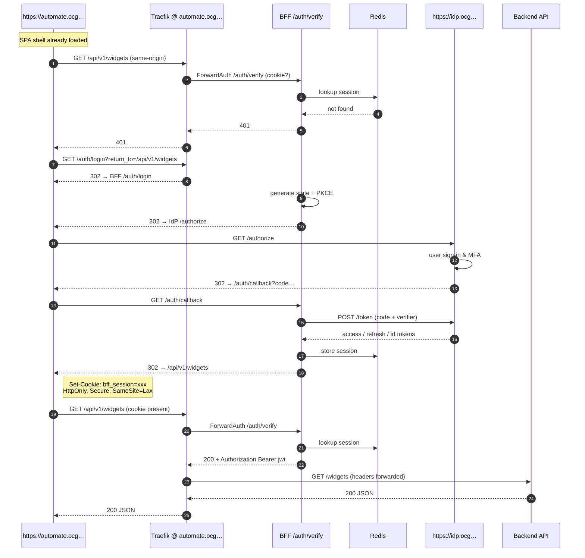

Below is the **single, authoritative walkthrough** that shows how the Edge-BFF + Traefik ForwardAuth pattern is supposed to operate **when everything is wired correctly**, followed by an **action-oriented “fix list”** that maps each outstanding implementation gap to the concrete change that closes it.

---

## 🏅 The Golden-Path Flow (happy case, zero CORS)

### Why no CORS?

* When the SPA calls `/api/**` on the **same host** (`automate.ocg.labs…`) the request is *same-origin* – the browser never sends a CORS pre-flight.
* Only tooling or legacy code that hits `https://api.ocg…` is cross-origin; that path is handled by the BFF’s CORS middleware if you add the origin to the allow-list.

---

## 🔨 Implementation To-Do List (the last mile)

| #     | Fix                          | Exact change                                                                                                                                                                                    | Block it removes                                                                          |
| ----- | ---------------------------- | ----------------------------------------------------------------------------------------------------------------------------------------------------------------------------------------------- | ----------------------------------------------------------------------------------------- |
| **1** | **Cookie name alignment**    | Use a single name: `bff_session` (SID_COOKIE) everywhere: • Set/delete in BFF • Forwarded by Traefik (`authRequestHeaders: Cookie`) • Verified in tests | Prevents ghost sessions; consistent handling. |
| **2** | **Header propagation**       | Add `Authorization` (or `X-Forwarded-Access-Token`) to **`authResponseHeaders`** in every ForwardAuth middleware. ([Traefik Labs Documentation][1], [Traefik Labs Documentation][2])            | Backend never sees JWT → 401/403.                                                         |
| **3** | **Wire all OAuth endpoints** | Ensure `/auth/login`, `/auth/callback`, `/auth/verify`, `/auth/logout` are imported in `main.py` and reachable in every environment (dev + prod).                                               | Flow dies at callback or verify.                                                          |
| **4** | **CORS on error responses**  | Use the `_create_cors_json_response()` helper for **all** 401/403 coming from middleware & `/auth/verify`.                                                                                      | Browser hides JSON body; SPA can’t auto-redirect.                                         |
| **5** | **Traefik per-SPA routers**  | For each SPA host: • `/` → static files • `/auth/**` → BFF (public) • `/api/**` → BFF  <strong>Current mode</strong>: ForwardAuth is <em>disabled</em> on the SPA `/api/**` routers so cookies reach the BFF and auth is done in Python (401 JSON with CORS). Keep ForwardAuth for non‑SPA domains (e.g., Traefik dashboard). For legacy `api.ocg…` host, add a router with CORS headers. | Developers hitting the wrong host think “CORS is broken.” |
| **6** | **SPA API base URL**         | Hard-code `const API_BASE='/api'; fetch(API_BASE+...)` in every SPA; remove old `https://api.ocg…` calls.                                                                                       | Same-origin shortcut never exercised in dev.                                              |
| **7** | **Redis TLS or proxy**       | Add `--tls-port 6379 --port 0` **or** stunnel side-car; update BFF URL to `rediss://`.                                                                                                          | Makes “Redis encryption” claim true; meets PCI/NIST.                                      |
| **8** | **Rate-limit bucket**        | If you keep `period: 1m` you *must* also set `average:`. Otherwise the bucket is zero. e.g. `average: 100`. ([Stack Overflow][3])                                                               | Requests throttled to 0/min under load.                                                   |
| **9** | **Local-dev origin**         | Add `http://localhost:3000` (etc.) to `CORS_ALLOW_ORIGINS`.                                                                                                                                     | SPA in dev continues to 401 with opaque CORS error.                                       |

*(items 1–4 are **P0** show-stoppers; 5–6 are developer-experience; 7–9 are hardening)*

---

## ✅ Why the pattern is still the right one

* **Security**   Tokens never reach the browser; XSS ≠ token theft.
* **Performance**  Redis lookup ≈ 1–3 ms, far cheaper than validating a JWT on every edge hop.
* **Simplicity for SPAs**  No SDK, no silent refresh loop – just cookies.
* **Standards track**  OAuth 2.1 (+PAR/DPoP) is future-proof; ForwardAuth is a first-class Traefik feature.

Netflix, Duende BFF, and many Kubernetes ingress stacks run this exact model today; the only barrier on your side is wiring the last few endpoints and headers.

---

### One-screen checklist before you pronounce “fixed”

1. **Cookie in dev tools** = exactly the name you picked, scoped to `.ocg.labs…`, SameSite =Lax.
2. **Network tab /auth/callback** = 302 → `/api/**` with `Set-Cookie`.
3. **Second /api/** request\*\* passes `Cookie`. If spa-api uses ForwardAuth: 200 + forwarded headers. If BFF handles auth for spa-api: BFF returns 200 and adds CORS on 401.
### Binding conventions and environment requirements

- Cookie: `bff_session` (HttpOnly, Secure, SameSite=Lax, Domain `.ocg.labs.empowernow.ai`).
- ForwardAuth path used by Traefik: `/auth/forward` (alias of `/auth/verify`). Current mode: disabled on SPA `/api/**` routers; BFF validates sessions internally and returns CORS-enabled 401 JSON.
- CSP must include `worker-src 'self' blob:`; do not add `unsafe-eval`.
- Routes are loaded from `/app/config/routes.yaml` (ServiceConfigs mount). No in-repo drift.
- `/api/auth/session` returns `{ authenticated: boolean }`; SDKs must read `authenticated`.
- Provide concrete `OIDC_SCOPES` via Compose (avoid literal `${...}` in live URLs).
- Service DNS names: `crud_service`, `pdp_app`, `idp-app`.
4. **Backend trace** shows valid `sub`, `aud`, `scope`.
5. **Same test hitting `https://api.ocg…`** responds with the CORS headers you configured.

Hit all five, and the architecture is *working as intended.*

[1]: https://doc.traefik.io/traefik/middlewares/http/forwardauth/?utm_source=chatgpt.com "Traefik ForwardAuth Documentation"
[2]: https://doc.traefik.io/traefik/reference/routing-configuration/http/middlewares/forwardauth/?utm_source=chatgpt.com "ForwardAuth - Traefik Labs documentation"
[3]: https://stackoverflow.com/questions/43262121/trying-to-use-fetch-and-pass-in-mode-no-cors?utm_source=chatgpt.com "Trying to use fetch and pass in mode: no-cors - Stack Overflow"

---

## Canonical API surface (as implemented)

- CRUD prefix is canonical for SPA calls routed via BFF:
  - Workflows: `/api/crud/workflows/*`, Execute: `/api/crud/workflows/v1/execute`, `/api/crud/execute`
  - Pages: `/api/crud/pages/*`
  - Tasks: `/api/crud/tasks/*`
  - Runs: `/api/crud/runs*`, Workflow runs: `/api/crud/workflow_runs/*`
  - Credentials: `/api/crud/credentials/*`
  - Commands: `/api/crud/commands/*`
  - Tools: `/api/crud/tools/*`
  - Agents: `/api/crud/agents/*` (canonical; legacy `/api/agents/*` remains for back-compat)
  - Labs LDAP: `/api/crud/labs/ldap/*`
  - PDP AuthZEN: `/access/v1/evaluation` (preserved path)

## Logout behavior (final)

- SPA triggers hard navigation to `/auth/logout?everywhere=true` and clears local auth storage immediately to avoid in-flight requests.
- BFF invalidates Redis session, clears `bff_session` cookie, and serves an intermediate HTML page that performs `window.location.replace()` to the IdP `end_session_endpoint`, with a meta-refresh and fallback link.
- BFF forces `post_logout_redirect_uri` to `https://<bff_host>/auth/login` to avoid redirecting to protected SPA routes after IdP logout.
- Back-compat shims `/api/auth/logout` (GET/POST) delegate to `/auth/logout`.

## Frontend telemetry endpoint

- Public metrics sink: `POST /api/v1/metrics` (minimal payload, PII filtered). Intended for frontend telemetry without requiring an authenticated session.
