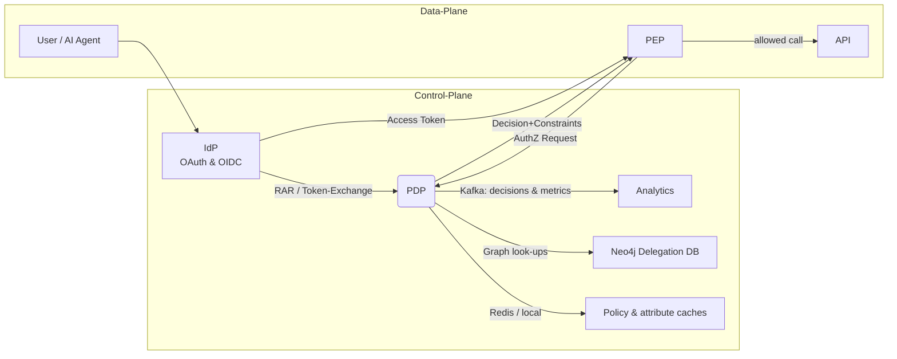
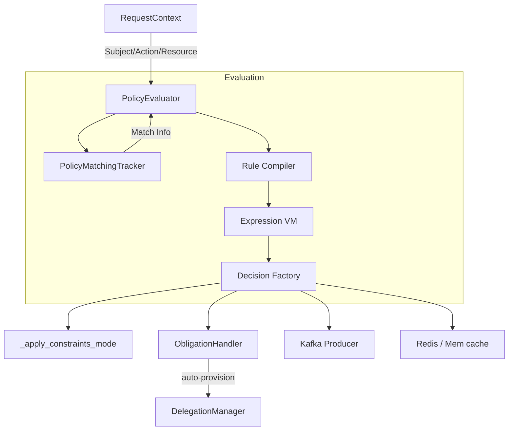

# Global-Scale AuthZEN PDP — CTO Technical Guide

*Version 2025  |  unrestricted distribution for evaluation purposes*

---

## 1  Executive Snapshot

Modern software estates are no longer human-only.  Micro-services, ML pipelines, serverless workers and **AI agents** must request access with the same governance, context and least-privilege guarantees we demand from people.

Our stack pairs an **OpenID-connect IdP** with a next-generation **AuthZEN-compliant Policy-Decision-Point (PDP)** to offer —

| Capability | What it solves | Where it lives |
|------------|----------------|----------------|
| Token Exchange + Rich-Authorisation-Request (RAR) | Grants short-lived, scoped tokens *after* policy evaluation | IdP (`token_exchange_service.py`) ↔ PDP batch endpoint |
| Delegation Graph w/ Constraints | Fine-grained *on-behalf-of* actions for AI agents, incl. spend-caps & expiry | Neo4j (**DelegationManager**) + PDP obligations |
| Separation of **Constraints** vs **Obligations** | PEP can enforce pre-conditions while post-conditions (audit, notify) run async | PDP core (`decision.py`, `explanation_generator.py`) |
| Learning-Mode | Observe would-be denies without breaking prod traffic | PDP (`learning_mode_registry.py`) + Kafka stream |
| Full Observability | Prometheus, OpenTelemetry, structured logs | `/metrics` endpoint, OTel exporter |

---

## 2  Why we built it

> **Thesis** — The next access wave is machine-centric & event-driven.  RBAC++ alone can't express *"TripMate may hold a ticket for < $4 500 on behalf of Alex only during working hours"*.

Design goals:
1. **Native non-human identities** (AIAgent, IoT, cron-jobs).  
2. First-class *delegation edges* with capabilities & constraints.  
3. **Batch decision** latency < 15 ms p95 under 10 000 req/s.  
4. Drop-in for any OIDC client – *no proprietary SDK lock-in.*

---

## 3  System Architecture



**Key points**
* IdP issues tokens **after** PDP evaluation (no "shadow" policy copy).  
* PDP streams every decision to Kafka → ClickHouse/Grafana dashboards in < 2 s.  
* Policy files are hot-reloaded via the file-watcher (no restart).

### 3.1  PDP internal pipeline



---

## 4  Deep-dive — AI Agent "TripMate" Flow

1. **Setup** — `Alex ⇢ TripMate` *DELEGATES_TO* edge with `spend_cap=4 500` seeded in graph.  
2. Client SPA calls **token-exchange** with RAR embedding three sub-actions (`search`, `hold`, `loyalty.read`).  
3. IdP forwards batch to `POST /access/v1/evaluations`.  PDP:  
   * Verifies delegation edge & constraint.  
   * Emits three *ALLOW* decisions + obligation `spend_cap`.
4. IdP mints JWT with:
   ```jsonc
   {
     "sub":"pers_123",         // Alex
     "act":{"sub":"agent_tm_001","rel":"onbehalf_of"},
     "authorization_details":[ ... ],
     "azp_constraints": {"spend_cap":4500}
   }
   ```
5. Booking-API PEP enforces spend-cap (`4000 ✔️`, `4600 ❌`).
6. **Revocation** — Ops flips edge to `revoked`; Redis pub/sub drops cached tokens in < 2 s.

---

## 5  Market Differentiators

| Feature | Ours | Typical PDP | Impact |
|---------|------|-------------|--------|
| **Delegation graph** with constraints | ✅ first-class | ⬜ rarely | Non-human identity, AI agents, B2B |  
| **Batch AuthZEN evaluation** | ✅ single HTTP round | ⬜ per-request loop | 10× latency drop for mobile & IoT |  
| **Learning-mode** | ✅ flag per subject | ⬜ no | Safe-mode rollout & auto-policy-mining |  
| **Constraints vs Obligations split** | ✅ explicit models | ⬜ mixed advice | Predictable PEP enforcement |  
| **File-watcher hot reload** | ✅ | ⬜ restart | No downtime policy pushes |  
| **Mermaid-ready explainability** | ✅  | ⬜ basic logs | CTO-friendly visual diffs |

---

## 6  Security & Compliance
* Full JWT PoP (DPoP & JARM) support.  
* OPA-style policy test-suite (≈ 400 cases in `tests/authzen`).  
* OpenTelemetry traces show **correlation-id** end-to-end.  
* Ready-made GuardDuty & Kusto rules for anomaly detection on Kafka stream.

---

## 7  Extensibility
* **Plugin registry** – drop a `pip` or `function` into `./plugins`, reload in seconds.  
* **PIPConfig** YAML lets ops tune timeouts, circuit-breaker, cache TTL.  
* DSL v2 compiler (`FEATURE_DSL_V2=1`) brings SQL-like predicate language for search endpoints.

---
