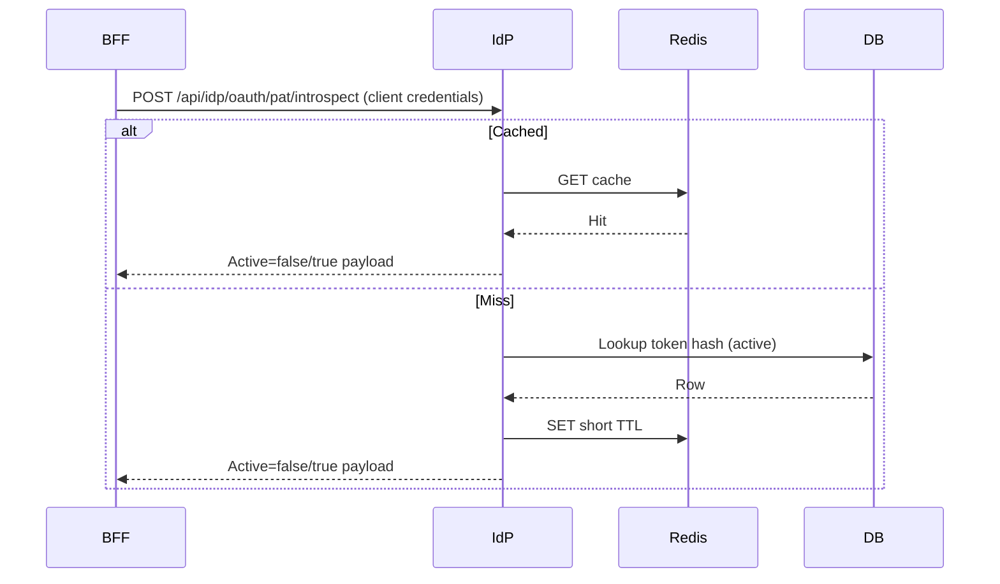

# PAT Introspection Hardening

## Access control
- Introspection endpoint is not public. Requires client credentials and `token.introspection` scope (or equivalent service allowlist).
- Enforce audience restrictions and allowed endpoints for the BFF service client in `clients.yaml`.



## Rate limiting
- Token bucket limits per caller and per token to prevent abuse.
- Return `429` with standard retry headers; instrument Prometheus counters.

## Circuit breaker
- Trips on repeated upstream/data-store failures; short-circuits to protect the IdP.
- Expose circuit metrics and an admin log event when state changes.

## Caching
- Redis cache for positive results with short TTL; local in-process TTL cache as a secondary.
- Negative cache with shorter TTL to avoid brute force.

## Telemetry
- Metrics: total calls, rate-limited, circuit open, cache hit/miss.
- Logs and audit entries include token prefix (no secrets), caller client_id, and subject ARN.

## Testing
- Unit tests for rate/CB thresholds, Redis optional mode, SQLite test mode.
- Integration tests cover issue → introspect → revoke flow and discovery metadata.

## Postman-friendly cURL
```bash
curl -sS \
  -H 'Content-Type: application/json' \
  -H 'Authorization: Bearer <service_token_or_client_credentials_result>' \
  -d '{"token":"aria_pat_XXXXXXXXXXXXXXXX"}' \
  https://idp.ocg.labs.empowernow.ai/api/idp/oauth/pat/introspect
```

## See also
- PAT lifecycle & policies: `PAT_Lifecycle_and_Policies.md`
- BFF client: `ms_bff_spike/ms_bff/src/services/pat_service.py`
