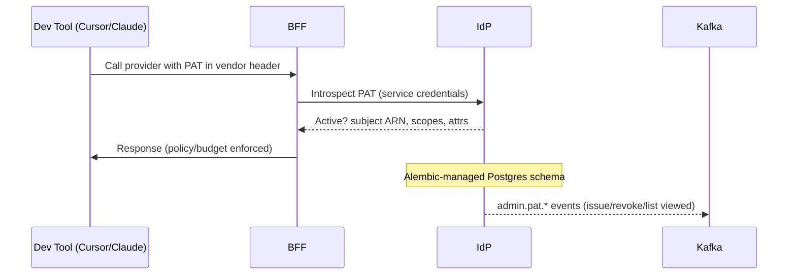

# PAT Lifecycle and Policies

## Token format & storage
- PATs are opaque to clients. The IdP stores only salted hashes of PAT values.
- Metadata (name, created_at, last_used_at, revoked_at) is stored alongside the hash.

## Issuance
- PATs can be issued via UI or API with optional expiry.
- Displayed once at creation; thereafter only token id and metadata are visible.

## Introspection
- BFF presents the PAT to IdP for introspection. The IdP validates hash and status, returns subject (ARN) and attributes.
- Introspection is protected by client credentials and rate-limited; results are cached (Redis + in-process TTL).
- Circuit breaker prevents cascading failures on IdP outages.

## Revocation
- Immediate logical revocation; cached validations expire per TTL.
- Mid-stream behavior: revocation affects new requests; existing streams are not forcibly terminated by IdP.

## Rotation
- Prefer issuing a new PAT, validate new traffic, then revoke the old PAT.
- Encourage shorter lifetimes and purpose-scoped naming.

## Audit
- Append-only audit ledger records PAT events; optional hash chain provides tamper evidence.
- Review `last_used_at` to detect stale tokens; alert on never-used tokens.
- Kafka business events emitted: `admin.pat.issued`, `admin.pat.revoked`, `admin.pat.list.viewed` (topic configurable; default `identity.events`).

## Security controls
- Introspection requires service-level credentials and appropriate scope.
- Rate limits per caller and per token; anomaly detection on unusual use.
- CSP/CORS and security headers enforced on IdP UI.

## Database & Migrations
- Runtime is Postgres-only; SQLite is not used in production.
- All schema changes are applied via Alembic before the IdP starts.

## See also
- UI Guide: `PAT_Management_UI_Guide.md`
- Introspection hardening: `PAT_Introspection_Hardening.md`
