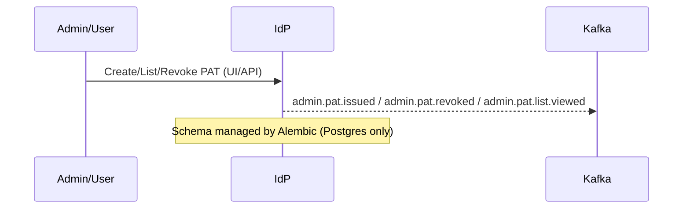

# PAT Management UI Guide

## Overview
The PATs page in the IdP UI lets admins and users issue, list, and revoke Personal Access Tokens used by dev tools to authenticate via the BFF proxy. The IdP stores only salted hashes and emits Kafka business events for issue/revoke/list views.



## Issue a PAT
1. Navigate to PATs.
2. Click “New PAT”. Provide a descriptive name (purpose/scope) and optional expiry.
3. Copy the token value when shown. It is displayed once only. Store securely.

## List & Search
- The grid lists PATs with columns like `id`, `name`, `created_at`, `last_used_at`, `revoked_at`.
- Use the search field to filter by name or id.

## Revoke a PAT
- Use the row action “Revoke”. Revocation is immediate; calls using the PAT will fail after introspection caches expire.

## Copy-once pattern
- The raw PAT is only shown at creation time. There is a separate action to copy the PAT id (not the secret).

## SWR and 304 optimizations
- The page uses a short SWR window and conditional GETs (If-None-Match, If-Modified-Since).
- When data hasn’t changed, the backend returns 304 and the UI keeps the cached list for instant rendering.

## Columns explained
- `last_used_at`: updated by the IdP upon successful introspection; useful to identify unused tokens.
- `revoked_at`: populated when revoked. Tokens with this set are invalid.

## Operational guidance
- Prefer short-lived PATs for high-risk contexts.
- Name tokens by purpose to aid audits (e.g., “cursor-dev-<initials>”).
- Periodically clean up unused PATs (no recent `last_used_at`).

## See also
- PAT lifecycle & policies: `PAT_Lifecycle_and_Policies.md`
- Introspection hardening: `PAT_Introspection_Hardening.md`

---

## API (Postman-friendly cURL)
These examples can be pasted into Postman (Import → Raw text) or terminal.

Issue a PAT:
```bash
curl -sS \
  -H 'Content-Type: application/json' \
  -H 'Authorization: Bearer <your_session_or_admin_token>' \
  -d '{
    "label": "cursor-dev-jd",
    "scopes": ["openid"],
    "ttl_days": 90,
    "client_id": null,
    "tenant_id": "t1",
    "user_arn": "arn:empowernow:iam::t1:user/jdoe"
  }' \
  https://idp.ocg.labs.empowernow.ai/api/idp/oauth/pat
```

List PATs for a user:
```bash
curl -sS \
  -H 'Authorization: Bearer <your_session_or_admin_token>' \
  'https://idp.ocg.labs.empowernow.ai/api/idp/oauth/pat?tenant_id=t1&user_arn=arn:empowernow:iam::t1:user/jdoe'
```

Revoke a PAT:
```bash
curl -sS -X DELETE \
  -H 'Authorization: Bearer <your_session_or_admin_token>' \
  https://idp.ocg.labs.empowernow.ai/api/idp/oauth/pat/pat_123
```

Introspect a PAT (service-to-service):
```bash
curl -sS \
  -H 'Content-Type: application/json' \
  -H 'Authorization: Bearer <service_token_or_client_credentials_result>' \
  -d '{"token":"aria_pat_XXXXXXXXXXXXXXXX"}' \
  https://idp.ocg.labs.empowernow.ai/api/idp/oauth/pat/introspect
```
