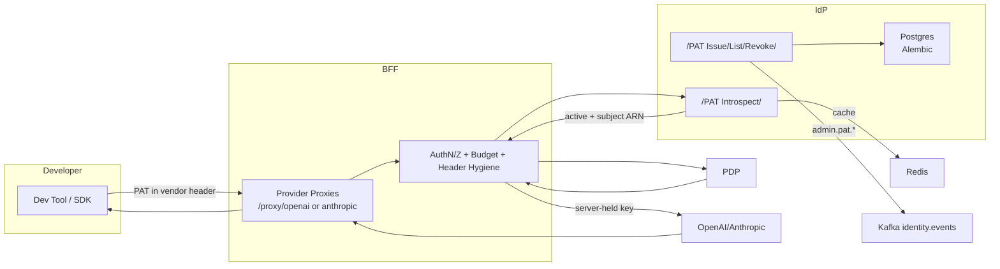

# System Architecture: PATs with the BFF OpenAI/Anthropic Proxy

## Purpose and Scope
- What we built: IdP-issued Personal Access Tokens (PATs) that dev tools (Cursor, VS Code/Continue, Claude Code) use with a BFF that proxies OpenAI/Anthropic. The BFF authenticates the user (via PAT introspection), enforces policy/budgets, and calls providers with server-held credentials.
- Why: centralize provider key custody, apply consistent authorization and spend controls, and gain observability; eliminate vendor keys in clients.
- Scope: IdP PAT lifecycle + introspection; BFF provider proxies + policy/budget + header hygiene; PDP integration; outage policy.

## Key Design Decisions
- IdP stores only salted `sha256(token)` + metadata; raw PAT shown once at issue time.
- Postgres-only runtime; all schema managed via Alembic before app start (no runtime DDL).
- IdP exposes `POST /api/idp/oauth/pat/introspect` for BFF; protected with service credentials; rate-limited; short cache (Redis + local TTL).
- BFF extracts vendor-native headers, classifies token (JWT vs PAT), calls introspection for PATs, constructs identity-first subject `(user_arn, agent:devtool:client|generic:pairwise)` and enforces PDP/budgets.
- Header hygiene: strip inbound credentials/org headers; pin upstream org/project on the server.
- Outage policy (LKG): bounded fallback for PDP outages; decisions audited.
- Kafka events: IdP emits `admin.pat.issued|revoked|list.viewed` to `ADMIN_KAFKA_TOPIC` (stack default `identity.events`).

### Single-tenant deployments
- Each deployment is single-tenant. `tenant_id` is treated as an instance label derived server-side (config), not provided by clients.
- It participates in pairwise ID derivation and labels metrics/audit; keeping it in schemas/responses future-proofs limited multi-tenant or aggregate telemetry without burdening clients.

## What was created (IdP) — components and purpose
- Endpoints (FastAPI)
  - `POST /api/idp/oauth/pat`: Issue a PAT (returns raw once). Purpose: secure issuance with server-side hashing and metadata.
  - `GET /api/idp/oauth/pat`: List caller/admin-visible PATs. Purpose: visibility and lifecycle management.
  - `DELETE /api/idp/oauth/pat/{pat_id}`: Revoke. Purpose: immediate invalidation (subject to short cache TTLs).
  - `POST /api/idp/oauth/pat/introspect`: Validate PAT and return canonical identity. Purpose: BFF auth; protected service-to-service.
- Repository (Postgres JSONB)
  - `PgPATRepository` on table `idp.personal_access_tokens`. Purpose: durable storage, hashed tokens, lifecycle timestamps.
- Optional audit ledger
  - `PgPATAuditRepository` with append-only hash chain. Purpose: tamper-evident audit of PAT events.
- Kafka business events
  - `admin.pat.issued`, `admin.pat.revoked`, `admin.pat.list.viewed`. Purpose: admin/audit telemetry to `identity.events` (configurable).
- Caching & resilience
  - Redis micro-cache for successful introspects; rate limiting and a small breaker. Purpose: protect the IdP and lower latency.
- Migrations & runtime
  - Alembic-managed schema (Postgres-only). Purpose: predictable deployments, no runtime DDL in the app.

## What was created (BFF) — components and purpose
- Provider proxies
  - `POST /proxy/openai/v1/...`, `POST /proxy/anthropic/v1/...`. Purpose: single entry for dev tools; normalize models; stream passthrough.
- Auth middleware & services
  - Token classifier in middleware; `pat_service` for discovery, caching, rate limiting, circuit breaker. Purpose: robust PAT authN path.
- PDP + budgeting integration
  - Build subject `(user_arn, agent_id)`; call PDP; hold/settle budgets; LKG outage policy. Purpose: enforce policy and spend controls.
- Header hygiene & pinning
  - Strip inbound credentials/org headers; set server-held keys and pinned org/project. Purpose: prevent exfiltration and drift.
- Metrics & observability
  - Introspect totals/limits/breaker metrics; proxy latencies; stream cancellations. Purpose: SLOs and incident response.
- Routing
  - Public proxy routes; PAT admin routes mapped to PDP actions (`list|issue|revoke`); introspect is bearer-only service-to-service.

## Security Posture and Rationale
- Remove provider keys from clients; concentrate trust in BFF with rotation controls and audit.
- Least-privilege: PATs scoped by policies; BFF enforces PDP and egress allowlists.
- Short TTL caches for introspection; circuit breaker to avoid cascading failure.
- Transparent streaming passthrough to avoid buffering sensitive payloads at rest.

## Implementation Overview
- IdP
  - `src/api/pat.py`: issue/list/revoke/introspect; Redis-assisted caching; Kafka admin events.
  - `src/repositories/postgres_pat_repository.py`: JSONB table `idp.personal_access_tokens` (Core + async sessions).
  - `alembic`: schema migrations; compose service `idp-alembic` runs `upgrade head` using secret DSN.
- BFF
  - `src/middleware/auth.py`: vendor header extraction, token classification.
  - `src/api/v1/endpoints/provider_proxies.py`: authenticates PAT users, strips headers, delegates.
  - `src/services/pat_service.py`: discovery, micro-cache, rate limit, circuit breaker.
  - `ServiceConfigs/BFF/config/routes.yaml`: public proxy routes; PAT admin routes with PDP mapping.
- PDP
  - Resource types `llm:proxy:openai|anthropic`; action `invoke`; inputs include normalized model and agent_id.

## Interfaces and Contracts (at a glance)
- IdP introspection response: `version, active, tenant_id, user_arn, identity_arn?, scopes, client_id?, pairwise, expires_at, pat_id, prefix`.
- BFF subject construction: subject = `user_arn`; agent_id = `agent:devtool:{client_id|generic}:{pairwise}`.
- PDP resource: `llm:proxy:{openai|anthropic}`; action: `invoke`.
- Admin routing: `GET/POST /api/idp/oauth/pat` and `DELETE /api/idp/oauth/pat/{id}` mapped to `idp:pat:{list|issue|revoke}`.

## Alternatives Considered
- Vendor keys per-user in the client: rejected (distribution risk, rotation burden, header drift).
- JWT-only for tools: not always supported by dev tools; PATs are a drop-in replacement for API keys.
- Runtime DDL for PAT table: rejected; Alembic ensures predictable deployments and rollback.

## Operational Characteristics
- Observability: BFF metrics for introspection totals/limits/breaker; proxy latencies; stream cancellations. IdP PAT Kafka events and introspect metrics.
- Rate limiting & CB: tunables at IdP/BFF; playbooks documented.
- Incident response: PAT leak, PDP outage (LKG), provider outage, Redis failure.

## Contracts and Examples
- Developer Quickstart: `Developer_Quickstart_PAT_Proxy.md`
- Proxy API Reference + cURL: `Proxy_API_Reference.md`
- IdP UI & Admin guides: `IdP/docs/PAT_Management_UI_Guide.md`, `PAT_Lifecycle_and_Policies.md`, `PAT_Introspection_Hardening.md`

## Configuration Summary
- IdP: `SQL_DATABASE_URL` (secret pointer), `PAT_PAIRWISE_SALT`, `REDIS_URL`, `ADMIN_KAFKA_TOPIC`.
- BFF: `OPENAI_API_KEY`, `ANTHROPIC_API_KEY` (secrets), IdP discovery URLs, `ENABLE_PROVIDER_PROXIES`.
- Traefik/Routes: public `/proxy/*` exposed; PAT admin endpoints session+PDP; introspect bearer-only.

## Future Work
- Signed-row audit ledger for PATs (hash chain) as primary.
- Expand model alias governance and org/project policy pinning.
- Broader Postman collections for PAT lifecycle and proxy calls.
