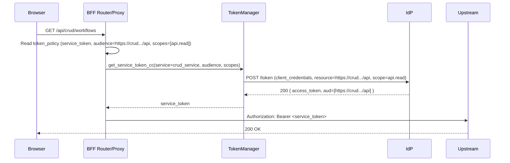
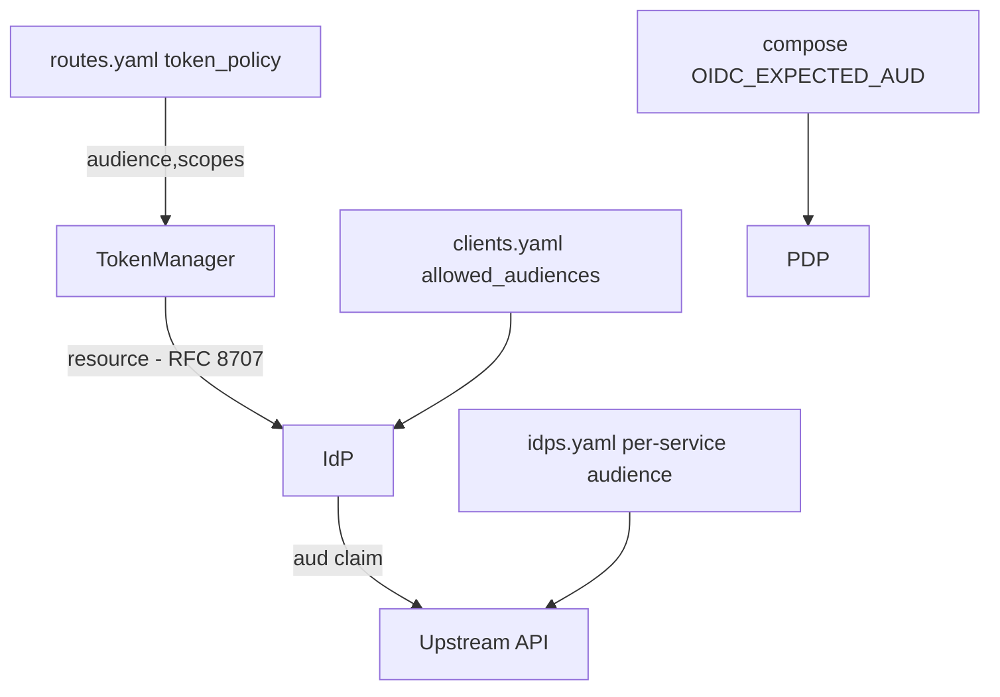

### URL audiences and per‑route token policy (Guidance)

This document explains how to align audiences with HTTPS URLs and use per‑route token policies with RFC 8707 resource to mint the right tokens server‑side.

#### Why
- Precise audience per API avoids 401s and reduces blast radius.
- BFF mints least‑privilege backend tokens per route; browser only holds a minimal session token.
- Matches leading vendors: URL audiences, CC for backend, OBO where user context is required.

#### Core rules
- Use HTTPS URL audiences per resource server (IdP Admin, CRUD, PDP). Avoid generic audiences for external APIs.
- In BFF `routes.yaml`, add `token_policy` and mint tokens with `resource=<URL audience>` (RFC 8707).
- Keep browser login scopes minimal; elevate only via backend tokens.

#### Checklist (what to change)
- ServiceConfigs/CRUDService/config/idps.yaml
  - empowernow.audience: https://crud.ocg.labs.empowernow.ai/api
- ServiceConfigs/BFF/config/idps.yaml
  - empowernow-crud.audience: https://crud.ocg.labs.empowernow.ai/api
  - Add `empowernow-pdp` if BFF calls PDP with CC: audience https://authz.ocg.labs.empowernow.ai/api
- ServiceConfigs/pdp/config/idps.yaml
  - If PDP accepts CC to its own API: audience https://authz.ocg.labs.empowernow.ai/api (not generic)
- ServiceConfigs/BFF/config/routes.yaml
  - CRUD routes token_policy.audience: https://crud.ocg.labs.empowernow.ai/api
  - PDP admin routes token_policy.audience: https://authz.ocg.labs.empowernow.ai/api; scopes minimal (e.g., pdp.*), not application.all
- ServiceConfigs/IdP/config/clients.yaml (bff-server and CC clients)
  - allowed_audiences include https://crud.ocg.labs.empowernow.ai/api and https://authz.ocg.labs.empowernow.ai/api
  - CC enabled; prefer RFC 8707 resource; avoid application.all on browser clients
- CRUDService/docker-compose-authzen4.yml (pdp service env)
  - OIDC_EXPECTED_AUD includes https://authz.ocg.labs.empowernow.ai/api

#### Mermaid: per‑route token acquisition

#### Mermaid: config surfaces

#### Notes
- For PDP, replace application.all with minimal PDP admin scopes when available (e.g., pdp:read/pdp:write).
- Use OBO only when upstreams require user context; otherwise prefer CC.

#### Rollout tips
- Add token_policy incrementally; verify upstream accepts URL audience; monitor 401s.
- Keep an allow‑list of acceptable audience hosts in BFF settings.

