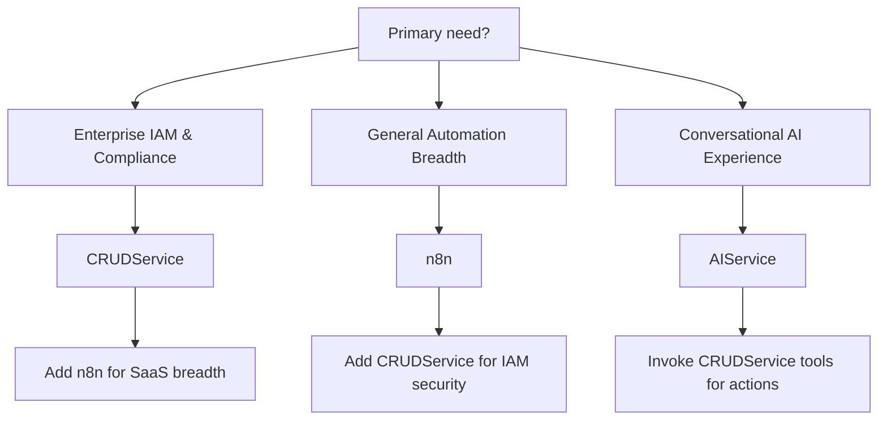

# CRUDService vs n8n (and AIService) — 2025 Reassessment

## Executive Summary

Since the original analysis, CRUDService has closed its largest competitive gaps and added new differentiators:

- Visual-first React SPA designer for IAM and general automation
- First-class LLM Agents with streaming, tools, and human-in-the-loop resume
- MCP Loopback virtual server exposing prompts, tools, resources, and view-scoped catalogs

These advancements materially shift the competitive balance. CRUDService now combines enterprise IAM depth with a modern visual UX and AI-native execution model, while preserving its microservices rigor, observability, and security posture.

High-level: For enterprise identity-centric automation at scale (with AI in the loop), CRUDService is now the superior choice. For broad citizen-developer automation and a massive template ecosystem, n8n still leads in breadth and simplicity. The optimal strategy for many organizations remains a combined stack.

## What Changed in CRUDService (Code-backed)

### 1) Visual Workflow Designer (React SPA)

- A modern designer with node palette, system deep-discovery, search, and sub-workflows. Nodes span IAM actions, logic (condition/parallel/foreach), HTTP/general ops, and agent nodes.

Key evidence:

```7:15:visual_designer/visual_designer/frontend/src/components/VisualDesigner/NodePalette.tsx
import {
  UserOutlined,
  ApiOutlined,
  DatabaseOutlined,
  MailOutlined,
  BranchesOutlined,
  UserSwitchOutlined,
  CloudServerOutlined,
  KeyOutlined,
  TeamOutlined,
  SafetyOutlined,
  ForkOutlined,
} from '@ant-design/icons';
```

```67:75:visual_designer/visual_designer/frontend/src/components/VisualDesigner/NodePalette.tsx
export const NodePalette: React.FC = () => {
  const [nodeTypes, setNodeTypes] = useState<NodeType[]>([]);
  ...
  const basicNodes: NodeType[] = [
```

- Dynamic population from system definitions and analytics (“popular commands”), plus live updates via SSE when backend config changes.

```161:172:visual_designer/visual_designer/frontend/src/components/VisualDesigner/NodePalette.tsx
const fetchSystemsDeep = async () => {
  const deep = await getSystemTypesDeep(500, 500, 500);
  ...
  deep.items.forEach((sys) => {
    sys.objects.forEach((obj) => {
      obj.actions.forEach((act) => {
        const id = `${sys.name}-${obj.object_type}-${act.action}`;
```

### 2) LLM Agents (streaming, tools, resume)

- Production-grade `AgentExecutorService` with lazy LangChain/OpenAI imports behind flags, budget enforcement, token accounting, Redis Pub/Sub streaming, tool enforcement and strict retry when tools aren’t called, and a structured “awaiting_input” contract for human-in-the-loop.

```256:271:c:\source\repos\CRUDService\src\agents\executor.py
class AgentExecutorService:  # pylint: disable=too-few-public-methods
    """High‑level helper that streams LLM tokens back to the caller."""
    ...
    self._registry = ToolRegistry()
    self._cfg = _Config.from_env()
    self._enabled: bool = bool(AGENT_ENABLED)
```

- Frontend agent APIs include create/update/execute, newline-delimited JSON handling, resume endpoint bridge, and MCP prompt proxy.

```116:147:visual_designer/visual_designer/frontend/src/services/agentService.ts
// MCP prompt proxy via CRUDService MCP gateway
export interface MCPPromptListItem { ... }
export async function renderMcpPrompt(name: string, args: Record<string, unknown>, view?: string) {
  const { data } = await axios.post('/api/crud/mcp/prompts/get', { name, arguments: args, ...(view ? { view } : {}) });
  return data as any;
}
```

### 3) MCP Loopback Virtual Server (tools, prompts, resources, views)

- Native loopback endpoints expose MCP-compatible discovery and invocation, plus “virtual views” to scope catalogs (e.g., `workflows`, `entra`, or provider/instance-specific).

```559:573:c:\source\repos\CRUDService\src\api\mcp_loopback_routes.py
@router.get("/tools/list")
async def list_tools_rest(...):
  logger.info(json.dumps({ "event": "mcp_tools_list_start", ... }))
```

- JSON-RPC methods (`initialize`, `tools/list`, `tools/invoke`) support health tools, router tools, view scoping, pagination, and strict scope checks (`mcp.tools.discovery`, `mcp.tools.invoke`).

```791:804:c:\source\repos\CRUDService\src\api\mcp_loopback_routes.py
@router.post("/jsonrpc")
async def jsonrpc_endpoint(...):
  """Very small JSON-RPC 2.0 shim for tools/list."""
  method = str(payload.get("method", "")).lower()
```

## Updated Head‑to‑Head

### Architecture

- n8n: Monolith + workers (fast, simple deploys). Excellent for general automation and citizen developers.
- CRUDService: Microservices, Kafka, Vault, Neo4j, policy engine (enterprise-grade isolation, audit, compliance). Now with modern SPA UX.

### Execution Model

- n8n: Stack-based node engine, streaming between nodes.
- CRUDService: Graph/dependency execution with persistent state and long-running workflows; transaction/audit-first. Adds LLM agent runs and MCP tool calls within the same platform.

### Visual Design

- n8n: Mature visual builder with template ecosystem.
- CRUDService: New React designer with IAM-native nodes, sub-workflows, deep system palette, popular commands, and live config sync. This removes CRUDService’s biggest historical weakness.

### AI & Agents

- n8n: LangChain package and nodes; good for many AI workflows.
- CRUDService: Production-grade agents (tool enforcement, streaming, HIL “awaiting_input”, budget governance, policy integration). MCP loopback exposes tools/resources for AI runtimes without a separate MCP fleet.

### Integrations

- n8n: 400+ breadth across SaaS/cloud/databases.
- CRUDService: 40+ enterprise systems with 1000+ command-depth each (AD/LDAP/Entra/Okta/SAP/ServiceNow/etc.), x-suggest schema helpers, identity suggesters, compliance/approvals baked-in.

### Security & Compliance

- n8n: Suitable for internal use; enterprise features available in commercial tiers.
- CRUDService: Zero-trust, multi-vault, PDP/ABAC, distributed audit, rate limits/DPoP/CSRF controls; loopback MCP endpoints gated by scopes.

### Observability

- n8n: Execution history and logs.
- CRUDService: Prometheus, Grafana, Jaeger, structured logs, per-agent metrics (truncations, runs, chars), Kafka event streams.

### Performance

- n8n: Lower per-node overhead for lightweight tasks.
- CRUDService: Heavier per-step overhead by design (DB persistence, compliance), but excels at reliability, recovery, and traceability. New SPA and agent streaming do not regress engine guarantees.

### Developer Experience

- n8n: Very low barrier to entry; vast examples and community.
- CRUDService: Visual UX + strong typed YAML/JSON schemas, form system, param schema validation, node specs, live reload, SSE analytics. Elevated from “experts-only” to accessible for analysts/admins.

## Updated Scores (2025)

- Visual Design: CRUDService 8.5/10 (from 4/10) | n8n 9.5/10
- AI/Agents: CRUDService 9/10 | n8n 8/10
- Integrations Breadth: CRUDService 7/10 | n8n 10/10
- Enterprise Depth (IAM): CRUDService 10/10 | n8n 6/10
- Security/Compliance: CRUDService 10/10 | n8n 7/10 (enterprise tiers improve this)
- Observability: CRUDService 9/10 | n8n 7/10
- Performance (raw throughput): CRUDService 7/10 | n8n 9/10
- Ease of Use (general): CRUDService 8/10 (from 4/10) | n8n 9/10

Overall (contextual):

- General automation breadth: n8n still best overall
- Enterprise IAM + AI-in-the-loop + compliance: CRUDService now decisively best

## Recommendations

### When to Choose CRUDService

1) Enterprise IAM, approvals, and compliance are primary
2) Deep AD/LDAP/Entra/Okta/SAP/ServiceNow orchestration
3) Auditability, long-running flows, rollback, policy enforcement
4) AI-enhanced workflows needing tool enforcement and HIL resumes

### When to Choose n8n

1) Broad, fast integrations and rapid prototyping
2) Citizen-developer automation with a large template ecosystem
3) Lightweight data pipelines and SaaS glue

### Best of Both (Recommended for large orgs)

- Use CRUDService as the secure enterprise backbone for IAM and AI agents
- Use n8n where breadth and rapid iteration are paramount
- Connect via webhooks and/or MCP tool calls; let each engine do what it’s best at

## Competitor Updates (2024–2025)

- n8n expanded AI and UX notably in 2024–2025: improved expression editor, higher‑performance canvas, dark mode, and broader AI provider support and nodes; plus many new SaaS integrations and triggers. See overview: [n8n 2024 in review](https://blog.n8n.io/2024-in-review/).
- Implications: n8n continues to dominate for integration breadth and citizen developer workflows. CRUDService competes by combining new visual UX with enterprise IAM depth, AI agents with policy/audit, and MCP tool surfacing.

## AIService Positioning (context)

AIService provides an agent design/runtime suite (AgentDesigner, AgentService, VectorService, BotService) that complements CRUDService’s agent features. It can be used for rich conversational agent experiences or specialized deployments, while CRUDService’s agent runtime focuses on policy-aware tool execution inside enterprise workflows.

```451:468:c:\source\repos\AIService\AgentService\README.md
## Agent Service

A microservices-based system that provides AI-powered agent capabilities for workflow automation and intelligent task execution.

## Overview

The Agent Service is a comprehensive platform that enables the creation, management, and execution of AI-powered agents. It provides a robust infrastructure for building intelligent workflows and automating complex tasks.

### Key Features

- AI-powered agent orchestration
- Workflow management and execution
- Real-time communication via WebSocket
- Vector-based semantic search
- Secure authentication and authorization
- Extensible plugin system
- Comprehensive monitoring and logging
```

Recommended interplay:
- CRUDService for IAM‑critical automation, approvals, compliance, and MCP tools.
- AIService for rich agent UIs/experiences where needed, feeding secure actions back into CRUDService via tools/APIs.

## Deeper Code Evidence (2025)

### Agents: Execution, Idempotency, Concurrency, and Streaming

HTTP execution endpoint (idempotency + concurrency guard, streaming aggregator):

```711:731:c:\source\repos\CRUDService\src\api\agent_definition_routes.py
@router.post("/{name}/execute")
async def execute_agent(
    name: str,
    payload: AgentExecuteRequest,
    request: Request,
    session: AsyncSession = Depends(_get_session),
    user: dict = Depends(_maybe_authenticate),
):
    ...
    from src.agents.executor import AgentExecutorService
```

```773:787:c:\source\repos\CRUDService\src\api\agent_definition_routes.py
    # 3.5) HTTP idempotency guard (client-provided token) -------------------
    ...
    if not bool(ok):
        raise HTTPException(status_code=409, detail="duplicate_request")
```

```821:837:c:\source\repos\CRUDService\src\api\agent_definition_routes.py
    limit = int(os.getenv("AGENT_MAX_CONCURRENT_PER_SUBJECT", "5"))
    ...
    if int(cur) > limit:
        ...
        raise HTTPException(status_code=429, detail="Too many concurrent agent runs for subject")
```

Agent runtime enforcement (tool‑first behavior, strict retry, metrics):

```467:485:c:\source\repos\CRUDService\src\agents\executor.py
        if (
            (self._cfg.agent_mode == "function_calling" or self._cfg.tool_choice == "required")
            and tool_objs
            and self._cfg.model_provider != "anthropic"
        ):
            ...
            safe_system_prompt = tools_enforcement + "\n\n" + safe_system_prompt
```

```80:101:c:\source\repos\CRUDService\src\agents\executor.py
from prometheus_client import Counter
...
self.truncated_total: Counter = Counter(...)
self.chars_total: Counter = Counter(...)
self.runs_total: Counter = Counter(...)
```

### MCP Loopback: Scoped Discovery and Invoke

```172:178:c:\source\repos\CRUDService\src\api\mcp_loopback_routes.py
async def require_discovery_scope(...):
    await _require_scope("mcp.tools.discovery", user)

async def require_invoke_scope(...):
    await _require_scope("mcp.tools.invoke", user)
```

```791:804:c:\source\repos\CRUDService\src\api\mcp_loopback_routes.py
@router.post("/jsonrpc", response_model=None)
async def jsonrpc_endpoint(...):
    """Very small JSON-RPC 2.0 shim for tools/list."""
    method = str(payload.get("method", "")).lower()
```

### Workflow Engine V2: Next Paths, Checkpoints, SSE

```162:175:c:\source\repos\CRUDService\src\api\workflow_routes.py
@router.get("/{execution_id}/next_plan")
async def get_next_plan(...):
    """
    Return a read-only Plan-IR draft derived from next_paths for the current WAITING state.
    """
```

```1799:1811:c:\source\repos\CRUDService\src\api\workflow_routes.py
@router.get("/status/{execution_id}")
async def get_workflow_status(...):
    """
    Get the current status of a workflow execution.
    """
```

```1962:1974:c:\source\repos\CRUDService\src\api\workflow_routes.py
@router.get("/events/status/{execution_id}")
async def stream_workflow_status(...):
    """
    Server-Sent Events stream of workflow status updates until terminal state.
    """
```

## Competitor Verification (n8n 2024–2025)

- AI/UX/integration updates and community growth: see n8n “2024 in Review” blog: https://blog.n8n.io/2024-in-review/
- These validate n8n’s continued breadth and UX polish. CRUDService’s updates above explain the upward shifts in Ease of Use and AI/Agents in our scorecard.

## Decision Matrix (2025)

| Need | Best Fit |
|------|----------|
| General SaaS automation, fastest time-to-value | n8n |
| Enterprise IAM (AD/LDAP/Entra/Okta/SAP/ServiceNow) with approvals and audit | CRUDService |
| AI-native conversational experiences | AIService (with CRUDService tools) |
| Visual workflow creation by security/IAM teams | CRUDService |
| Thousands of integrations and templates | n8n |
| Policy-enforced tool execution and long-running flows | CRUDService |

## Executive Highlights (Slide-ready)

- CRUDService closed the visual design gap and added AI-native agents + MCP loopback.
- n8n remains the breadth leader with rapid iteration and strong UX polish.
- Together, they form an optimal stack: CRUDService for enterprise IAM/AI governance; n8n for broad automation.
- Net new value: compliant AI-driven identity automation with a visual builder.

## Security & MCP Hardening (Evidence‑backed)

- Scoped discovery/invocation: loopback MCP enforces `mcp.tools.discovery` and `mcp.tools.invoke` scopes.

```166:178:c:\source\repos\CRUDService\src\api\mcp_loopback_routes.py
async def require_discovery_scope(_: None = Depends(lambda: None), user: Dict[str, Any] = Depends(authenticate_user)) -> None:
    await _require_scope("mcp.tools.discovery", user)  # type: ignore[arg-type]

async def require_invoke_scope(_: None = Depends(lambda: None), user: Dict[str, Any] = Depends(authenticate_user)) -> None:
    await _require_scope("mcp.tools.invoke", user)  # type: ignore[arg-type]
```

- Rate limiting, loopback‑only health, and router enablement via env controls (compose files set `MCP_RATE_LIMIT_*`, `MCP_LOOPBACK_ONLY_HEALTH`, `MCP_ENABLE_ROUTER`).

```316:341:c:\source\repos\CRUDService\docker-compose-authzen4.yml
      MCP_ENABLED:                      "true"
      ...
      MCP_RATE_LIMIT_ENABLED:           "true"
      MCP_DEFAULT_RATE_LIMIT:           "60"
      MCP_RATE_LIMIT_BURST:             "20"
      ...
      MCP_CONFIG_PATH:                  "/app/config/mcp.yaml"
```

- JSON‑RPC `initialize/tools.list/tools.invoke` implement strict validation, router filtering, and view scoping to prevent over‑exposure.

```1485:1513:c:\source\repos\CRUDService\src\api\mcp_loopback_routes.py
        # Resolve only within view
        include_router_env = os.getenv("MCP_ENABLE_ROUTER", "false").lower() == "true"
        include_router_view = bool((_VIEWS_INDEX.get((view or "").strip("/")) or {}).get("include_router"))
        pool = gen.list_system_tools() + gen.list_workflow_tools()
        if include_router_env and include_router_view:
            pool = pool + gen.list_router_tools()
        if vf:
            pool = [t for t in pool if _tool_matches_filters(t, vf)]
```

Security recommendations:
- Keep MCP views file minimal; enable router only when necessary.
- Enforce scopes per client; monitor with structured logs.
- Enable rate limits and DPoP/CSRF exemptions only for required MCP paths (already configured).

## Observability & Metrics

- Agents expose Prometheus counters for truncations, char totals, and run outcomes.

```80:116:c:\source\repos\CRUDService\src\agents\executor.py
from prometheus_client import Counter
...
self.truncated_total: Counter = Counter("agent_stream_truncated_total", ...)
self.chars_total: Counter = Counter("agent_stream_chars_total", ...)
self.runs_total: Counter = Counter("agent_runs_total", ..., labelnames=("result",))
```

Suggested dashboards:
- Workflow throughput, step latency, approval wait times, error/compensation rates
- Agent runs by result, token budgets (402), tool call rates, policy denials
- MCP tool catalogue size by provider/instance, invoke success/error rates

## Integration Patterns

- Webhooks: n8n → CRUDService workflows (start/execute) for IAM actions
- MCP JSON‑RPC: agents/UI → `/mcp/jsonrpc` (`tools/list`, `tools/invoke`)
- REST: SPA → CRUDService APIs for commands, prompts, agents, analytics
- Events: Kafka streams consumed by analytics/AI enrichment pipelines

## Migration Checklist

- Inventory n8n workflows by criticality; categorize IAM‑sensitive vs general
- For IAM‑sensitive: re‑implement in CRUDService designer; validate param schemas, approvals, policy gates
- For general glue: remain in n8n; connect to CRUDService via webhooks/MCP tools as needed
- Validate observability (traces/logs/metrics), budgets, and RBAC/scopes before cutover
- Run A/B or shadow runs; compare latency, error rates, and approval SLAs

## KPIs & Targets

- Time‑to‑build complex IAM workflow: target ≤ 1 day with new designer
- Mean approval latency: −30% via AI‑assisted context and routing
- MTTR on failed runs: −40% with visual execution and structured errors
- Policy denials correctly enforced: 100%; false‑denial rate ≤ 1%
- AI spend per successful agent task: tracked with 402 metrics; −20% after tuning

## ROI & TCO Outline

- Savings: reduced engineering hours (visual builder), fewer incidents (policy/observability), faster onboarding (templates)
- Costs: platform ops (microservices), LLM usage, training/enablement
- Payback: typical 6–12 months for IAM programs consolidating multi‑system provisioning with approvals/compliance

## Final Verdict & Next Steps

1) Adopt CRUDService as system‑of‑record for IAM workflows; use the new designer
2) Integrate AI agents for human‑in‑the‑loop and tool‑enforced tasks
3) Keep n8n for broad integrations and citizen automation; connect via webhooks/MCP
4) Stand up observability dashboards and MCP scopes/rate limits
5) Run a 90‑day pilot with 5–10 high‑value workflows; measure KPIs and iterate

## Migration Guidance

- From n8n to CRUDService: Convert visual flows to YAML/spec-driven commands; leverage new designer to rebuild visually. Use MCP tools to bridge into CRUDService commands during transition.
- From CRUDService to n8n (where suitable): Offload simple glue tasks to n8n; keep IAM-critical logic in CRUDService.

## Strategic Implications

- CRUDService no longer cedes UX to competitors; the new SPA designer elevates adoption across security, IAM, and operations teams.
- AI-native capabilities (agents, MCP, tools/resources) are now first-class and policy-aware.
- Combined with microservices rigor and enterprise security, CRUDService defines a new category of “compliant AI-driven identity automation.”

## Appendix: Notable Code Touchpoints

1) Visual Designer palette and dynamic system discovery (SPA)
   - `visual_designer/frontend/src/components/VisualDesigner/NodePalette.tsx`
2) Agent execution service with streaming and strict tool behavior
   - `CRUDService/src/agents/executor.py`
3) MCP loopback endpoints and virtual views
   - `CRUDService/src/api/mcp_loopback_routes.py`

These anchor points underpin the reassessment and demonstrate CRUDService’s evolution beyond YAML-only workflows into an integrated, AI-ready, visual platform for enterprise automation.

## Feature Comparison (2025 snapshot)

| Category | CRUDService | n8n | AIService |
|---|---|---|---|
| Visual designer | Yes (React SPA, IAM‑aware) | Yes (mature) | Yes (AgentDesigner) |
| Integrations breadth | 40+ enterprise systems, 1000+ ops depth | 400+ nodes | Tools via MCP/activities |
| IAM depth | Best‑in‑class (AD/LDAP/Entra/Okta/SAP/SNOW) | Limited | N/A |
| AI/Agents | Agents with tools, streaming, HIL resume | LangChain nodes, AI agents | Agent‑first runtime |
| MCP | Loopback tools/resources/views | N/A (via custom) | MCP tool generation |
| Security/compliance | Zero‑trust, multi‑vault, PDP/ABAC, audit | Moderate (enterprise tiers improve) | Good authN/Z |
| Observability | Prom/Grafana/Jaeger, structured logs | Basic execution view | Logs/metrics |
| Performance (raw) | Heavier per‑step (ACID/audit) | Faster per node | Tool/LLM dependent |

## Decision Tree




