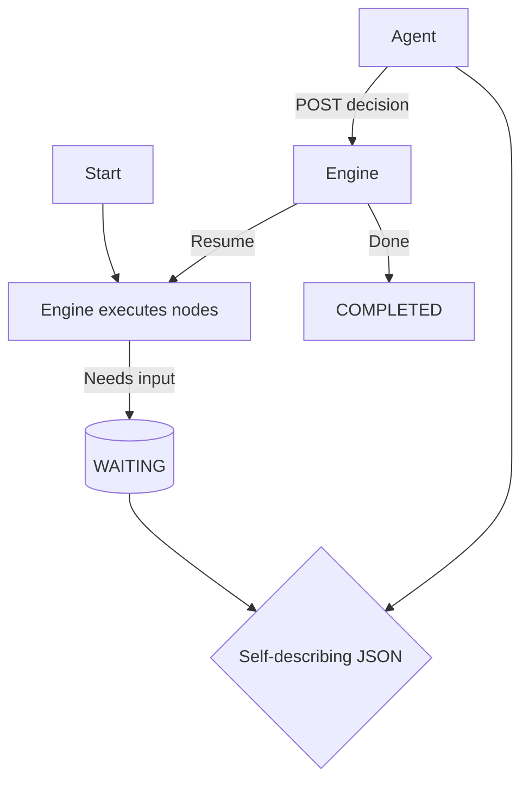

# Self-Describing Workflow Responses – External Overview

CRUD Service workflows return **agent-friendly JSON** so that human UIs *and* automated agents (LLMs, RPA bots, etc.) can drive a process without custom SDKs.  This document explains the principle and the response format—no deep code details required.

---

## 1  Why Self-Describing Responses?

1. **Zero-Shot Automation** – an agent receives enough information in every response to know *what action is required* and *how to perform it*.
2. **Traceability** – correlation IDs and flattened results make every step easy to audit.
3. **Tool Agnosticism** – pure JSON over REST; works with Python, JavaScript or prompt-based agents equally well.

---

## 2  The Three Pillars of Explainability

Each wait-state response contains:

| Field | Purpose |
|-------|---------|
| `required_action` | Human-readable description of what must happen next (approve, fill a form, choose an option…). |
| `request_format`  | Machine-readable template (method, URL, body) the agent can copy-paste to perform the action. |
| `ai_context`      | Short guidance strings, mapping each allowed decision (e.g. `approve` / `reject`) to when it should be chosen.

Together these let an LLM decide & execute without extra training.

---

## 3  Canonical Response Shape

```jsonc
{
  "status": "waiting",              // HTTP or engine status
  "message": "Approval needed",      // short human message
  "correlation_id": "<uuid>",

  "result": {
    "workflow_status": "waiting",     // engine state
    "state_version": 12,               // concurrency token (also ETag)
    "contract_version": "1.0",

    "required_action": {
      "task_type": "approval",        // approval | form | llm | bulk
      "description": "Manager must approve expense",
      "what_to_do": "POST decision with approve|reject"
    },

    "request_format": {
      "method": "POST",
      "url": "/workflows/{id}/decision",
      "headers": { "content-type": "application/json", "If-Match": "12" },
      "body": {
        "task_id": "<uuid>",
        "decision": "approve | reject",
        "data": {},
        "state_version": 12,
        "idempotency_key": "wf:{workflow}:{node}:12:{actor}"
      },
      "fingerprint": "sha256:…",
      "idempotency_key": "wf:{workflow}:{node}:12:{actor}"
    },

    "ai_context": {
      "approve": "Use when all policy rules are met",
      "reject": "Use when requirements are not met"
    },

    "form": { /* present when task_type == form */ },
    "workflow": { /* mermaid diagrams, node status map */ },
    "_links": { "resume": { "href": "/workflow/resume/{task_id}", "method": "POST" } },
    "mcp_request_format": { "tool": "workflow.resume", "args_schema": {"type":"object","required":["task_id","state_version","idempotency_key","decision|data"]}}
  }
}
```

### Concurrency & Idempotency (at a glance)
- Send either `If-Match: <state_version>` header or include `state_version` in the body; prefer the header.
- Include a stable `idempotency_key` per attempt; replays return the original response (no duplicate effects).
- Stale `If-Match` → 412 Precondition Failed. Stale body `state_version` → 409 Conflict. Both include a refreshed WAITING payload.

### How an Agent Consumes It

1. Check `status`; if `waiting`, read `result.required_action`.
2. Copy `result.request_format` to craft the next HTTP call.
3. Use `ai_context` to choose among allowed decisions.
4. Send the request; repeat with the new response.

---

## 4  Helper Endpoints for Planning

An optional endpoint returns *what the engine is ready to run next* without executing anything.  This lets agents plan or visualise parallel branches.

```
GET /workflows/{id}/next_paths
```

Response (array):

```jsonc
{
  "decision": "proceed | waiting | complete",
  "triggers_nodes": ["uuid1", "uuid2"],
  "explanation": "All prerequisites satisfied",
  "metadata": { "node_types": ["ACTION"] }
}
```

---

## 5  High-Level Lifecycle



---

## 6  Observability & Safety

• **Correlation-ID logging** links every agent call to workflow state.  
• **OpenTelemetry spans** wrap builders & executors (latency, errors).  
• **PII-aware redaction** can be enabled per workflow.  
• **Deterministic fingerprints** join audit events across systems.

---

## 7  Extending the Format

Need a new task type (e.g. signature, biometric auth)?
1. Add the task to `task_type` list.
2. Provide a matching `request_format` template and `ai_context` guidance.
3. Return `form` or other custom fields if needed—all additional keys are ignored by default clients.

---

For detailed API docs or schema definitions, contact the CRUD Service team.

