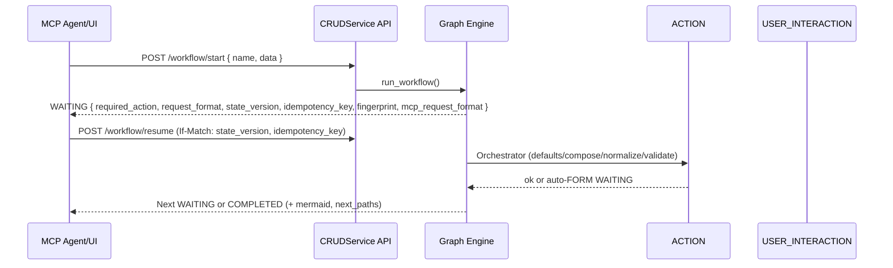
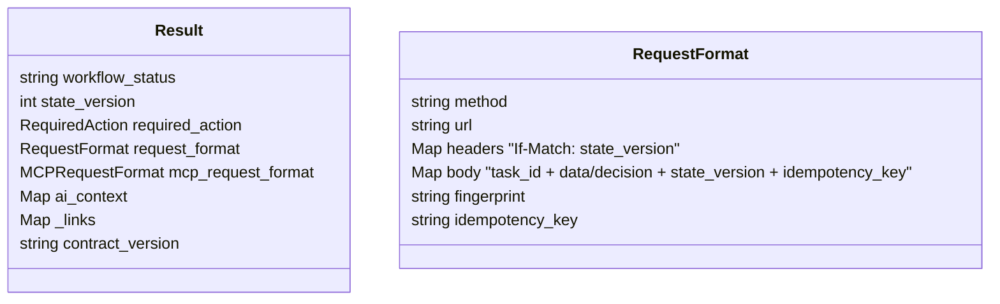
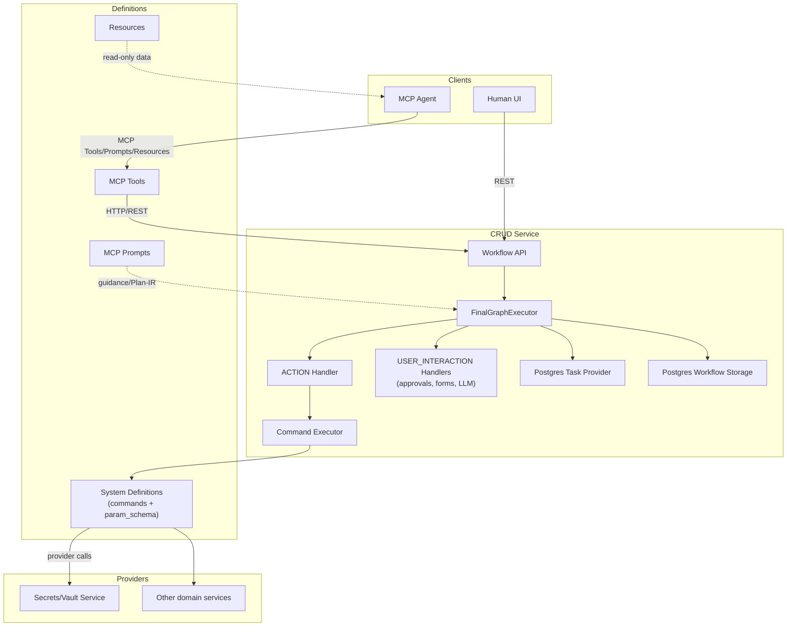
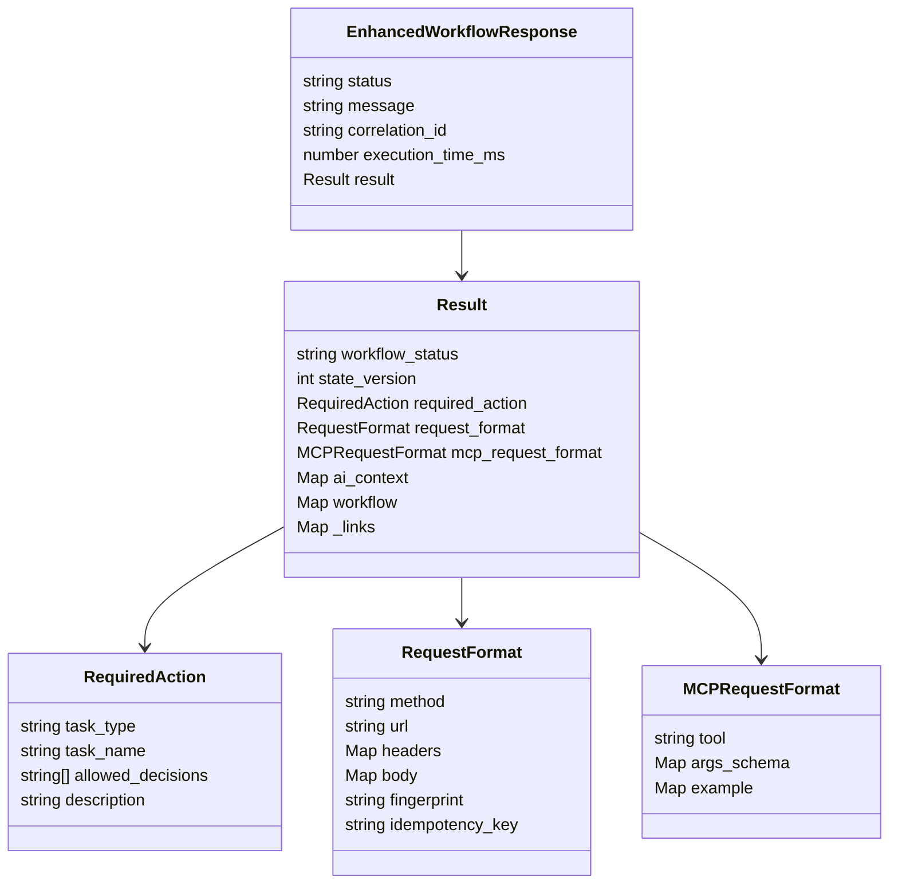
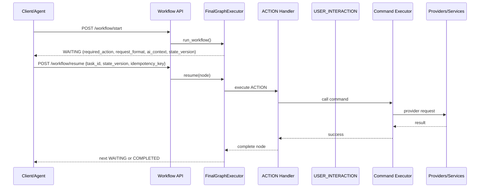
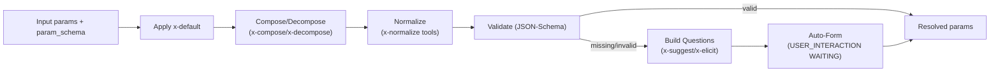
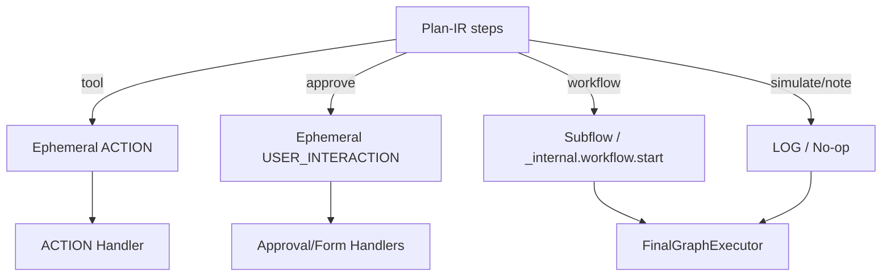

## Executive design: Self‑Describing Workflows + MCP for agent‑driven automation

### The current state of LLM agents (why change is needed)
- How agents work today: an LLM loops over “think → call tool → read result → think again.” Each tool call is a one‑off API action. The agent or a custom UI decides what to try next.
- What goes wrong in practice:
  - Accuracy & repeatability: different runs explore different tool paths; subtle prompt changes alter outcomes.
  - Predictability & control: clients don’t get a precise “what to do next and how” contract; retries can double‑write.
  - Autonomy risks: without version checks/idempotency, parallel agents or humans can race or replay.
  - Cost & maintenance: bespoke UI logic per workflow and per tool leads to drift and rework.

### Our big idea (10,000‑foot view)
Return a single, self‑describing “WAITING” response at each decision point that tells any client—UI or agent—exactly what to do next and how to do it safely. Pair that with a workflow engine that executes all side‑effects deterministically (with ETag/idempotency/audit). The client follows the blueprint; the engine does the work.

### Vision
- Build a single, declarative contract that any client—human UI, MCP agent, RPA bot—can use to advance a workflow with zero custom SDKs.
- Keep all execution inside our existing graph engine (ACTION and USER_INTERACTION nodes), preserving circuit breakers, retries, idempotency, metrics, and audit.
- Make agents safe and useful out‑of‑the‑box by returning self‑describing responses that include what to do next, how to do it, and guardrails.

### Outcome
- Faster time‑to‑value for new automations (days → hours).
- Higher task completion rates with fewer handoffs; measurable reductions in rework and errors.
- Consistent safety and auditability across human and agent interactions.

---

## Concepts and how they fit together

### Model Context Protocol (MCP)
- MCP is a lightweight standard that lets LLM agents call “tools,” read “resources,” and use “prompts.”
- In our platform:
  - MCP Tools map directly to our system definitions and commands (e.g., `secrets.catalog.normalize`, `secrets.secret.create_or_update`).
  - MCP Resources can expose read‑only data (e.g., workflow state, next paths).
  - MCP Prompts wrap deterministic plans (Plan‑IR) or elicit missing parameters, but execution still happens through our nodes.
  - Important: catalog/helper tools (suggest/normalize) are side‑effect‑free (no Create/Update/Delete); workflow facade tools (start/resume/state) call CRUDService only and never call providers.

### System definitions and commands (ServiceConfigs)
- We describe every capability once (HTTP method, endpoint, params).
- We add a `param_schema` per command with a few metadata hints (x‑fields) so the UI/LLM knows how to help:
  - x‑normalize: call a tool to canonicalize inputs (e.g., `secrets.normalize`).
  - x‑suggest: list options for dropdown/autocomplete (e.g., `secrets.keys`, `secrets.search`, `secrets.mounts`).
  - x‑compose/x‑decompose: build a complex parameter like a URI from parts.
  - x‑default, x‑elicit, x‑redact, x‑rbac‑scope: defaults, questions, masking, access hints.

### Graph workflows (CRUD Service engine)
- Execution runs as a graph of nodes:
  - ACTION nodes call commands via our executor.
  - USER_INTERACTION nodes handle approvals, forms, LLM interactions; engine sets WAITING and resumes after decision.
- We already enrich responses with next paths and diagrams; execution remains deterministic and auditable.
 - Side‑effects (any mutation in external systems like Vault/AD/Auth0/DB/K8s) happen only inside ACTION nodes under concurrency (ETag/If‑Match), idempotency, retry, and audit controls.

### CRUD Service MCP Server and agent
- The MCP server exposes our tools/resources/prompts to any compatible agent (e.g., Claude Desktop).
- Agents use our “self‑describing response” to decide and then either:
  - call our REST `/workflow/resume/{task_id}`, or
  - invoke the MCP “workflow.resume” facade (same effect, zero SDK).

---

## Quick poster (at a glance)

See the full narrative in `docs/explainability_v3_slow.md` and the schema details in `docs/param_schema_orchestrator_guide.md`. For a one‑page quick reference, see `docs/explainability_cheat_sheet.md`.

### End‑to‑end sequence (with safety headers)


### WAITING contract anatomy


---

### High‑level architecture (visual)



---

## The self‑describing workflow response (the universal contract)

Every WAITING response includes three pillars:
- required_action: what the human/agent must do (approval, form, llm).
- request_format: the exact call to make next (method, url, body shape).
- ai_context: brief, role‑aware guidance to pick among allowed options.

We add four small but decisive upgrades:
- workflow_status and state_version: explicit state + ETag for concurrency safety.
- idempotency_key: dedupe repeated resumes (agent retries, network glitches).
- fingerprint: hash of “this exact call” (method + url + body shape + node + state_version) for audit joins.
- mcp_request_format: an optional MCP tool facade mirroring request_format for zero‑SDK “Run” buttons.
- contract_version: version string of the WAITING contract (e.g., "1.0").

Example (truncated, executive‑level illustration):
```json
{
  "status": "waiting",
  "correlation_id": "…",
  "result": {
    "workflow_status": "waiting",
    "state_version": 7,
    "contract_version": "1.0",
    "required_action": {
      "task_type": "approval",
      "task_name": "ManagerApproval",
      "allowed_decisions": ["approve","reject"]
    },
    "request_format": {
      "method": "POST",
      "url": "/workflow/resume/{task_id}",
      "headers": {"content-type": "application/json"},
      "body": {"task_id":"…","decision":"approve|reject","data":{},"state_version":7,"idempotency_key":"…"},
      "fingerprint": "sha256:…",
      "idempotency_key": "execution:node:7:user"
    },
    "mcp_request_format": {
      "tool": "workflow.resume",
      "args_schema": { "type":"object","required":["task_id","decision","state_version","idempotency_key"] }
    },
    "_links": { "self": {"href": "/workflow/status/…"}, "resume": {"href": "/workflow/resume/…","method":"POST"} },
    "ai_context": { "approve": "…", "reject": "…", "policy_flags": {"requires_human": true} }
  }
}
```

### Self‑describing response schema (visual)



---

## End‑to‑end experience

1) Start or resume a workflow.
- Engine returns a WAITING payload with the triplet + safety metadata (state_version, idempotency_key, fingerprint).
- Also returns `next_paths` and small mermaid diagrams for visibility.

2) Client decides how to proceed (UI/agent).
- If parameters are missing, our Orchestrator (below) elicits values using schema hints and suggesters.
- For approvals, the agent chooses an allowed decision; for forms, it fills the structure.

3) Client calls `/workflow/resume/{task_id}` (or MCP facade).
- Send `If‑Match: <state_version>` or include `state_version` in the body; always include `idempotency_key`.
- On stale version: If-Match stale → 412; body.state_version stale → 409; both return a refreshed WAITING payload.
- On duplicate idempotency_key we return the prior response (deduped).

4) Engine resumes deterministically via the same node handlers and continues.

### End‑to‑end interaction (sequence)



---

## Parameter Orchestrator (metadata‑driven slot filling)

- Generic preflight for ACTION nodes:
  - Apply defaults, compose/decompose, call `x‑normalize` (e.g., canonicalize secret URIs; generic fallback echoes canonical values or prepends `args.default_prefix` when a normalize tool cannot be executed), and validate.
  - If parameters are missing/invalid, synthesize a FORM from `param_schema` and set WAITING.
- Result: The same definitions power both the UI (deterministic forms) and LLM (conversational elicitation), with no bespoke code per command.

### Parameter Orchestrator pipeline



---

## Planning: from next paths to Plan‑IR (read‑only)
- Optional helper returns a Plan‑IR draft derived from `next_paths` (no side effects).
- The executor compiles plan steps into ephemeral nodes at run time:
  - tool → ephemeral ACTION (uses circuit‑breaker, retries, audit).
  - approve → ephemeral USER_INTERACTION.
  - workflow → internal workflow.start (subflow) or our existing plan executor.
- No parallel scheduler—everything runs through the existing handlers.

#### Workflows as meta‑tools (composition)
- The LLM planner can treat existing workflows as coarse‑grained “tools” inside a plan.
- Each `workflow` step compiles to a subflow (`_internal.workflow.start`) with its own WAITING/resume cycle.
- Side‑effects still execute only inside ACTION nodes of each (sub)workflow under If‑Match/idempotency/retries/audit.
- Idempotency keys and fingerprints are namespaced per (sub)workflow and state_version to preserve exactly‑once semantics across the chain.

### Plan‑IR compilation to nodes



---

## Security, safety, and compliance

- Redaction: Honor `x‑redact`/`x‑pii` in system schemas; mask values in ai_context, examples, logs, and receipts.
- Authorization: All command execution continues to enforce scopes/PDP at the provider/service layer (e.g., Secrets vault strategies).
- Concurrency: `state_version` (ETag) prevents out‑of‑order resumes; 409 responses guide clients to refetch.
- Idempotency: `idempotency_key` dedupes resumed actions; keys include workflow/node/state_version/actor.
- Audit: `fingerprint`, `correlation_id`, and event receipts tie intent → action across ClickHouse/logs.

---

## Product value and KPIs

- Automation rate: % of workflows progressed by agents end‑to‑end without human intervention.
- Time‑to‑decision: Avg time from WAITING to valid RESUME (expect significant reduction).
- Error rate: 409/conflict, 4xx validation errors; trend down with orchestration + schema hints.
- Safety: 0 PII leaks in prompts/logs; idempotent replay success rate.
- Developer velocity: # of new commands automated per month; config‑only changes.

---

## Delivery plan (2–3 weeks)

Phase 1: Contract hardening (1 week)
- Enhanced builder output: add `workflow_status`, `state_version`, HATEOAS `_links`, `request_format.url/headers/fingerprint/idempotency_key`, `mcp_request_format`.
- Central redaction utility honoring `x‑redact` across builder and logging.
- Resume endpoint: require versioning (If‑Match/body) and `idempotency_key`; return 412/409 on stale; dedupe repeated calls.

Phase 2: Orchestrator + MCP UX (1 week)
- Param Orchestrator preflight in ACTION handler; auto‑form elicitation on missing/invalid params.
- MCP prompt runner helper in the executor to standardize LLM interactions (redaction, logging).
- System schemas: annotate high‑value commands with `param_schema` and x‑fields (done for Secrets).

Phase 3: Planning helpers + tests (up to 1 week)
- Optional `GET /workflow/{id}/next_plan` (read‑only Plan‑IR draft).
- Accept profile to inline next_plan in WAITING when requested.
- Test suite: golden WAITING fixtures (state_version/fingerprint/idempotency_key), 409 stale, idempotent retry, redaction snapshots, fingerprint stability.

### Shipped schema‑as‑API surface (summary)
- MCP
  - `systems.describe_command` (introspection)
  - `workflow.schema_start` (schema‑driven start helper)
  - Suggesters: `auth0.user.search`, `auth0.group.search`, `entra.user.search`, `entra.group.search`
- REST
  - `GET /commands/describe` (ETag/If‑None‑Match)
  - `GET /commands/form_schema` (UI‑friendly fields with suggest/redact)
  - `GET /tools/suggest/{provider}/{kind}` (PII‑safe fallback suggesters)
  - `GET /catalog/browse` (catalog summary), `GET /observability/kpis` (KPI counters)

---

## Risks and mitigations

- Schema drift: One source of truth—system `param_schema`. Prompts and UI read it; builder enforces it.
- Policy drift between wait and resume: Sign a `continuation` token (JWT/HMAC) with `{workflow_id,node_id,state_version,policy_hash}`; verify on resume (optional).
- Latency: Cache normalize/suggest; debounce UI lookups; keep ai_context minimal.
- Adoption: Start with Secrets and two identity commands to prove the loop; generalize over time.

---

## Why now
- The platform already emits the core triplet and runs everything through the graph engine.
- We’ve added MCP tools (e.g., Secrets `normalize`, `mounts`, `keys`, `search`) and smart prompts.
- The remaining work is surgical, centralized, and backwards‑compatible—high ROI with low risk.

---

## Appendices

### A. Glossary
- MCP Tool: a callable operation exposed by the MCP server; maps to our system command.
- MCP Resource: a read‑only dataset exposed to agents (e.g., workflow state).
- MCP Prompt: a reusable prompt that can produce text, structured JSON, or Plan‑IR.
- Plan‑IR: a deterministic plan structure; we compile each step into ephemeral nodes and dispatch via existing handlers.
- Self‑Describing Response: our WAITING payload with `required_action`, `request_format`, and `ai_context`, plus safety metadata.
- Param Orchestrator: a metadata‑driven preflight that fills/normalizes/validates parameters using `param_schema`.

### B. Current concrete wins already landed
- Secrets UX: smart URI normalization endpoint (`/api/secrets/normalize`) and system annotations (x‑normalize/x‑suggest). Prompt updated to auto‑canonicalize before write.
- MCP tools for Secrets: `catalog.normalize`, `catalog.mounts`, `catalog.keys`, `catalog.search`—ready for agent slot‑filling and UI dropdowns.

---

## Ask

- Approve the Phase 1–3 plan and KPIs.
- Endorse “self‑describing contract” as the universal agent interface and the single source of truth.
- Align teams (UI/Agent/Backend) on using system `param_schema` and x‑fields for all new commands.

This design keeps our safety, determinism, and audit where they belong—in the engine—while opening the door to safe, zero‑shot automation across the portfolio.


I'll scan the codebase to locate the workflow engine, API endpoints (start/resume), MCP server, and any existing concepts like WAITING responses, idempotency, state versioning, and secrets tools to evaluate the proposed design against the current implementation. Then I'll dive into key files to confirm behaviors and identify gaps.

[5 tools called]

I'm going to open key engine and API files to confirm how WAITING responses are built and how resume/start flows enforce state_version, idempotency, fingerprint, and MCP integration, then compare against the proposed design.

[4 tools called]

I'll open the builder and executor code to inspect how WAITING payloads and resume semantics are implemented, then compare to the proposal's contract (state_version, idempotency_key, fingerprint, MCP facade).

[1 tool called]

I'll quickly search for the actual HTTP route implementation for workflow resume and start, and inspect the enhanced builder to verify which fields are present in WAITING payloads.

[2 tools called]

I'll list the API and utils files and open `final_executor.py` and `enhanced_result_builder.py` to verify WAITING payload composition and resume semantics, then I’ll search for the workflow start/resume endpoints.

[3 tools called]

I’m going to scan the ServiceConfigs for parameter schemas and x- metadata (x-normalize, x-suggest, x-compose, x-decompose) to verify current annotations, and check MCP prompt files for Plan-IR usage and sensitivity tags to compare with the proposal. Then I’ll consolidate findings and gaps.

[9 tools called]

Let me open the approval handler to cite the WAITING transition snippet and verify line numbers.

[1 tool called]

Status: I’ve inspected the engine, API, MCP gateway, and ServiceConfigs to validate what already exists vs. what the proposal adds. Below is a direct critique with concrete gaps and low-risk improvements.

High-signal findings vs proposal

- Core triplet already present, but missing safety fields:
  - Present: WAITING state semantics and `required_action` + `request_format` built in `src/utils/enhanced_result_builder.py`.
```340:399:src/utils/enhanced_result_builder.py
        # 6) Build required_action, request_format, enhance ai_context.
        ...
        request_format = _build_request_format(
            task_id=task_id, task_name=task_name, task_type=task_type, form=form
        )
        ...
            "result": {
                "workflow": enhanced_workflow,
                "required_action": required_action,
                "request_format": request_format,
                "form": form,
                "ai_context": enhanced_ai_context,
                "data": data,
            },
```
  - Missing: `workflow_status`, `state_version`, `idempotency_key`, `fingerprint`, `_links`, `mcp_request_format`. None of these are added by the builder yet. There is no fingerprint or state version logic in the builder or resume route.

- Resume endpoint exists, but no concurrency or idempotency guards yet:
  - Resume route is implemented: `POST /workflow/resume/{task_id}`.
```636:678:src/api/workflow_routes.py
@router.post("/resume/{task_id}", response_model=EnhancedWorkflowResponse)
async def resume_workflow(...):
    ...
    task_row = await _load_task_from_db(session, task_id, correlation_id)
    workflow_context = await _load_workflow_context(session, workflow_id_str, task_id, correlation_id)
    executor = await _initialize_workflow_executor(...)
    await _restore_checkpoint(executor, workflow_id_str, task_id, correlation_id)
    await executor.resume(node_id_for_graph, resume_request.data, session_user_id)
    result = await executor.run(session_user_id=session_user_id)
```
  - Gaps vs proposal:
    - No `If-Match: state_version` validation or 409 on stale version.
    - No `idempotency_key` parameter or dedupe behavior on resume.
    - No `fingerprint` calculated or echoed for audit joins.
    - No explicit `workflow_status` string surfaced in the enhanced result.

- WAITING creation and context marking are solid:
  - Approval/form/LLM nodes reliably mark WAITING and store task_id.
```254:262:src/engine/graph_executor/user_interaction/approval_handler.py
        task_id = await executor.task_provider.create_task(task_request)
        node.config["task_id"] = str(task_id)
        # (C) Mark WAITING
        node.status = NodeStatus.WAITING
        executor.waiting_on_user_node = node.id
        wait_details = {"task_id": str(task_id), "resolver_type": resolver_type}
        executor.context.set_waiting(wait_type="approval", details=wait_details)
```
  - WorkflowContext models WAITING and resume transitions.
```561:569:src/workflows/workflow_context.py
    def set_waiting(self, wait_type: str, details: Dict[str, Any]) -> None:
        if wait_type.lower() == "bulk":
            self.status = WorkflowStatus.WAITING_FOR_BULK
        else:
            self.status = WorkflowStatus.WAITING_FOR_INPUT
        self.waiting_on = {"type": wait_type, **details}
```

- Parameter Orchestrator: partial, prompt-driven normalization but not schema-driven:
  - There is no centralized orchestrator that reads `param_schema` x-fields (x-normalize/suggest/compose/decompose) before ACTION execution.
  - There are prompt-based helpers in `action_handler` that can update params from an assistant response, but it’s not schema-aware.
```213:244:src/engine/graph_executor/action_handler.py
        # Optional assist prompt to normalize/complete params before execution
        ...
        normalized = json.loads(final_chunk) ...
        if isinstance(normalized, dict) and isinstance(normalized.get("params"), dict):
            node.config.setdefault("params", {}).update(normalized["params"])
```
  - ServiceConfigs are already annotated with rich `param_schema` for Secrets:
```15:36:ServiceConfigs/CRUDService/config/systems/secrets.yaml
        param_schema:
          uri:
            type: string
            ...
            x-suggest: ...
            x-normalize: { tool: "secrets.catalog.normalize" }
```
  - Tools exist for suggest/normalize/keys/metadata in `ServiceConfigs/CRUDService/config/tools.yaml`. This is ready to power an orchestrator.

- MCP: Gateway and prompts are there, facade not yet in WAITING contract:
  - MCP gateway (FastMCP) is running, registering YAML prompts and proxy tools.
  - Prompts produce Plan-IR; gateway compiles/relays.
  - However, the enhanced WAITING payload does not include an MCP `mcp_request_format` that mirrors `request_format`.

- `_links` and next_paths/visualization:
  - You already enrich responses with mermaid diagrams and `next_paths` in start and resume routes. `_links` HATEOAS is not present yet; trivial to add.

- Idempotency in other areas but not resume:
  - There is idempotency handling in agents and plan runtime hashing for tool calls, but not for workflow resume requests. No idempotency cache/table keyed by `idempotency_key`.

- State version foundation exists in DB model:
  - `PostgresTaskProvider.update_task` supports optimistic versioning:
```273:304:src/providers/postgres_task_provider.py
    async def update_task(..., expected_version: Optional[int] = None) -> bool:
        ...
        if expected_version is not None:
            conditions.append(WorkflowTask.version == expected_version)
            values["version"] = expected_version + 1
```
  - But state_version is not surfaced in the WAITING payload nor enforced in resume (no If-Match or expected_version plumbing).

What to change (minimal, surgical edits)

Phase 1 (contract hardening)
- Enhanced builder:
  - Add `workflow_status` from `WorkflowContext.status.value`.
  - Add `state_version` from a durable counter:
    - Use `WorkflowTask.version` of the WAITING task or a `WorkflowContext` version field if exposed. If not yet exposed, include `task.version` as `state_version` and carry it through to the resume route as expected_version.
  - Add `request_format.headers If-Match: state_version`.
  - Compute `fingerprint` over method+url+body shape+task_id+state_version.
  - Generate `idempotency_key` suggestion: `wf:{workflow_id}:{node_id}:{state_version}:{actor}`.
  - Add `_links.self` and `_links.resume`.
  - Add `mcp_request_format`:
    - tool: "workflow.resume"
    - args_schema requiring `task_id`, `data`, `state_version`, `idempotency_key`.

- Resume endpoint:
  - Accept `state_version` and optional `idempotency_key` in `ResumeWorkflowRequest`.
  - Lookup current task version; if mismatch with provided `state_version`, return 409 and include a refreshed WAITING payload.
  - If `idempotency_key` provided, check a short-lived idempotency store (Redis or DB) keyed by that value and return prior response if duplicate.
  - On success, bump task.version via `expected_version` to guard against races.

Phase 2 (orchestrator preflight)
- In ACTION handler, before execution:
  - Load `param_schema` for the system/command.
  - Apply x-defaults, x-compose/x-decompose, call x-normalize tools (via internal tool registry), then validate JSON schema.
  - If missing/invalid, synthesize a FORM `USER_INTERACTION` with a schema derived from `param_schema` and enter WAITING. The builder then emits the form in `required_action` and `request_format`.

Phase 3 (MCP prompt runner + planning helper)
- Introduce `mcp_request_format` now to wire zero-SDK clients; later add optional `GET /workflow/{id}/next_plan` read-only draft plan.
- Existing Plan-IR compilation path is already implemented via `plan_runtime` and prompt-driven compile-and-execute; keep it read-only draft in API if desired.

Security and redaction
- Ensure `x-redact` honored in `ai_context`, `example_payload`, and logs. The builder currently echoes example payloads unredacted; add masking when `x-redact: true`.

Evidence excerpts

- Resume route exists; no concurrency or idempotency checks:
```636:779:src/api/workflow_routes.py
@router.post("/resume/{task_id}")
async def resume_workflow(...):
    task_row = await _load_task_from_db(...)
    workflow_context = await _load_workflow_context(...)
    executor = await _initialize_workflow_executor(...)
    await _restore_checkpoint(...)
    await executor.resume(node_id_for_graph, resume_request.data, session_user_id)
    result = await executor.run(session_user_id=session_user_id)
```

- WAITING creation and context WAITING marking:
```254:262:src/engine/graph_executor/user_interaction/approval_handler.py
        node.status = NodeStatus.WAITING
        executor.waiting_on_user_node = node.id
        wait_details = {"task_id": str(task_id), "resolver_type": resolver_type}
        executor.context.set_waiting(wait_type="approval", details=wait_details)
```

- Builder emits request_format but not safety fields:
```533:571:src/utils/enhanced_result_builder.py
def _build_request_format(...):
    return {
        "endpoint": f"/workflow/resume/{task_id}" or "/workflow/resume/UNKNOWN",
        "method": "POST",
        "required_structure": {...},
        "example_payload": {...},
        "validation_rules": ...
    }
```

- DB version available for optimistic control:
```273:304:src/providers/postgres_task_provider.py
async def update_task(..., expected_version: Optional[int] = None) -> bool:
    if expected_version is not None:
        conditions.append(WorkflowTask.version == expected_version)
        values["version"] = expected_version + 1
```

- System `param_schema` with x- metadata for orchestrator:
```15:36:ServiceConfigs/CRUDService/config/systems/secrets.yaml
param_schema:
  uri:
    type: string
    x-suggest: ...
    x-normalize: { tool: "secrets.catalog.normalize" }
    x-decompose: [...]
    x-compose: ...
    x-default: "yaml://secret/"
  value:
    type: string
    x-redact: true
```

Critique summary

- Strengths:
  - Solid engine semantics for WAITING, resume, and context transitions.
  - Enhanced response structure and next_paths/mermaid already in place.
  - MCP gateway/prompts/tools are mature enough to support the proposed UX.
  - DB supports optimistic versioning—perfect hook for `state_version`.

- Gaps to address:
  - Missing `state_version`/If-Match and idempotency on resume.
  - Missing `fingerprint`, `_links`, and MCP facade (`mcp_request_format`) in WAITING payload.
  - No centralized schema-driven Parameter Orchestrator; only ad-hoc prompt assistance.
  - Redaction not enforced in builder examples (`x-redact`).

- Risk/effort:
  - Phase 1 is localized to `workflow_routes.py` and `enhanced_result_builder.py` plus a small idempotency cache; low risk.
  - Phase 2 needs a clean utility module invoked by ACTION handler; moderate effort but configuration-driven.
  - All changes are backward-compatible if fields are additive and headers optional initially.

If you want, I can implement Phase 1 now:
- Extend `ResumeWorkflowRequest` with `state_version` and `idempotency_key`.
- Enforce version match and add 409 handling returning refreshed WAITING.
- Add idempotency cache check.
- Update builder to include `workflow_status`, `state_version`, `fingerprint`, `_links`, `mcp_request_format`, and set `If-Match` header in `request_format`.

---

## Implementation details (Phases 1–3)

### API Contract Changes (Phase 1)
- Add to `result`:
  - `workflow_status` (string; mirrors `WorkflowContext.status.value`)
  - `state_version` (integer; monotonic from waiting task version)
  - `contract_version` (string; e.g., "1.0")
- Harden `request_format`:
  - `url` (rename from `endpoint`), `method`, `headers` include `If-Match: <state_version>`
  - `body` structure includes `task_id`, `data|decision`, `state_version`, `idempotency_key`
  - `fingerprint` (sha256 over method+url+body-keys+waiting_node_id+task_type+state_version)
- Add `mcp_request_format` mirroring `request_format`:
  - `tool: "workflow.resume"`, `args_schema` with required `task_id`, `data|decision`, `state_version`, `idempotency_key`
- Add `_links.self` and `_links.resume`
- Redact examples and `ai_context` values honoring `x-redact`

### Resume Semantics (Phase 1)
- Require `state_version` (or `If-Match`) and `idempotency_key` on `/workflow/resume/{task_id}`
- On version mismatch → `409 Conflict` and return refreshed WAITING payload
- Idempotency: dedupe on `idempotency_key` (Redis/DB TTL); return prior response on replay
- Atomically bump task version using optimistic update (`expected_version`)

### Parameter Orchestrator (Phase 2)
- Central preflight before ACTION execution:
  - Apply `x-default`, `x-compose/x-decompose`, call `x-normalize` tools, validate JSON Schema
  - If missing/invalid → synthesize FORM from `param_schema` and set WAITING
- One source of truth: `ServiceConfigs` `param_schema` + x‑fields

### Prompt Runner Unification (Phase 2)
- Add `executor.run_prompt(name, args, out_schema)` and reuse in approval/form/LLM/agent handlers
- Centralize redaction, logging, correlation, error mapping

### Planning Helper (Phase 3)
- `GET /workflow/{id}/next_plan` returns a read‑only Plan‑IR draft from `next_paths` (policy/allow‑tags aware)
- Execution still compiles steps to ephemeral nodes; no side effects here

### Error Handling & Security
- Problem Details (RFC‑7807) for 4xx/5xx with `{type,title,detail,fingerprint,correlation_id}`
- Optional `continuation` token signed with `{workflow_id,node_id,state_version,policy_hash}`; verify on resume
- `ai_context.policy_flags`: e.g., `requires_human`, `dry_run_available`, `max_blast_radius`

#### API error format (Problem Details)
All error responses from workflow start/resume/next_plan are RFC‑7807 Problem Details JSON with at least:
```
{ "type": "about:blank", "title": "…", "detail": "…", "status": 4xx|5xx,
  "correlation_id": "…", "fingerprint": "…"? }
```
Clients should rely on `status` and `title`; `fingerprint` is included when available to assist audit joins.

#### Contract versioning
`result.contract_version` is set to "1.0". Additive changes will preserve compatibility; breaking changes increment the major version.

#### MCP facade quick reference
The WAITING payload includes `mcp_request_format` mirroring `request_format`:
```
{ "tool": "workflow.resume",
  "args_schema": { "type":"object",
    "required":["task_id","state_version","idempotency_key","decision|data"] } }
```
Agents can call the facade directly without any SDKs.

### Rollout & PR Slices
1) Builder fields + `_links` + `mcp_request_format` + redaction
2) Resume: `If-Match`/`state_version`, idempotency cache, 409 handling, metrics
3) Orchestrator module + `action_handler` integration (start with Secrets)
4) Prompt runner unification across handlers
5) `GET /workflow/{id}/next_plan` (read‑only) + tests
6) Config annotations for 1–2 more identity commands; docs + golden fixtures

### Acceptance Criteria
- WAITING includes `workflow_status`, `state_version`, `fingerprint`, `idempotency_key`, `_links`, `mcp_request_format`, `contract_version`
- Resume enforces version/idempotency; stale → 409 with refreshed WAITING; replay → prior response
- Orchestrator fills/validates; auto‑FORM on gaps; redaction verified in logs and payloads
- Planning helper returns stable drafts; no side effects
- Tests cover conflict, idempotency, fingerprint stability, redaction, orchestrator normalization

---

## Decisions to lock (to minimize ambiguity)

1) Concurrency token form
- Return both `ETag: "<state_version>"` header and `result.state_version`.
- Accept either `If-Match` header or `state_version` in body on resume; prefer `If-Match`.

2) Idempotency key scope
- Deduplicate on `{workflow_id}:{waiting_node_id}:{state_version}:{actor_id}`.
- Different actor implies a different attempt (policy may still block server‑side).

3) Continuation token (feature‑flagged)
- Signed, opaque `continuation` covering `{workflow_id, waiting_node_id, state_version, policy_hash, actor_id, exp}`.
- Verify on resume when flag is enabled.

4) Server‑enforced guardrails
- Reject any `decision` not in `required_action.allowed_decisions` (422 Problem Details).
- Enforce `ai_context.policy_flags` (e.g., `requires_human`, `max_blast_radius`, `dry_run_available`) in the resume path (403 if violated).

---

## Fingerprint determinism (publishable rule)

Canonicalize before hashing and snapshot‑test it:

```
canon.method     = method.upper()
canon.url        = normalize_url(url)             # no trailing '/', sorted query
canon.body_spec  = sorted(list(body.required_keys))
canon.wait_node  = waiting_node_id
canon.task_type  = task_type
canon.state_ver  = state_version
fingerprint = "sha256:" + sha256(json.dumps(canon, separators=(",",":"), sort_keys=True))
```

---

## Edge cases to cover (tests)

1) Race replay: two resumes on same `state_version` → one 200, one 409 with refreshed WAITING.
2) Idempotent retry: same `idempotency_key` → prior response, no duplicate side‑effects.
3) Actor binding: same `idempotency_key` but different actor → treated as new attempt (or 403 by policy).
4) Continuation tamper: bad signature/wrong node → 401/403 Problem Details.
5) Fingerprint drift: trivial body/order/whitespace changes don’t change fingerprint; structural changes do.
6) Orchestrator loop: missing/invalid → FORM; after submit, orchestrator resolves → action executes.
7) Allowed decisions: decision outside set → 422 with allowed set in PD.
8) Policy flags: resume without human when `requires_human:true` → 403 PD.
9) Redaction: secrets absent from examples, `ai_context`, and logs (snapshot).
10) Multi‑tenant scoping of keys (`idempotency`, continuation).

---

## Observability & rollout notes

Telemetry
- Span attributes: `workflow.waiting.state_version`, `resume.idempotency_key`, `resume.fingerprint`, `required_action.task_type`, `decision`.
- Counters: `workflow_resume_conflict_total`, `workflow_resume_idempotent_replay_total`, `workflow_orchestrator_forms_created_total`, `workflow_plan_compilation_failed_total`.
- SLO: p95 resume latency < 2s (excluding downstream ACTION time).

Rollout
- Start with `WORKFLOW_RESUME_REQUIRE_VERSION=false`, `WORKFLOW_RESUME_REQUIRE_IDEMPOTENCY=false`; log warnings when missing.
- Enable flags per tenant when dashboards are green.
- Keep `request_format.endpoint` for one release (deprecated); prefer `request_format.url`.