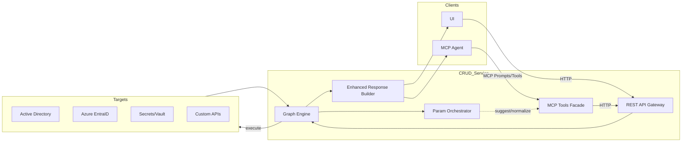
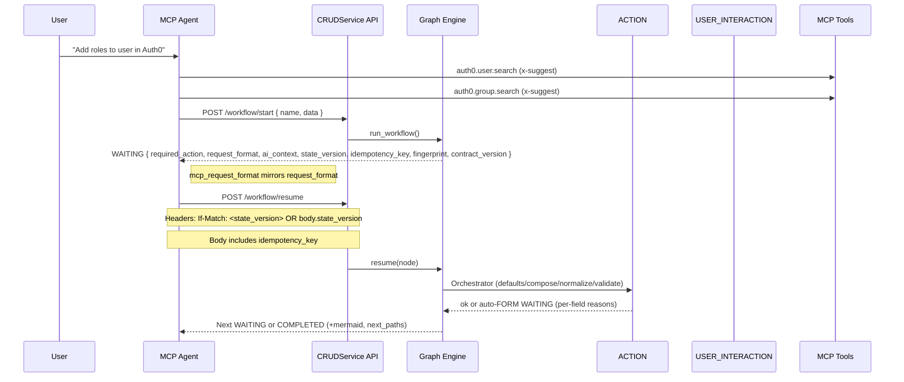
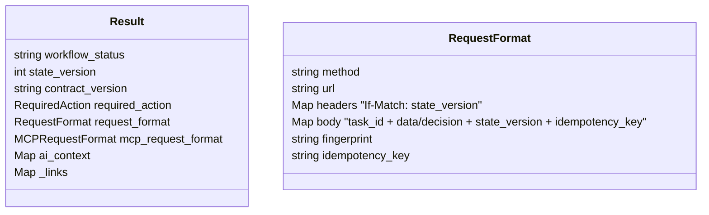
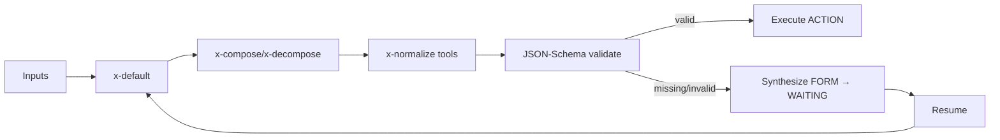
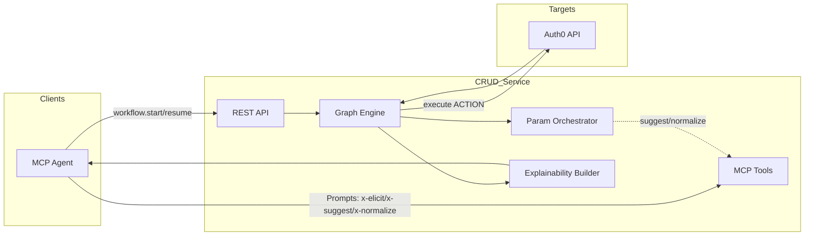

## EmpowerNow AI Agent Workflow Explainability V3
### Where we are today (LLM agents without explainability)
- Agents loop through “think → call tool → think,” choosing actions based on prompts and recent results. Each tool call is an isolated API hit.
- Pain points we see:
  - Runs diverge: small context changes lead to different tool paths and outcomes.
  - No precise next‑step contract: clients guess how to proceed; retries can re‑execute side‑effects.
  - Parallelism hazards: two clients can race to act; no version locks or dedupe by default.
  - High UI effort: per‑workflow forms and validations get hard‑coded and drift.

### The big idea
Return a self‑describing WAITING response that includes “what to do,” “how to do it,” and safety headers (If‑Match/idempotency). Orbit and agents simply follow the blueprint. The graph engine executes all side‑effects deterministically and audibly.
### The mental model in 5 pieces

#### At‑a‑glance architecture


- Definitions (source of truth): System commands declare inputs with a `param_schema` and x‑fields (x‑elicit, x‑suggest, x‑normalize, x‑compose/x‑decompose, x‑default, x‑redact). This powers UI forms, LLM elicitation, and engine preflight.
- Prompts (how agents “think”): MCP Prompts generate a Plan‑IR or directly return structured args; they call suggest/normalize tools based on `param_schema`, not hard‑coded logic.
  - Note: suggest/normalize tools are side‑effect‑free (no Create/Update/Delete); plans compile to nodes, and only ACTION nodes perform mutations.
- Tools (how agents “do”): MCP Tools map 1:1 to your backend commands (or helper catalog tools). No side‑effects bypass the engine.
- Engine (how work executes safely): Graph nodes run deterministically; the Orchestrator runs preflight (defaults/normalize/validate) before ACTION nodes; if inputs are missing/invalid it synthesizes a FORM USER_INTERACTION and waits.
  - Side‑effects are confined to ACTION nodes with concurrency (If‑Match), idempotency, retries, and audit.
- Explainability (how clients steer safely): Every WAITING/COMPLETED response is self‑describing: required_action, exact request_format, ai_context, next_paths/diagrams, plus safety metadata (state_version, idempotency_key, fingerprint) and an MCP facade.

### How they fit end‑to‑end

1) Agent or UI intent
- Agent prompts read `param_schema` to ask the right questions (x‑elicit) and call x‑suggest/x‑normalize tools to slot‑fill inputs.
- UI renders forms directly from the same schema, with autocompletes driven by the same tools.

2) Start or resume the workflow
- Client calls `POST /workflow/start` (or the MCP tool facade `workflow.start`).
- Engine runs until it either completes or hits a USER_INTERACTION gate (approval/form/LLM).

3) Self‑describing WAITING response (the universal contract)
- required_action: task type/name and, for approvals, `allowed_decisions`.
- request_format: precise `url`, `method`, `headers`, and `body` shape to resume safely.
- ai_context: short guidance; can include policy flags (e.g., `requires_human`).
- Safety metadata:
  - `state_version` (concurrency token; also sent as ETag/If‑Match),
  - `idempotency_key` (client‑chosen dedupe),
  - `fingerprint` (audit join; stable hash over method/url/body‑shape/node/state).
- Extras: `_links` (HATEOAS), `mcp_request_format` (tool facade for zero‑SDK resume), `next_paths` and mermaid diagrams.

#### WAITING contract – required fields and redaction policy
- `result.contract_version: "1.0"`
- `result.workflow_status`
- `result.state_version`
- `result.required_action`
- `result.request_format` with:
  - `method`, `url`
  - `headers` including `Content-Type: application/json` and `If-Match: <state_version>`
  - `body` with `{ task_id, decision|data, state_version, idempotency_key }`
  - `fingerprint`
  - `idempotency_key`
- `_links.{self,resume}`
- `mcp_request_format` mirroring `request_format` with a strict `args_schema`

Redaction policy:
- Apply `x-redact`/`x-pii` to examples, `ai_context`, logs, and any echoed request fragments in WAITING.
- Redaction must be deterministic and covered by snapshot tests.

4) Decision and resume
- Agent decides (e.g., approve) or fills a form based on `param_schema` suggesters, then resumes:
  - Include `If‑Match: <state_version>` header, OR provide `state_version` in body; always include `idempotency_key`.
  - On stale `If‑Match` → 412 with refreshed WAITING.
  - On stale body.state_version → 409 with refreshed WAITING.
  - On idempotent replay (same idempotency_key) → prior response returned, no duplicate effects.

5) Orchestrator before ACTION side‑effects
- Applies x‑default, x‑compose/x‑decompose, x‑normalize (side‑effect‑free; 1–2s timeout; per‑run short‑TTL cache; generic fallback echoes canonical values or prepends `args.default_prefix` when a normalize tool cannot be executed), JSON‑Schema validation.
- If missing/invalid → synthesizes a FORM (from `param_schema`) and returns WAITING again with per‑field reasons.
- If valid → executes ACTION deterministically; circuit‑breakers/metrics/audit apply.

6) Completion and explainability
- Final response includes receipts, domain insights, diagrams; you can optionally query `GET /workflow/{id}/next_plan` to see a read‑only Plan‑IR draft derived from `next_paths`.

### What each part is responsible for

- param_schema (in system YAML):
  - “What is needed?” Types, requirements, constraints, redaction, elicit/suggest/normalize hooks.
- MCP Prompt:
  - “How to get it?” Guided questions and lookups (x‑suggest/x‑normalize) to produce structured args or a Plan‑IR.
- MCP Tools:
  - “How to invoke capability?” Pure mapping to backend commands and catalog utilities; no policy shortcuts.
- Engine + Orchestrator:
  - “Is it safe and complete?” Preflight fills/validates; if not, forms; otherwise executes with retries/audit/idempotency/concurrency.
- Prompt runner (`run_prompt`):
  - Centralizes MCP/tool invocation for prompts with redaction, correlation IDs, timeouts, model policy, and error mapping; all handlers call this for consistency.
- Explainability API:
  - “What do I do next and how?” Self‑describing WAITING contract with the exact resume call, plus diagrams/next paths.

### How to decide what to add to a command’s param_schema

- Identifiers (user/group/URI/DN): add x‑suggest lookups and x‑normalize.
- Enumerations: use `enum` or x‑suggest.
- Compound values (URIs, paths): x‑compose/x‑decompose.
- Defaults: x‑default (env/mount/path).
- Sensitive: x‑redact (and mark x‑pii when applicable).
- Access hints: x‑rbac‑scope for downstream PDP/UX.

Minimal example
```yaml
param_schema:
  SystemIdentifier:
    type: string
    x-elicit: "Which user?"
    x-suggest:
      - tool: "entra.user.search"
        args: { q: "{{ query }}" }
        map: { label: "displayName", value: "id" }
  RoleIds:
    type: array
    items: { type: string }
    x-elicit: "Which roles?"
    x-suggest:
      - tool: "entra.group.search"
        args: { q: "{{ query }}" }
        map: { label: "displayName", value: "id" }
```

### How agents and prompts concretely use this

- Prompts translate human intent → structured args by:
  - asking `x-elicit` questions,
  - calling `x-suggest` tools to fetch candidate values,
  - calling `x-normalize` to canonicalize shorthands/URIs/IDs,
  - then producing either:
    - a Plan‑IR with steps (`approve`, `tool`, `workflow`) that the engine compiles to nodes, or
    - direct args for `workflow.start` (and then follow WAITING contracts on each gate).
- The WAITING payload includes an `mcp_request_format` so the agent can resume with a single MCP tool call, no SDK.

### Why this works (and connects to your explainability/patent narrative)

- One contract, many clients: Any UI or agent can progress the workflow by following the WAITING contract—no brittle client logic.
- Determinism + audit: All side‑effects flow through the graph engine with circuit‑breakers, retries, metrics; `fingerprint`, `idempotency_key`, and `state_version` create a safe, replay‑resistant protocol.
- Guided autonomy: Param schemas and prompts provide the “how to ask and fill” layer; the engine enforces the “how to run safely” layer.
- Explainability built‑in: Every WAITING tells you exactly what to do next, how, and why; diagrams and next_paths make it traceable.

If you want, I can add a one‑page “cheat sheet” in the docs that shows:
- A side‑by‑side of `param_schema` → UI fields → prompt questions/tool calls → orchestrator checks,
- A single sequence diagram from intent to completion with headers showing where `state_version`, `idempotency_key`, and `fingerprint` are produced and consumed.

---

## Poster: intent → explainability → safe execution (one page)

### End‑to‑end sequence (with safety headers)


### WAITING contract anatomy (callouts)


### Fingerprint canonicalization (rule + test vectors)
- Canonicalization rule: hash over `{ METHOD_UPPER, normalized_url, sorted_required_body_keys, waiting_node_id, task_type, state_version }` using SHA‑256; represented as `sha256:<hex>`.
- Example inputs → fingerprints:
  - POST /workflow/resume/8db1…, body keys `[decision,idempotency_key,state_version,task_id]`, node `ConfirmAddRoles`, type `approval`, version `7` → `sha256:2a7c…` (example placeholder).
  - POST /workflow/resume/1a2b…, form submit keys `[data,idempotency_key,state_version,task_id]`, node `FillMissing`, type `form`, version `3` → `sha256:b91f…`.

---

## Orchestrator pipeline (visual + tiny example)



Tiny example (before → after):
- Before: `{ SystemIdentifier: "", membersToAdd: [] }`
- After x-default: `{ SystemIdentifier: "", membersToAdd: [], env: "prod" }`
- After suggest/normalize: `{ SystemIdentifier: "auth0|abc", membersToAdd: ["role_1"], env: "prod" }`
- After validate: either valid → execute; or missing `SystemIdentifier` → auto‑FORM WAITING.

---

## Real‑world scenarios

### 1) Auth0 – Add roles to user
- `param_schema`: x-elicit per field; `auth0.user.search`, `auth0.group.search` for x-suggest.
- Prompt: calls the suggesters, confirms choices, then emits Plan‑IR tool step or starts workflow.
- WAITING: approval gate with `allowed_decisions` and MCP facade.
- Resume: `If-Match` + `idempotency_key`.

### 2) Entra – Add user to group
- `param_schema`: `entra.user.search`, `entra.group.search`; normalize GUIDs.
- Policy flags: `requires_human: true` when needed.

### 3) Secrets – Rotate DB password
- `x-normalize`: URI canonicalization
- `ai_context.policy_flags.requires_human: true`
- Idempotent retries return the same response.

---

## Command wiring worksheet + checklist
- Identify IDs → x-suggest + x-normalize
- Lists/enums → items + suggest or enum
- Compound → x-decompose/x-compose
- Defaults → x-default
- Sensitive → x-redact
- Access hints → x-rbac-scope

Checklist
- [ ] Fields typed and required
- [ ] x-elicit per required field
- [ ] x-suggest (tool/args/map) for lookups
- [ ] x-normalize for canonicalization
- [ ] x-defaults
- [ ] x-decompose/x-compose if applicable
- [ ] x-redact/x-pii
- [ ] JSON‑Schema patterns/constraints

---

## 5‑minute quickstart (curl + MCP)

1) Start a workflow
```bash
curl -sS -X POST /workflow/start \
  -H 'Content-Type: application/json' \
  -d '{"workflow_name":"add_roles","data":{"SystemIdentifier":"auth0|abc","membersToAdd":["role_1"]}}'
```
2) Read WAITING → copy `state_version`, `request_format.url`, and `idempotency_key`.
3) Resume
```bash
curl -sS -X POST \
  -H 'Content-Type: application/json' \
  -H 'If-Match: 7' \
  /workflow/resume/8db1… \
  -d '{"data":{},"state_version":7,"idempotency_key":"wf:…"}'
```
MCP: call `workflow.resume` with `{task_id, state_version, idempotency_key, decision|data}`.

---

## Cheat sheet (HTTP/MCP/headers)
- Always send `If-Match: <state_version>` on resume.
- Always send a stable `idempotency_key` per attempt.
- Use `mcp_request_format` for one‑click MCP “Run”.
- On 409: refetch status to get a fresh WAITING.

---

## FAQ & Troubleshooting
- 409 conflict? Two clients raced; refetch and use the latest `state_version`.
- My resume did nothing? Check `If-Match` and `task_id`.
- Where are secrets masked? `x-redact` applies to examples/logs.
- Can agents bypass safety? No—side‑effects only run via ACTION nodes inside the engine.


Here’s a crisp, end-to-end example of how an MCP agent drives a real workflow using param_schema, prompts, tools, the engine, and the explainability contract.

Real-world walkthrough: Auth0 – Add roles to a user

1) Agent “thinks” with the prompt (uses param_schema x-fields)
- Reads param_schema:
  - SystemIdentifier: x-elicit “Which Auth0 user?”, x-suggest auth0.user.search
  - membersToAdd: x-elicit “Which roles?”, x-suggest auth0.group.search
- Calls suggesters to slot-fill:

```json
{ "tool": "auth0.user.search", "args": { "q": "jane.doe" } }
{ "tool": "auth0.group.search", "args": { "q": "billing-admin" } }
```

2) Agent starts the workflow (MCP or REST)
Note: planners can chain existing workflows as coarse “meta‑tools” inside a plan; each becomes a subflow with its own WAITING/resume. All writes still occur only in ACTION nodes with If‑Match/idempotency/retries/audit per subflow.
```json
{ "tool": "workflow.start", "args": {
  "workflow_name": "auth0_add_roles",
  "data": { "SystemIdentifier": "auth0|abc", "membersToAdd": ["rol_123"] }
}}
```

Equivalent:
```bash
curl -sS -X POST /workflow/start \
  -H 'Content-Type: application/json' \
  -d '{"workflow_name":"auth0_add_roles","data":{"SystemIdentifier":"auth0|abc","membersToAdd":["rol_123"]}}'
```

3) Engine returns WAITING (self-describing)
- required_action: approval (allowed_decisions)
- request_format: exact resume call
- safety: state_version, idempotency_key, fingerprint
- agent facade: mcp_request_format

```json
{
  "status":"waiting",
  "result":{
    "workflow_status":"waiting",
    "state_version":7,
    "contract_version":"1.0",
    "required_action":{"task_type":"approval","task_name":"ConfirmAddRoles","allowed_decisions":["approve","reject"]},
    "request_format":{
      "method":"POST",
      "url":"/workflow/resume/8db1...",
      "headers":{"content-type":"application/json","If-Match":"7"},
      "body":{"task_id":"8db1...","decision":"approve|reject","state_version":7,"idempotency_key":"wf:...:node:7:actor"},
      "fingerprint":"sha256:...",
      "idempotency_key":"wf:...:node:7:actor"
    },
    "mcp_request_format":{"tool":"workflow.resume","args_schema":{"type":"object","required":["task_id","decision","state_version","idempotency_key"]}}
  }
}
```

4) Agent decides and resumes (concurrency + idempotency)
```json
{ "tool": "workflow.resume",
  "args": { "task_id": "8db1...", "decision": "approve", "state_version": 7, "idempotency_key": "wf:...:node:7:actor" }
}
```

Equivalent:
```bash
curl -sS -X POST /workflow/resume/8db1... \
  -H 'Content-Type: application/json' -H 'If-Match: 7' \
  -d '{"data":{"decision":"approve"},"state_version":7,"idempotency_key":"wf:...:node:7:actor"}'
```

- If stale version via If-Match → 412 with refreshed WAITING; if stale via body.state_version → 409; agent refetches status and retries with new state_version.
- If network retry → same idempotency_key returns the original response (no double-write).

5) Orchestrator preflight before ACTION (safety)
- Applies x-default, x-compose/x-decompose (if any), x-normalize (side-effect-free), validates JSON Schema.
- If missing/invalid → auto-FORM WAITING with fields derived from param_schema (agent fills via x-suggest and resumes).
- If valid → call the Auth0 command through the engine (circuit breakers, retries, metrics, audit).

6) Completion
```json
{ "status":"success",
  "result":{ "workflow_status":"completed","data":{"user":"auth0|abc","roles_added":["rol_123"]} }
}
```

Visual (how pieces interact)


Key takeaways
- Param schema is the “what” (fields, defaults, lookups, normalization, redaction).
- Prompts/tools are the agent “how” (ask, suggest, normalize).
- The explainability WAITING contract is the “how to safely proceed next” (exact resume call + safety headers).
- The engine/Orchestrator is the “run safely or wait” (preflight; auto-FORM when needed; deterministic ACTIONs).

### MCP resources and tools (read-only + facade)
- `workflow.state`: current WAITING/COMPLETED payload
- `workflow.next_paths`: available next paths
- `workflow.next_plan`: read-only Plan‑IR draft
- `workflow.resume`: mirrors `request_format` with `args_schema`

### Acceptance criteria (transaction-grade)
- Race: two resumes same state_version → one 200; one 412/409; no duplicates.
- Idempotent replay → 200 with prior response; effects not repeated.
- Redaction snapshots: no secrets in examples/ai_context/logs.
- 422 for invalid decision; 403 for policy flag violation.
