## Identity ARNs and Federation Mapping (Supplement)

This guide explains how the IdP mints canonical ARNs and applies federation identity mapping rules. It covers the full mapping logic, configuration, emitted claims, observability, and rollout controls.

### Goals
- Always mint a unique, provider-scoped account ARN for inbound identities.
- Optionally consolidate multiple external accounts for the same human into a single platform identity ARN when safe.
- Preserve provenance and provide clear rollout controls and observability.

### Canonical ARN grammar and hygiene
- Canonical format: `auth:{type}:{provider}:{subject}`
  - Types: `account | identity | agent | service`
  - Provider regex: `^[a-z0-9][a-z0-9._-]{0,63}$` (lowercase, may include dot, underscore, dash)
  - Subject: capped at 4096 chars; `:` and control characters are percent-encoded. Safe characters include `@._-+/=`.
- Builder: implemented in `src/services/federation_service.py` (`_build_canonical_arn`).

### Mapping flow (FederationService)
1) Token validation
   - Primary via JWKS; fallback to RFC 7662 introspection when configured (non-Azure-like).
2) Stage A (always): provider-scoped account ARN
   - Stable subject chosen from `idp_config.stable_id_claim` (e.g., `oid` for Entra) or `sub`.
   - Account ARN: `auth:account:{provider}:{stable_subject}` → `emp_account_arn`.
   - Cached via `ArnCacheService` for 24h.
   - Entra provider shaping: when issuer is Microsoft Entra (`https://login.microsoftonline.com/...`), the provider is shaped to `entra.{tenant_id}` using `claims.tid`/`claims.tenant_id` (or configured tenant), ensuring uniqueness across tenants.
3) Stage B (optional): consolidated identity ARN
   - Enabled per IdP via `identity_mapping` block in `ServiceConfigs/IdP/config/federation.yaml`.
   - Selection order: first non-empty of claims named in `select` (e.g., `email`, `upn`, `preferred_username`, `sub`).
     - Note: selectors currently read top-level claim names; dot-path/JSONPath are not evaluated at this time.
   - Validation rules in `require` (all optional):
     - `email_verified: true`: requires `claims.email_verified == True` when the selected value looks like an email.
     - `allowed_domains: [..]`: restricts acceptable email domains (case-insensitive).
     - `regex`: either a string pattern or `{pattern, source}` to validate a specific claim against a regex.
   - Projection (subject for identity ARN):
     - `email` (passthrough): selected value used as subject.
     - `opaque-hash`: deterministic peppered HMAC-SHA256 over `issuer|selected`, Base32-encoded (`oph<pepper_id>.<b32>`). Pepper from env `IDMAP_PEPPER_<PEPPER_ID>`.
   - Identity ARN: `auth:identity:empowernow:{projected_subject}` → `emp_identity_arn`.
   - Alias cache: `IdentityAliasCacheService` caches by `(issuer, provider, source, value[, client_id]) → identity/account ARNs`, with short-lived negative cache keyed the same using the actual failed `{source,value}`. This avoids cross-tenant collisions and respects pairwise semantics when `client_id` is relevant.
4) sub assignment (configurable)
   - `sub_mode`: `account | identity | stable-internal` (default `account`).
   - `dry_run: true|false` (default `false`).
   - Behavior:
     - When `dry_run: true`, we emit `emp_identity_arn` if available, but do not change `sub`.
     - When `dry_run: false`, `sub` is set to identity when `sub_mode == identity` and an identity ARN exists; otherwise `sub` stays account.
     - `stable-internal` is reserved; currently treated as account.
5) Provenance claims
   - `federation`: `{orig_iss, orig_sub, stable_id_claim, mapped_at}`

### Configuration (per IdP)
Add an `identity_mapping` block under each IdP in `ServiceConfigs/IdP/config/federation.yaml`:

```yaml
identity_mapping:
  select: ["email", "preferred_username", "sub"]
  require:
    email_verified: true
    allowed_domains: ["acme.com"]        # optional
    # regex: "^[A-Z0-9]{6}$"             # or
    # regex: { pattern: "^[A-Z0-9]{6}$", source: "preferred_username" }
  projection: "email"                     # email | opaque-hash
  sub_mode: "identity"                    # account | identity | stable-internal
  dry_run: true
```

For `opaque-hash`, set a pepper via env: `IDMAP_PEPPER_H1=...` and reference it with `opaque_hash.pepper_id: "h1"` (defaults to `h1`).

### Emitted claims in tokens
- `emp_account_arn`: always present (Stage A)
- `emp_identity_arn`: present when Stage B rules validate and a projection succeeds
- `sub`: set per `sub_mode`/`dry_run` logic; defaults to account ARN
- `federation`: provenance metadata (issuer, original subject, etc.)

### Observability
- Counters (Prometheus, `src/metrics/prometheus.py`):
  - `identity_mapping_total{provider, result, reason}`
    - `result`: `consolidated | no_rule_match | dryrun | disabled | invalid` (mutually exclusive per request)
    - `reason`: `rule_matched | no_rule_match | dryrun | disabled | invalid`
  - `identity_mapping_cache_total{provider, outcome}` with `outcome=hit|miss|neg_hit`
- Logging: set `LOG_REDACT_EMAIL_LOCAL=true` to mask email local-part in emitted ARNs in logs (e.g., `u***r@example.com`).

### PDP consumption
- Use `get_subject_arn(claims)` (PDP helper) to select the canonical subject:
  1) `emp_identity_arn`, then 2) `emp_account_arn`, then 3) `sub`.
- Policies can standardize on identity ARNs (`auth:identity:empowernow:...`) while remaining compatible with account ARNs.

### Edge cases and fallbacks
- Missing selection: if no value is found across `select`, no identity ARN is produced; account ARN is still emitted.
- Unverified email / disallowed domain / regex fail: identity mapping suppressed; negative cache entry stored briefly to reduce churn.
- Provider hygiene: providers must match the regex; otherwise mapping is skipped.
- Subject safety: long or unsafe subjects are trimmed/encoded by the builder.

### Rollout guidance
1) Start with `dry_run: true` for each IdP. Monitor:
   - `identity_mapping_total{result=dryrun}` and cache outcomes.
   - Collision/anomaly checks via logs/metrics (no PII).
2) Define acceptance criteria (e.g., 0 invalid, domain coverage ≥ 95%).
3) Flip `sub_mode: identity` and set `dry_run: false` per IdP once safe.
4) Keep `emp_account_arn` for provenance and audit.

### Examples
- Entra (account-only sub by default):
```yaml
identity_mapping:
  select: ["email", "upn", "sub"]
  require: { email_verified: true }
  projection: "email"
  sub_mode: "account"
  dry_run: false
```
- Okta (identity sub after dry-run):
```yaml
identity_mapping:
  select: ["email", "preferred_username", "sub"]
  require: { email_verified: true }
  projection: "email"
  sub_mode: "identity"
  dry_run: true
```
- Google (opaque-hash projection):
```yaml
identity_mapping:
  select: ["email"]
  require: { email_verified: true }
  projection: "opaque-hash"
  # pepper env: IDMAP_PEPPER_H1
  sub_mode: "identity"
  dry_run: false
```

### File reference
- Mapping logic: `src/services/federation_service.py`
- Alias cache: `src/services/identity_alias_cache_service.py`
- ARN hygiene: `_build_canonical_arn` in `federation_service.py`
- Metrics: `src/metrics/prometheus.py`
- Logging redaction: `src/utils/logging_utils.py`
- PDP helper: `pdp/src/app/identity_utils.py` (`get_subject_arn`)


# Identity ARNs and Federation Mapping (Visual Guide)

This guide explains how the IdP mints canonical ARNs and applies federation identity mapping rules. It covers the full mapping logic, configuration, emitted claims, observability, and rollout controls.

## Goals
- Always mint a unique, provider-scoped account ARN for inbound identities
- Optionally consolidate multiple external accounts for the same human into a single platform identity ARN when safe
- Preserve provenance and provide clear rollout controls and observability

## Canonical ARN Structure

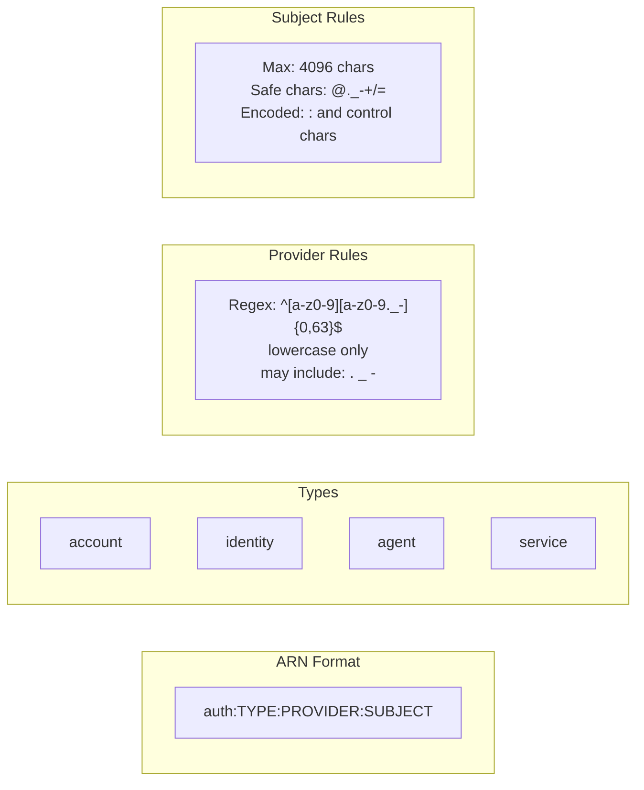

## Identity Mapping Flow

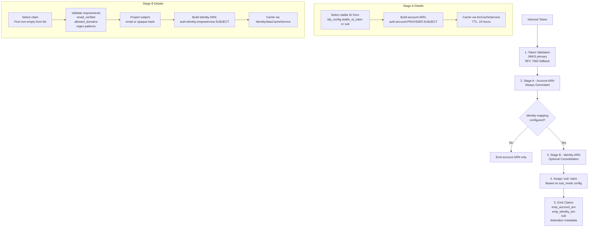

<!-- Entra provider diagram moved next to the Entra example below -->

## Configuration Decision Tree

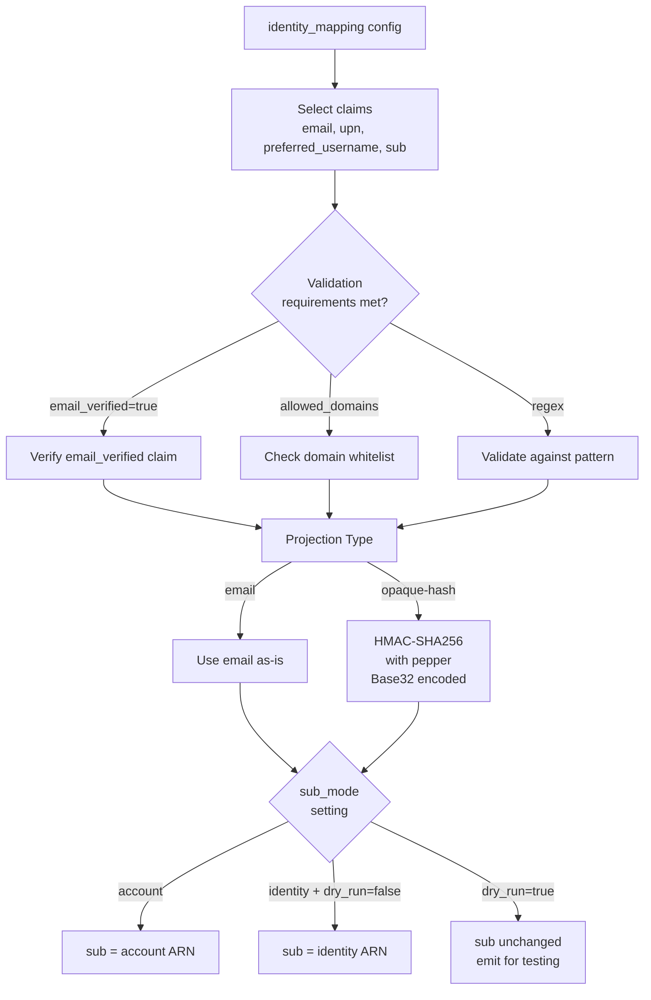

## Configuration Examples

### Basic Configuration Structure
```yaml
identity_mapping:
  select: ["email", "preferred_username", "sub"]  # Priority order
  require:
    email_verified: true                          # Email verification
    allowed_domains: ["acme.com", "corp.acme.com"] # Domain whitelist
    regex: "^[A-Z0-9]{6}$"                        # Pattern validation
  projection: "email"                             # or "opaque-hash"
  sub_mode: "identity"                            # account|identity|stable-internal
  dry_run: true                                   # Test mode first
```

<!-- Provider-specific summary diagram moved next to each example section below -->

## Emitted Claims Structure

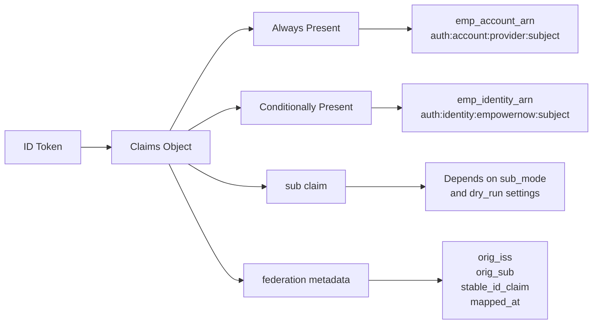

## Observability & Monitoring

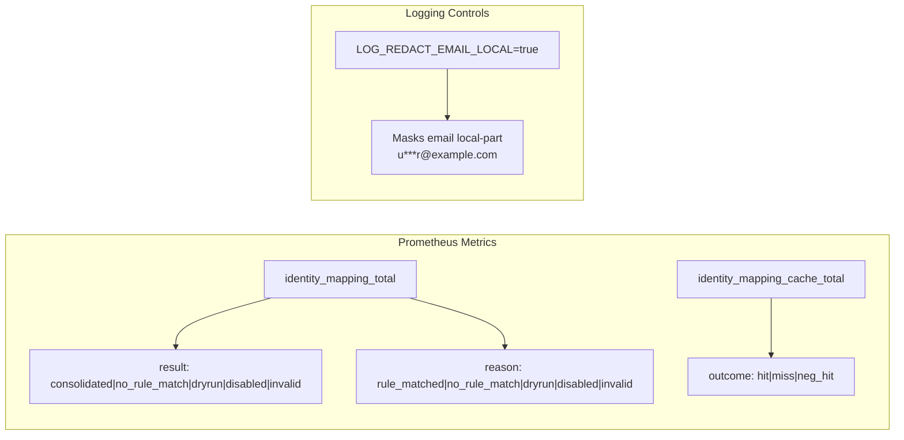

## Rollout Process

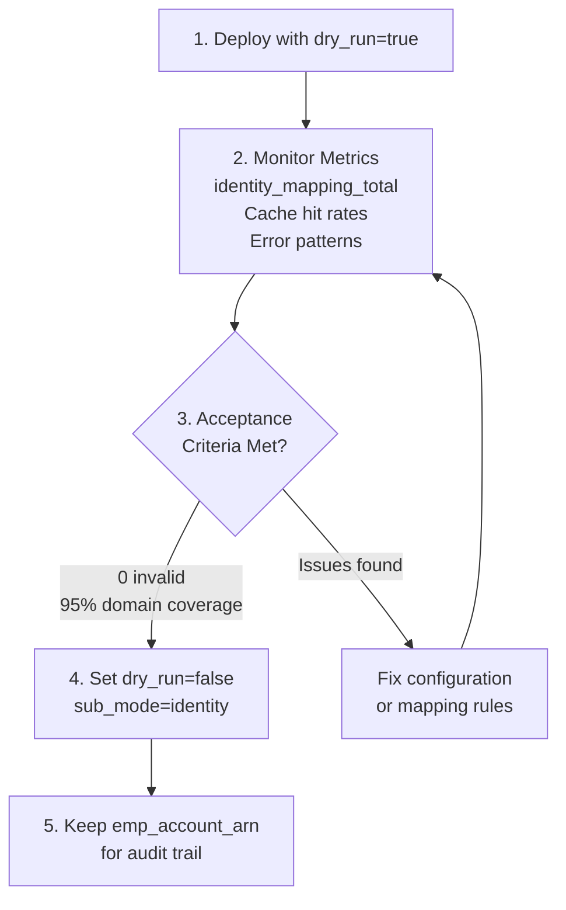

## PDP Integration

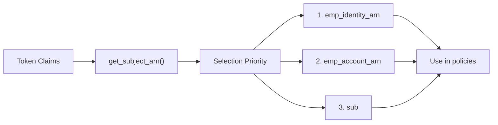

## Edge Case Handling

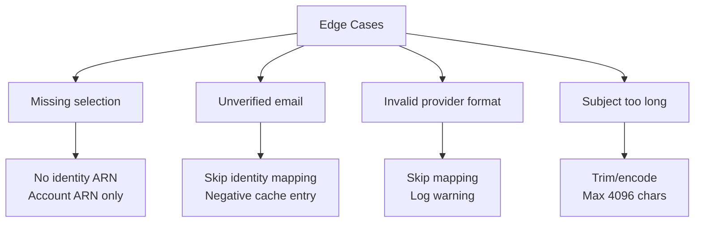

## File Reference Architecture

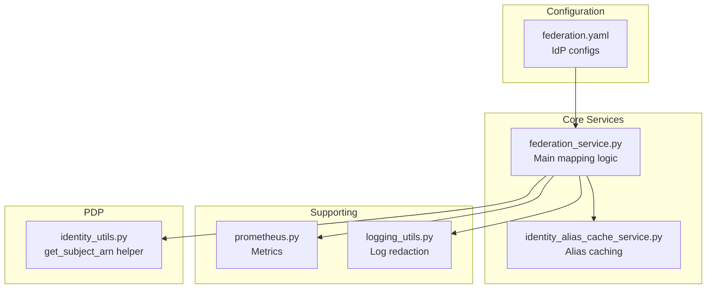

## Quick Reference

### ARN Builder Function
- Location: `src/services/federation_service.py`
- Function: `_build_canonical_arn()`
- Provider regex: `^[a-z0-9][a-z0-9._-]{0,63}$`
- Subject encoding: Percent-encodes `:` and control chars

### Cache Services
- **ArnCacheService**: Account ARN caching, 24h TTL
- **IdentityAliasCacheService**: Identity mapping cache with negative cache support
- Cache key: `(issuer, provider, source, value[, client_id])`

### Environment Variables
- `IDMAP_PEPPER_<ID>`: Pepper for opaque-hash projection
- `LOG_REDACT_EMAIL_LOCAL`: Enable email redaction in logs

### Validation Requirements
- `email_verified`: Requires boolean true claim
- `allowed_domains`: Case-insensitive domain matching
- `regex`: Pattern matching with optional source claim specification

### Sub Mode Behavior
| sub_mode | dry_run | Has Identity ARN | Result |
|----------|---------|------------------|---------|
| account  | any     | any              | sub = account ARN |
| identity | true    | yes              | sub = account ARN, emit identity |
| identity | false   | yes              | sub = identity ARN |
| identity | false   | no               | sub = account ARN |

## Real‑world federation.yaml examples

Below are end‑to‑end YAML snippets you can paste into `ServiceConfigs/IdP/config/federation.yaml` under `federation.trusted_idps`. They show realistic claim choices, validation, and projection settings for common providers. Adjust issuers, audiences, and client credentials to your tenants.

### Entra ID (single tenant; account sub, identity optional)
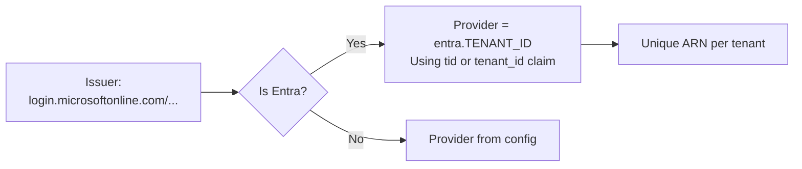
```yaml
- name: "entra-id"
  issuer: "https://login.microsoftonline.com/<TENANT_ID>/v2.0"
  audience:
    - "api://<APP_ID>"
    - "<APP_ID>"
  jwks_url: "https://login.microsoftonline.com/<TENANT_ID>/discovery/v2.0/keys"

  # Optional introspection (rarely used for Entra)
  introspection_url: "https://login.microsoftonline.com/<TENANT_ID>/oauth2/v2.0/introspect"
  client_id: "<APP_ID>"
  client_secret: "${ENTRA_CLIENT_SECRET}"

  # Entra specifics
  tenant_id: "<TENANT_ID>"
  stable_id_claim: "oid"   # per-tenant unique object id

  max_token_age: 86400
  require_verified_email: false

  # Stage B: consolidate to platform identity only when verified email available
  identity_mapping:
    select: ["email", "upn", "sub"]
    require:
      email_verified: true
    projection: "email"
    sub_mode: "account"   # keep sub as account for Entra by default
    dry_run: false
```

### Okta (verified email → identity; start in dry_run)
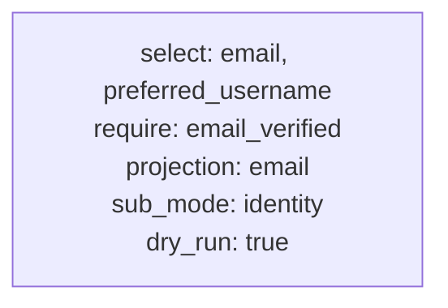
```yaml
- name: "okta"
  issuer: "https://<your-domain>.okta.com/oauth2/default"
  audience: ["api://my-okta-audience", "<OKTA_APP_ID>"]
  jwks_url: "https://<your-domain>.okta.com/oauth2/default/v1/keys"

  introspection_url: "https://<your-domain>.okta.com/oauth2/default/v1/introspect"
  client_id: "<OKTA_APP_ID>"
  client_secret: "${OKTA_CLIENT_SECRET}"

  max_token_age: 7200
  require_verified_email: false

  identity_mapping:
    select: ["email", "preferred_username", "sub"]
    require:
      email_verified: true
      # optional allow-list example
      # allowed_domains: ["acme.com", "corp.acme.com"]
    projection: "email"
    sub_mode: "identity"
    dry_run: true
```

### Auth0 (verified email required)
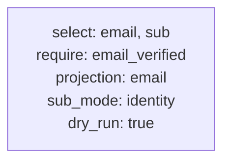
```yaml
- name: "auth0"
  issuer: "https://<tenant>.auth0.com/"
  audience: ["https://my-api.example.com"]
  jwks_url: "https://<tenant>.auth0.com/.well-known/jwks.json"

  max_token_age: 3600
  require_verified_email: true

  identity_mapping:
    select: ["email", "sub"]
    require:
      email_verified: true
    projection: "email"
    sub_mode: "identity"
    dry_run: true
```

### Google (opaque‑hash projection; no PII in subject)
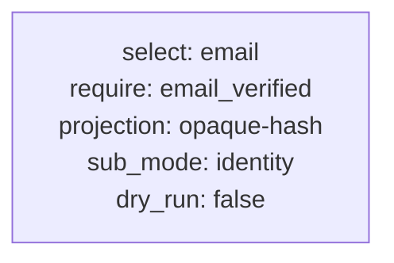
```yaml
- name: "google"
  issuer: "https://accounts.google.com"
  audience: ["<GOOGLE_CLIENT_ID>.apps.googleusercontent.com"]
  jwks_url: "https://www.googleapis.com/oauth2/v3/certs"

  # Google tokeninfo exists but is atypical for introspection
  max_token_age: 3600
  require_verified_email: true

  identity_mapping:
    select: ["email"]
    require:
      email_verified: true
    projection: "opaque-hash"
    opaque_hash:
      pepper_id: "h1"     # export IDMAP_PEPPER_H1 in environment
    sub_mode: "identity"
    dry_run: false
```

### Generic OIDC (regex + domain allow‑list)
```yaml
- name: "generic-oidc"
  issuer: "https://identity.example.com"
  audience: ["my-client-id"]
  jwks_url: "https://identity.example.com/.well-known/jwks.json"

  introspection_url: "https://identity.example.com/oauth2/introspect"
  client_id: "introspection-client"
  client_secret: "${GENERIC_CLIENT_SECRET}"

  max_token_age: 1800
  require_verified_email: false

  identity_mapping:
    select: ["email", "preferred_username", "sub"]
    require:
      allowed_domains: ["acme.com"]
      regex: { pattern: "^[A-Z0-9]{6}$", source: "preferred_username" }
    projection: "email"
    sub_mode: "account"
    dry_run: false
```

### Keycloak (realm/resource roles via claims_mapping; identity on email)
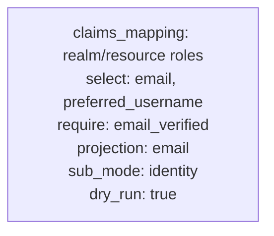
```yaml
- name: "keycloak"
  issuer: "https://kc.example.com/realms/acme"
  audience: ["acme-portal"]
  jwks_url: "https://kc.example.com/realms/acme/protocol/openid-connect/certs"

  claims_mapping:
    roles:
      - source: "realm_access.roles"
        format: "array"
      - source: "resource_access.acme-portal.roles"
        format: "array"

  identity_mapping:
    select: ["email", "preferred_username"]
    require:
      email_verified: true
    projection: "email"
    sub_mode: "identity"
    dry_run: true
```

## Advanced patterns and tips

- Pairwise-style cache scoping: The alias cache keys include `(issuer, provider, source, value[, client_id])`. When the incoming claims include `client_id` (or `azp` mapped to it), mappings are effectively pairwise per client.
- Entra uniqueness: The provider is automatically shaped to `entra.{tenant_id}` at runtime to avoid cross-tenant collisions; keep `stable_id_claim: oid` in config.
- Opaque-hash secrets: Do not derive opaque identifiers without a pepper. Export `IDMAP_PEPPER_<ID>` (for example, `IDMAP_PEPPER_H1`). If missing, Stage B is skipped and counted as `invalid`.
- Domain allow‑lists: Use `allowed_domains` for exact domain matches; consider configuring both root and subdomain entries if needed.
- Regex validation: Use `{ pattern, source }` to validate a particular claim instead of the selected value when required.
- Dry‑run rollout: Begin with `dry_run: true` for new providers; flip to `sub_mode: identity` only after metrics show stability (no `invalid`, high coverage).

## Environment overrides (per‑IdP) via env vars

You can override nested fields without editing YAML using environment variables (loader supports nested overrides):

```bash
# Windows PowerShell examples
$env:SETTINGS_FILE = 'C:\\source\\repos\\ServiceConfigs\\IdP\\config\\settings.yaml'
# Flip Okta to live mode
$env:FEDERATION__TRUSTED_IDPS__1__IDENTITY_MAPPING__DRY_RUN = 'false'
$env:FEDERATION__TRUSTED_IDPS__1__IDENTITY_MAPPING__SUB_MODE = 'identity'
# Provide pepper for opaque-hash
$env:IDMAP_PEPPER_H1 = '<secret>'
```

Indexing in `TRUSTED_IDPS__N__...` matches the provider’s position in your YAML.

## FAQ for SSO Admins (Ping, Okta, Entra ID)

- **Where do I get issuer/jwks/introspection endpoints for my IdP?**
  - Use the OIDC discovery document at `/.well-known/openid-configuration` for your tenant/realm/org. Copy `issuer`, `jwks_uri`, and (if present) `introspection_endpoint` directly into the IdP block. If the vendor does not expose introspection (or it’s disabled), omit `introspection_url` and the IdP will use JWKS verification.

- **What should I use for `stable_id_claim`?**
  - Entra ID: `oid` (per-tenant stable object id).
  - Okta: `sub` is typical.
  - Ping (PingFederate/PingOne): `sub` is typical unless pairwise subjects are enabled. Pairwise still works because cache keys include `issuer` and optional `client_id`.

- **How do I choose the `select` list (Stage B)?**
  - Start with `email`, then provider-specific username (`preferred_username` or `upn`), then `sub`. Confirm claim availability in your tokens.

- **What if my IdP does not send `email_verified`?**
  - Remove the requirement or combine with `allowed_domains`. If `email_verified: true` is required and absent/false, Stage B is skipped for that token.

- **How do I avoid cross‑tenant or cross‑org collisions?**
  - Entra is handled automatically via `entra.{tenant_id}`. For Okta/Ping across multiple orgs, suffix provider names (e.g., `okta.acme`, `okta.contoso`) for clarity. Stage B cache keys include `issuer` (and `client_id` when present) to prevent collisions.

- **What is a “pepper” and how do I set it?**
  - A secret used with HMAC to derive an opaque identity for `opaque-hash` projection. Set `IDMAP_PEPPER_<ID>` (e.g., `IDMAP_PEPPER_H1`) and reference it via `opaque_hash.pepper_id`. If missing, Stage B is skipped and counted as `invalid`.

- **Can I rotate peppers?**
  - Yes. Create a new `pepper_id` (e.g., `h2`), set the env var, then update config to use it. Existing identifiers remain stable; no insecure fallback exists.

- **What does “pairwise” mean here?**
  - Some IdPs issue a different `sub` per client. Because the alias cache key optionally includes `client_id` (from claims such as `azp`), mappings are effectively per-client where applicable.

- **What is the cache behavior (TTL)?**
  - Identity alias cache: positive ≈ 7 days; negative ≈ 15 minutes. Signature verification cache: 5 minutes or less if the token expires sooner.

- **How do I validate rules before switching `sub` to identity?**
  - Use `dry_run: true` and monitor `identity_mapping_total` and `identity_mapping_cache_total` metrics. Flip `sub_mode: identity` and set `dry_run: false` once results are stable.

- **Does Stage B support dot‑path/JSONPath selectors?**
  - Not yet; selectors are top‑level fields only.

- **What should I use for Ping specifically?**
  - Use Ping OIDC metadata to populate `issuer`, `jwks_url` (from `jwks_uri`), and optionally `introspection_url`. Start with `stable_id_claim: "sub"`, `select: ["email", "preferred_username", "sub"]`, `projection: "email"`, `dry_run: true`. Add `require.email_verified` and/or `allowed_domains` if those claims are present.

- **Where do I place these settings?**
  - In `ServiceConfigs/IdP/config/federation.yaml` under `federation.trusted_idps`, or via environment overrides documented above.

- **How do I disable identity consolidation for a provider?**
  - Omit `identity_mapping` for that IdP. Stage A account ARNs will still be minted and emitted.

