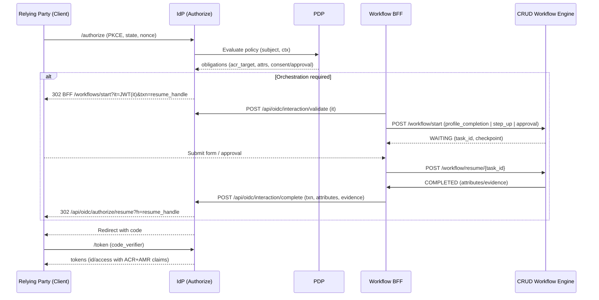

### Can our graph workflow engine deliver superior login/user orchestration with IdP + PDP?

Yes. Your CRUDService graph engine gives you a vendor‑agnostic, programmable orchestration layer with capabilities that rival or exceed Curity’s Authentication Actions and Ping’s DaVinci, especially when combined with your IdP’s advanced OAuth/OIDC stack and PDP obligations.

### Why it’s stronger than typical “visual orchestration”
- Superior runtime control
  - Concurrency, circuit‑breakers, timeouts, and error flows on each node.
  - Deterministic checkpointing + resume for long‑running and out‑of‑band steps (approvals, identity proofing).
- Adaptive UX synthesis
  - Param orchestrator auto‑synthesizes forms when inputs are missing/invalid; you don’t need to pre‑model every screen.
- First‑class approvals and human‑in‑the‑loop
  - User interaction nodes with typed forms and approvals integrate naturally into auth journeys.
- Deep policy integration
  - PDP obligations drive step‑up/consent/delegation branches without vendor‑specific lock‑in.
- Eventing + analytics
  - Kafka events across IdP and CRUDService enable feedback loops and collaborative adaptive authentication.

### Mapped to your engine components
- final_executor.py: graph runtime (concurrency, WAITING/COMPLETED transitions, checkpoints, domain insights)
```3930:3990:CRUDService/src/engine/graph_executor/final_executor.py
domain_insights["workflow_intelligence"] = (
    generate_workflow_intelligence_graph(self)
)
...
partial_user_interaction = await self.response_builder.build_waiting_response(
    workflow_context=self.context,
    node=node,
    interaction_type=node.config.get("interaction_type", "user_interaction"),
    task_id=task_id,
    ...
)
```

- action_handler.py: param orchestration and auto‑form synthesis when inputs are missing/invalid
```406:449:CRUDService/src/engine/graph_executor/action_handler.py
# Synthesize a FORM USER_INTERACTION node and set WAITING
# by delegating to the form handler (reuse existing mechanism)
from src.engine.graph_executor.user_interaction.handler import handle_user_interaction
node.config["interaction_type"] = "form"
...
node.config["form_schema"]["fields"] = fields
...
await handle_user_interaction(node, executor)
return
```

- form_handler.py: create DB‑backed tasks, persist checkpoint, set WAITING, resume safely on submit
```753:761:CRUDService/src/engine/graph_executor/user_interaction/form_handler.py
# Set node to WAITING state
node.status = NodeStatus.WAITING
executor.waiting_on_user_node = node.id
...
metrics.observe_workflow_task_duration(FORM_CREATE_TIME, elapsed_ms)
```

- vacation_request_workflow.yaml: example of multi‑step form → approval → end. This pattern maps directly to login flows: collect consent, step‑up, supervisor approval for privileged role elevation, etc.

### What you can orchestrate in login journeys (beyond Curity/Ping)
- Risk‑ and policy‑driven branching with PDP obligations
  - Challenge with WebAuthn/MFA only when PDP says so; skip otherwise.
- Human‑in‑the‑loop approvals inside auth
  - Out‑of‑band manager approval before granting high‑risk roles/entitlements.
- Progressive profiling and attribute gathering
  - Auto‑synthesized forms request missing attributes (department, project, assurance artifacts) only when required.
- Long‑running login sessions with guaranteed resume
  - Checkpoints survive browser/app restarts across approval/verification steps.
- Enriched analytics and collaborative adaptivity
  - Emit and consume Kafka events to adapt future flows.

### Example: define a login orchestration with your engine
```yaml
name: login_orchestration
version: "1.0"

nodes:
  start_external_login:
    type: ACTION
    config:
      system: idp
      object_type: auth
      action: start_external_authorize
      params:
        provider: "{{ in.provider }}"         # azure|okta|auth0
        client_id: "{{ in.client_id }}"
        redirect_uri: "{{ in.redirect_uri }}"
    edges:
      - to: handle_callback

  handle_callback:
    type: ACTION
    config:
      system: idp
      object_type: auth
      action: exchange_code_for_tokens
      params:
        code: "{{ in.code }}"
    edges:
      - to: evaluate_risk

  evaluate_risk:
    type: ACTION
    config:
      system: pdp
      object_type: risk
      action: evaluate
      params:
        subject: "{{ var.subject }}"
        context: "{{ in.context }}"
      response_mapping:
        - target: var.risk_level
          expression: "{{ response.risk_level }}"
        - target: var.step_up_required
          expression: "{{ response.obligations.step_up_required }}"
    edges:
      - to: step_up if: "{{ var.step_up_required }}"
      - to: consent if: "{{ not var.step_up_required }}"

  step_up:
    type: USER_INTERACTION
    config:
      interaction_type: form              # or approval for privileged flows
      form_schema:
        fields:
          - name: "webauthn_assertion"
            type: "string"
            required: true
      response_mapping:
        - target: var.webauthn_assertion
          expression: "{{ response.webauthn_assertion }}"
    edges:
      - to: verify_step_up

  verify_step_up:
    type: ACTION
    config:
      system: idp
      object_type: mfa
      action: verify_webauthn
      params:
        assertion: "{{ var.webauthn_assertion }}"
    edges:
      - to: consent

  consent:
    type: USER_INTERACTION
    config:
      interaction_type: form
      form_id: "terms-privacy-v1"
      response_mapping:
        - target: var.consent_given
          expression: "{{ response.accepted == true }}"
    edges:
      - to: mint_tokens

  mint_tokens:
    type: ACTION
    config:
      system: idp
      object_type: tokens
      action: mint
      params:
        subject: "{{ var.subject }}"
        acr: "{{ var.acr }}"
        claims: "{{ var.mapped_claims }}"
    edges:
      - to: end

  end:
    type: END
    config:
      message: "Login completed"
```

### Integration notes
- IdP: keep tokens authoritative; the workflow drives when/how to step‑up and when to mint. Use your existing DPoP/FAPI middleware and discovery features.
- PDP: obligations set step‑up, consent, or approvals; engine branches accordingly.
- UI: reuse `workflow-ui` to render synthesized forms/tasks; use task IDs + checkpoint metadata to resume.
- Security: sanitize inputs (already in `final_executor._sanitize_user_input`); store only what’s needed in tasks/checkpoints.

### How this compares to Ping’s orchestration
- Comparable flow logic, but with stronger runtime and developer ergonomics for complex, conditional, long‑running auth journeys. And it’s vendor‑agnostic by design; you decide which connectors to call and how to shape claims, not the platform.
- Reference: [Ping Identity – Identity Orchestration](https://www.pingidentity.com/en/resources/identity-fundamentals/identity-orchestration.html)

I can turn the example into a working `config/workflows/login_orchestration.yaml`, wire IdP/PDP actions, and add a minimal UI route to demo end‑to‑end.

### End-to-end: Progressive Profiling with IdP + CRUD Workflow + back to IdP

- Start at IdP
  - Client hits IdP `/authorize` (PKCE). User authenticates (local or external).
  - IdP evaluates “profile completeness” (policy/PDP). If required attributes are missing, IdP pauses the OIDC transaction server-side and issues a short-lived interaction_token (JWT) and a resume_handle.

- Handoff to CRUD workflow (front-channel)
  - IdP redirects the browser to Workflow UI with the interaction token:
    - 302 → `https://automate…/workflows/start?workflow=profile_completion&it=<interaction_token>`
  - Workflow BFF validates `it` (via IdP JWKS or `POST /api/oidc/interaction/validate`), then calls CRUD:
    - `POST /workflow/start` with inputs: `{ sub, required_fields, interaction_token, resume_handle }`
  - Engine starts `profile_completion` workflow:
    - If inputs are missing/invalid, it auto-synthesizes a form and moves to WAITING (task_id + checkpoint).
    - UI renders the form, user submits; engine validates, maps to workflow vars.

- Commit back to IdP (back-channel + front-channel resume)
  - On completion, the Workflow BFF calls IdP:
    - `POST /api/oidc/interaction/complete` with `{ interaction_token, attributes: { … } }`
    - IdP verifies, updates user store, marks transaction ready.
  - Browser is then redirected to IdP’s resume endpoint:
    - 302 → `https://idp…/api/oidc/authorize/resume?h=<resume_handle>`
  - IdP resumes the original OIDC request and redirects to the RP with `code` (now with complete claims).

### Minimal contracts

- interaction_token (JWT, 5–10 min TTL)
  - iss=idp, aud=crud.workflow, sub=user ARN, required_fields=[…], resume_handle, nonce
- IdP endpoints (internal/public as appropriate)
  - POST `/api/oidc/interaction/validate` → {valid, fields}
  - POST `/api/oidc/interaction/complete` → {ok}; auth: BFF service credentials or signed `it`
  - GET `/api/oidc/authorize/resume?h=…` → continues OIDC
- CRUD workflow start
  - POST `/workflow/start` → returns WAITING (form) → `/workflow/resume` on submit
  - Stores `interaction_token`, `resume_handle` in task metadata

### Example workflow (profile completion)

```yaml
name: profile_completion
version: "1.0"
nodes:
  collect_profile:
    type: USER_INTERACTION
    config:
      interaction_type: form
      form_schema:
        fields:
          - name: "department"   ; type: "string" ; required: true
          - name: "location"     ; type: "string" ; required: true
      response_mapping:
        - target: var.department
          expression: "{{ response.department }}"
        - target: var.location
          expression: "{{ response.location }}"
    edges:
      - to: commit_to_idp

  commit_to_idp:
    type: ACTION
    config:
      system: idp
      object_type: profile
      action: interaction_complete
      params:
        interaction_token: "{{ in.interaction_token }}"
        attributes:
          department: "{{ var.department }}"
          location: "{{ var.location }}"
    edges:
      - to: end

  end:
    type: END
    config:
      message: "Profile completion done"
```

### Key implementation notes

- IdP (authorize flow)
  - After authentication, check completeness → if missing:
    - Generate `interaction_token` + `resume_handle`
    - Redirect to Workflow UI with `it`
    - Persist server-side OIDC transaction context keyed by `resume_handle`
- CRUD Workflow
  - Validates `it`; starts workflow; synthesizes form if needed; sanitizes inputs; checkpoint on WAITING
  - On completion, back-channel to IdP `interaction/complete`, then front-channel 302 to IdP `authorize/resume`
- Security
  - `interaction_token`: narrow aud, short TTL, nonce, bind to user/session
  - BFF→IdP back-channel: mTLS or client credentials + `it` verification
  - Preserve PKCE + OIDC params in IdP server-side; never leak to CRUD
  - CSRF: form posts are within Workflow UI; back-channel is service-authenticated
- UX
  - Same look-and-feel via Workflow UI; resume is seamless
  - If user abandons, checkpoint enables later resume; IdP can set max_age for pending

This delivers a clean, standards-aligned “federate then orchestrate” journey with progressive profiling, using your runtime strengths (concurrency, checkpoints, auto-forms), and preserving the IdP’s authority over tokens and OIDC continuity. Reference: [Ping Identity – Identity Orchestration](https://www.pingidentity.com/en/resources/identity-fundamentals/identity-orchestration.html)

- If useful, I can add the `profile_completion` YAML to `CRUDService/config/workflows/`, add IdP `interaction/*` endpoints, and wire the Workflow UI start route to accept `it` and prefill required fields.

### Additional orchestration use cases (beyond progressive profiling)

- Step‑up MFA/WebAuthn: trigger phishing‑resistant step‑up when PDP or policy requires a higher ACR, then resume.
- Human approvals/consent: privileged elevation or sensitive scopes via approver flows (reusing Consent patterns) before mint.
- Risk‑based challenges: geo/device posture signals drive additional steps or attribute attestations.
- Identity proofing/KYC: document capture or IDV vendor flows; checkpointed WAITING with resume.
- Account/social linking: collect and verify external identities; merge and resume.
- Terms/AUP re‑acceptance and privacy choices: present policy screens and persist flags in profile.
- Attribute verification: email/phone OTP; retry/backoff; update claims on success.
- Device registration/binding: enroll device or key material; bind via DPoP `cnf` when applicable.
- Dual approvals / complex elevation: chained approvals for high‑risk actions; engine concurrency supported.

### Protocol binding and continuity (tighten)

- Treat `resume_handle` as a first‑class opaque transaction id; bind it in the IdP store to: `client_id, redirect_uri, code_challenge, code_challenge_method, state, nonce, acr_values, max_age, prompt`.
- Enforce ACR/AMR continuity on resume; verify AMR evidence (e.g., WebAuthn) satisfies target ACR before minting.
- Optional (now/roadmap): PAR + JAR/JARM to harden request param integrity; advertise in discovery when enabled.
- Continue DPoP/mTLS where available; carry `cnf` in tokens when bound.

### Interaction token and resume flow (finalized)

- Interaction token `it` (JWS): `iss=idp`, `aud=crud.workflow`, `txn=resume_handle`, `sub=user_arn`, `sid=session_id`, `nonce`, `iat/exp(≤ 10m)`, `jti`, optional `acr_target`, `required_fields[]`, optional `consent_scopes[]`.
- One‑time replay guard: persist `it.jti` until consumed at `/api/oidc/interaction/complete`.
- Allow ±60s skew; if enforcing freshness, the validate API may return `not_before` guidance to the UI.

### Security and privacy practices

- PII minimization: store only deltas for profile fields; redact logs; encrypt sensitive values at rest where feasible.
- Phishing‑resistant step‑up default: prefer WebAuthn for privileged elevation; OTP as fallback per policy.
- CSRF: Workflow UI POSTs are same‑site or CSRF‑token protected; no OIDC params leaked to front‑channel beyond `it`.
- Rate‑limits and backoff: per‑IP/service on `interaction/validate|complete`; return device‑flow style `slow_down` when applicable.

### Failure modes (defined)

- Abandon/timeout: interactions expire after TTL (e.g., 10–30 minutes); IdP invalidates `resume_handle`; workflow WAITING tasks may be cleaned up by TTL.
- Late decisions: approvals after expiry are rejected; a new interaction is required.
- Idempotency: `/api/oidc/interaction/complete` is idempotent per `txn` (transaction id); repeats return 409 with a pointer to resume.

### PDP obligation contract (explicit)

```json
{
  "decision": "Permit|Deny",
  "obligations": {
    "acr_target": "urn:acr:phishing-resistant",
    "require_consent": true,
    "require_attributes": ["department","location"],
    "require_approval": {
      "role": "privileged-admin",
      "approver_policy": "manager-of"
    }
  },
  "advice": { "risk_level": "high" }
}
```

Map 1:1 to engine branches: `step_up`, `profile_completion`, `consent`, `approval`.

### Observability (day‑2 ready)

- IdP metrics: `authorize_paused_total`, `authorize_resumed_total`, `interaction_started_total`, `interaction_completed_total`, `interaction_complete_latency_ms`, `acr_mismatch_denies_total`.
- Workflow metrics: task create/resolve counts, WAITING duration, abandon rates, approval lead time.
- Tracing: propagate a single `X-Correlation-ID` from IdP → Workflow BFF → CRUDService → back‑channel.
- Eventing: emit `identity.profile.updated` with minimal fields (sub, changed_fields, source) on successful attribute commit.

### Performance and UX

- Prefer streaming updates (SSE/WebSocket) from Workflow UI to reduce polling.
- Add mobile deep‑links for approval tasks; preserve `txn` across app boundaries.

### Updated sequence (concise)



### YAML (v1.1) deltas (key points)

- Add `acr_target` and `txn` to params and validations; mint only when obligations satisfied.
- Allow concurrency when PDP returns multiple obligations (e.g., `step_up` and `collect_attrs`).

```yaml
name: login_orchestration
version: "1.1"
nodes:
  evaluate_policy:
    type: ACTION
    config:
      system: pdp
      object_type: risk
      action: evaluate
      params: { subject: "{{ var.subject }}", context: "{{ in.context }}" }
      response_mapping:
        - target: var.acr_target
          expression: "{{ response.obligations.acr_target or 'urn:acr:loa1' }}"
        - target: var.required_attrs
          expression: "{{ response.obligations.require_attributes or [] }}"
        - target: var.need_consent
          expression: "{{ response.obligations.require_consent == true }}"
        - target: var.need_approval
          expression: "{{ response.obligations.require_approval != null }}"
    edges:
      - to: step_up if: "{{ var.acr_target == 'urn:acr:phishing-resistant' }}"
      - to: collect_attrs if: "{{ var.required_attrs | length > 0 }}"
      - to: consent if: "{{ var.need_consent }}"
      - to: approval if: "{{ var.need_approval }}"
      - to: mint_tokens

  collect_attrs:
    type: USER_INTERACTION
    config:
      interaction_type: form
      form_schema:
        fields_from: "{{ var.required_attrs }}"
    edges: [ { to: commit_attrs } ]

  commit_attrs:
    type: ACTION
    config:
      system: idp
      object_type: profile
      action: interaction_complete
      params:
        interaction_token: "{{ in.interaction_token }}"
        attributes: "{{ var }}"
    edges: [ { to: mint_tokens } ]

  mint_tokens:
    type: ACTION
    config:
      system: idp
      object_type: tokens
      action: mint
      params:
        txn: "{{ in.txn }}"
        acr: "{{ var.acr_target }}"
        claims: "{{ var.mapped_claims }}"
    edges: [ { to: end } ]

  end: { type: END, config: { message: "Login completed" } }
```

### Edge cases

- Reauth: if `max_age` exceeded on resume, require re‑auth before mint.
- Multiple journeys: run branches in parallel; mint only when all required branches complete.
- Context change: if UA/IP context drifts, soft‑challenge or re‑auth per policy.
- SLA: if approval exceeds SLA, cancel transaction; show “request expired” with restart link.

### Implementation checklist (recap)

- IdP: store full OIDC request under `resume_handle`; bind `it → txn`. Enforce ACR/AMR on resume.
- IdP: `/api/oidc/interaction/validate` and `/api/oidc/interaction/complete` (idempotent per `txn`).
- Workflow BFF: validate `it` (sig, aud, exp, txn); sanitize/limit PII; start/resume workflows.
- CRUD workflow: WAITING/RESUME with checkpoint; optional concurrency; redaction hooks for logs.
- PDP: return explicit obligations (`acr_target`, `require_*`) and separate advice (`risk_level`).

### References

- Identity orchestration background and patterns: [Ping Identity – Identity Orchestration](https://www.pingidentity.com/en/resources/identity-fundamentals/identity-orchestration.html)
