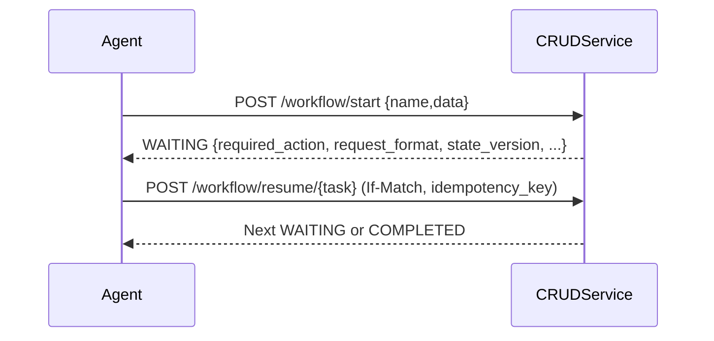

# LLM Agent Adoption Guide

This guide shows how to integrate your agent with the CRUDService using zero-SDK primitives: REST and MCP.

## Core contract at WAITING

Clients (UI, MCP, RPA, Agents) drive resumes with the self-describing triplet plus safety metadata.

Key fields to use:
- result.required_action
- result.request_format { url, method, headers: { If-Match }, fingerprint, idempotency_key }
- result.state_version
- result._links, result.mcp_request_format

## Minimal agent loop (REST)

1. Start workflow
2. Read WAITING payload
3. If form/approval: prepare data with state_version + idempotency_key
4. POST to request_format.url with If-Match header

## Minimal agent loop (MCP)

1. Call tools/list
2. Use systems.describe_command to get required_params + param_schema
3. Use systems.suggest or identity.suggest to elicit values
4. Use workflow.schema_start to validate and/or start when complete

## Elicitation via param_schema

- x-suggest: maps to REST suggesters (/tools/suggest/{provider}/{kind})
- x-normalize: call tool to canonicalize values before submit
- x-compose/x-decompose: pre/post transforms handled by orchestrator

## Idempotency and concurrency

- Always send If-Match: <state_version>
- Always include result.request_format.idempotency_key in the body

## Example: Plan to form, then resume

## Stability rules

- Fingerprint is deterministic over method+url+body-keys+node+state_version
- Version conflicts return RFC-7807 Problem Details with refreshed WAITING

## Safety

- PII redaction applied to examples and logs
- Server enforces allowed_decisions and policy flags

