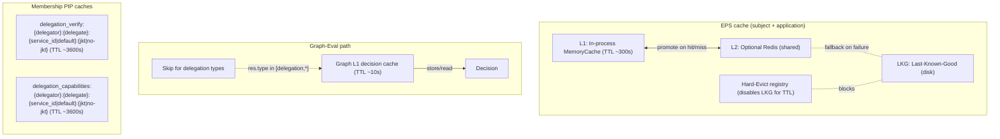
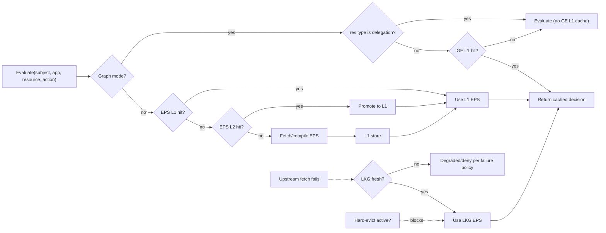
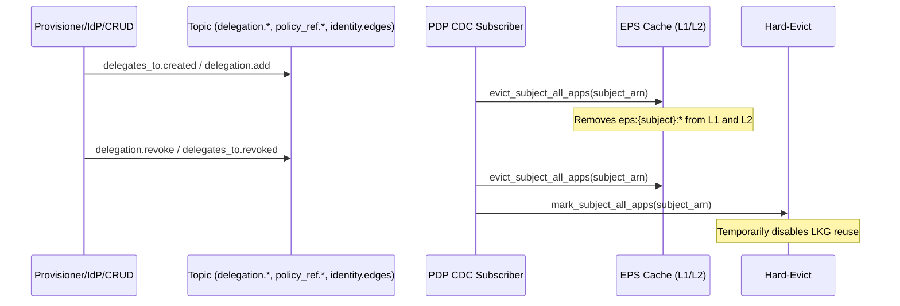
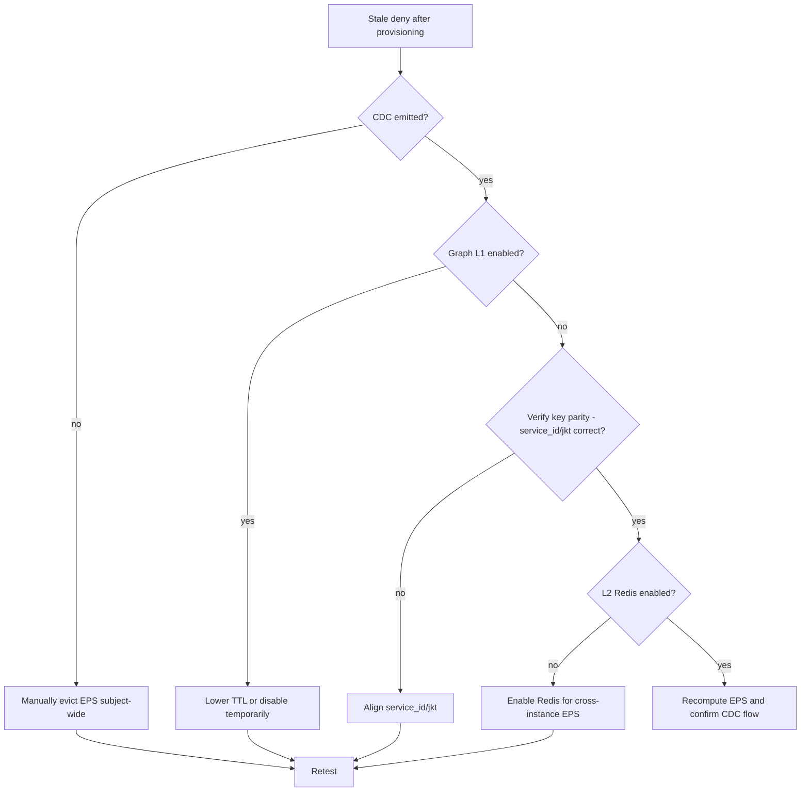

### EmpowerNow PDP Caching Guide

This guide explains how caching works inside the PDP, where delegation and membership data are cached, how invalidation flows, and what knobs you can turn to avoid stale decisions after provisioning.

### Layers at a Glance
- EPS cache (Effective Policy Set) for a subject+application
  - L1: in-process `MemoryCache`
  - L2: optional shared `RedisCache` when `REDIS_URL` is set
  - Coarse invalidation by subject across all apps
- LKG: disk-based Last-Known-Good EPS fallback, with a staleness window
- Hard-evict registry: temporarily disables using LKG for impacted subjects
- Graph-Eval L1 decision cache: optional, per-request cache for graph decisions
- Membership PIP caches:
  - Delegation verification cache (per delegator, delegate, service_id, JKT)
  - Delegation capabilities cache (same key shape)
  - Additional short-lived caches (e.g., inherited policies)

#### Visual overview of caches



### Core Code References

EPS two-tier cache (keying, TTL, invalidation):
```4:12:C:\source\repos\pdp\src\app\pdp\cache\eps_cache.py
EPS (Effective Policy Set) cache with L1/L2 support and coarse invalidation.
// L1 in-process, L2 shared (Redis), key: eps:{subject_arn}:{application_id}
```

```42:51:C:\source\repos\pdp\src\app\pdp\cache\eps_cache.py
class EpsCache:
    def __init__(self, l1: Optional[CacheStrategy] = None, l2: Optional[CacheStrategy] = None, ttl_seconds: int = 300) -> None:
        self.l1: CacheStrategy = l1 or MemoryCache()
        self.l2: Optional[CacheStrategy] = l2
        self.ttl_seconds: int = ttl_seconds
```

```115:133:C:\source\repos\pdp\src\app\pdp\cache\eps_cache.py
async def evict(self, subject_arn: str, application_id: str) -> None: ...
async def evict_subject_all_apps(self, subject_arn: str) -> None:
    pattern = f"eps:{subject_arn}:*"
    await self.l1.delete_pattern(pattern)
    if self.l2 is not None:
        await self.l2.delete_pattern(pattern)
```

PDP wiring: L2 Redis optional; L1 Graph cache; LKG and HardEvict:
```106:129:C:\source\repos\pdp\src\app\pdp\policy_decision_point.py
redis_url = os.getenv("REDIS_URL")
if redis_url:
    l2 = RedisCache(redis_url=redis_url, keys=CacheKeys(prefix="authz"))
else:
    l2 = None
self.eps_cache = EpsCache(l1=MemoryCache(), l2=l2)
self._graph_l1_cache = MemoryCache()
self._eps_lkg = EpsLKGStore(Path(state_dir)/"eps-lkg")
self._hard_evict = HardEvictRegistry()
```

Graph-Eval L1 decision cache and skip for delegation resource types:
```1109:1126:C:\source\repos\pdp\src\app\pdp\policy_decision_point.py
cache_enabled = (os.getenv("PDP_L1_CACHE_ENABLED","false").lower() in ("1","true","yes","y"))
ttl = int(os.getenv("PDP_L1_CACHE_TTL","10") or "10")
res_type = res.get("type") or ""
# Skip cache for delegation resource types
if cache_enabled and res_type not in ("delegation","delegation_context","user_delegation"):
    cached = await self._graph_l1_cache.get(cache_key)
    ...
```

```1184:1189:C:\source\repos\pdp\src\app\pdp\policy_decision_point.py
if cache_enabled and res_type not in ("delegation","delegation_context","user_delegation"):
    await self._graph_l1_cache.set(cache_key, pd.model_dump(), ttl=ttl)
```

LKG store (disk) and freshness window:
```67:77:C:\source\repos\pdp\src\app\pdp\cache\eps_lkg.py
async def get_if_fresh(self, subject_arn, application_id, max_staleness_seconds):
    entry = await self.load(subject_arn, application_id)
    if entry is None or max_staleness_seconds <= 0:
        return None
    age = time.time() - entry.saved_at_epoch
    if age <= max_staleness_seconds:
        return entry.payload
```

Hard-evict registry (disables LKG for a subject for TTL):
```17:27:C:\source\repos\pdp\src\app\pdp\cache\hard_evict.py
class HardEvictRegistry:
    def __init__(self, ttl_seconds: int = 1800) -> None:
        self._ttl = int(ttl_seconds)
...
async def mark_subject_all_apps(self, subject_arn: str) -> None:
    self._by_subject_all_apps[subject_arn] = now + self._ttl
```

CDC-driven coarse invalidation and hard-evict on revoke:
```70:87:C:\source\repos\pdp\src\app\cdc\subscriber.py
if any(x in topic for x in ["delegates_to.created","delegates_to.updated","delegates_to.revoked", "delegation.add","delegation.update","delegation.revoke","delegation.expire","policy_ref.added","policy_ref.removed","identity.belongs_to","controlled_by"]):
    await self.eps_cache.evict_subject_all_apps(subject_arn)
    if "delegates_to.revoked" in topic or "delegation.revoke" in topic:
        await self.hard_evict.mark_subject_all_apps(subject_arn)
```

Delegation verification cache (key shape, TTL, update on create):
```1496:1516:C:\source\repos\pdp\plugins\pips\membership_service_pip.py
service_id = getattr(self.api.settings, "service_id", None)
cache_key = f"delegation_verify:{delegator_id}:{delegate_id}:{service_id or 'default'}:{jkt if jkt else 'no-jkt'}"
cached_result = await self.cache.get(cache_key)  # hit returns immediately
```

```1560:1562:C:\source\repos\pdp\plugins\pips\membership_service_pip.py
await self.cache.set(cache_key, result, ttl=DEFAULT_DELEGATION_CACHE_TTL)
```

```2007:2017:C:\source\repos\pdp\plugins\pips\membership_service_pip.py
# after successful create:
await self.cache.set(cache_key, {
    "verified": True, "delegator_id": delegator_id, "delegate_id": delegate_id,
    "delegation_id": result.get("delegation_id"), "binding_valid": True,
    "capabilities": result.get("capabilities", [])
}, ttl=DEFAULT_DELEGATION_CACHE_TTL)
```

Revocation invalidation by prefix (covers all service_id/JKT):
```2541:2550:C:\source\repos\pdp\plugins\pips\membership_service_pip.py
verify_prefix = f"delegation_verify:{delegator_id}:{delegate_id}:"
caps_prefix = f"delegation_capabilities:{delegator_id}:{delegate_id}:"
await self.cache.delete_prefix(verify_prefix)
await self.cache.delete_prefix(caps_prefix)
```

Delegation TTL constants:
```87:94:C:\source\repos\pdp\src\app\core\constants\delegation_constants.py
DEFAULT_DELEGATION_CACHE_TTL = 3600
DEFAULT_DELEGATION_TOKEN_TTL = 43200
DEFAULT_DELEGATION_EXPIRY = 2592000
```

### How it Works

- Effective Policy Set (EPS)
  - When evaluating via EPS mode, PDP fetches per-subject+app EPS from L1; on miss, from L2; on L2 hit, it promotes to L1. Default TTL is 300s.
  - EPS is persisted to LKG and reused if the remote fetch fails and subject is not hard-evicted.
  - EPS invalidation is coarse-grained: either specific subject+app or “subject across all apps.” CDC integrates to trigger these evictions.

- Graph-Eval path
  - If graph mode is selected, PDP can cache the final decision in a small L1 cache keyed by subject, resource, action, and app.
  - It intentionally avoids caching for delegation-related resources.

- Membership PIP delegation caches
  - verify_delegation caches positive/negative lookups keyed by delegator, delegate, service_id, and JKT binding. Default TTL is 1 hour.
  - create_delegation updates the corresponding verify cache entry immediately so a subsequent verify with the same key returns positive.
  - revoke_delegation invalidates verify and capabilities caches via prefix delete (wipes all service_id/JKT variants).

#### EPS and Graph‑Eval request lifecycle



### Why You See Stale Denies After Provisioning

- EPS compiled state is cached (300s) separately from the membership PIP delegation verify cache. Even if verify_delegation is updated to positive after provisioning, an authorization that depends on EPS (not a direct delegation verify) can still read stale EPS from L1/L2 or fall back to LKG.
- If your provisioning interceptor creates the delegation but does not emit a CDC event, the PDP will not evict EPS for the delegator. The next evaluation can be served from EPS caches and deny until TTL expires.
- If Graph-Eval L1 caching is enabled and the request is not a delegation resource, a previous deny decision might be reused for up to PDP_L1_CACHE_TTL seconds.

### Knobs You Can Turn

- EPS cache
  - Use Redis for L2: set `REDIS_URL`. Keys are prefixed with `authz` and formatted as `eps:{subject_arn}:{application_id}`.
  - TTL: constructor default is 300 seconds. If you wrap PDP or instantiate `EpsCache(ttl_seconds=...)` yourself, you can change it.
  - Invalidation:
    - Specific pair: `eps_cache.evict(subject, app)`
    - Subject-wide: `eps_cache.evict_subject_all_apps(subject)` (what CDC uses)

- LKG and Hard-Evict
  - LKG directory: `PDP_STATE_DIR` env (default `.state/eps-lkg`)
  - LKG staleness threshold in PDP usage: 300s
  - Hard-evict TTL default: 1800s; disables LKG for a subject to avoid using stale state after revocations

- Graph-Eval L1 cache
  - Enable: `PDP_L1_CACHE_ENABLED=true|false` (default false)
  - TTL: `PDP_L1_CACHE_TTL` (seconds; default 10)
  - Auto-skip on resource types: `delegation`, `delegation_context`, `user_delegation`

- Delegation verification (membership PIP)
  - TTL: `DEFAULT_DELEGATION_CACHE_TTL` (1 hour, constant)
  - Key: `delegation_verify:{delegator}:{delegate}:{service_id|default}:{jkt|no-jkt}`
  - Revocation invalidation: prefix delete of `delegation_verify:{delegator}:{delegate}:*` and `delegation_capabilities:{delegator}:{delegate}:*`
  - Important: JKT and service_id differences create distinct cache entries. Mismatches mean you update one key but read another.

### Recommended Flow After Provisioning

- Ensure CDC is emitted on creation:
  - Publish an event like `delegates_to.created`/`delegation.add` with `subject`/`from` set to the delegator ARN. This will trigger `eps_cache.evict_subject_all_apps(subject)` immediately across PDP instances.
- Ensure verify cache coherence:
  - If you create a delegation inside the PDP request path, the Membership PIP’s `create_delegation` already upserts the matching `delegation_verify` cache entry. Make sure follow-up verifies use the identical `service_id` and `jkt` attributes.
- Avoid stale Graph-Eval decisions:
  - If you run graph mode and expect immediate effect, either disable `PDP_L1_CACHE_ENABLED` during provisioning-sensitive flows, or reissue requests with a resource type that’s excluded from L1 caching (for delegation checks) until you’ve observed the CDC-driven EPS refresh.
- For revocations:
  - CDC should also mark hard-evict; this prevents LKG from reintroducing stale grants during outages.

#### CDC‑driven invalidation sequence



### Troubleshooting Playbook

- Deny persists after provisioning:
  - Check whether a CDC event fired. If not, evict EPS manually for the delegator:
    - Temporary: run `eps_cache.evict_subject_all_apps(delegator)`
  - Confirm the evaluate mode. If graph mode is in use:
    - Check `PDP_L1_CACHE_ENABLED` and `PDP_L1_CACHE_TTL`. Consider disabling or reducing TTL while testing.
  - Confirm verify key parity:
    - Same `delegator`, `delegate`, `service_id`, and `jkt` as used in `create_delegation`.
- Works on one instance but not others:
  - Ensure L2 Redis is enabled (`REDIS_URL`) so EPS invalidations propagate across instances.
- Revocation appears ignored:
  - Verify CDC sent a revoke topic and hard-evict is applied (disables LKG).
  - Confirm `delete_prefix` executed for both `delegation_verify:` and `delegation_capabilities:`.

#### Decision tree



#### Provisioning to Allow timeline

```mermaid
gantt
  dateFormat  X
  title Provisioning to Allow Timeline (relative seconds)
  section Delegation verify cache
  verify_set              :done, 0, 5
  verify_ttl(3600s)       :active, 5, 3600
  section EPS caches
  EPS_L1/L2 precompiled   :crit, 0, 300
  CDC eviction (ideal)    :milestone, 2, 0
  EPS recompute           : 3, 5
  LKG freshness(300s)     : 0, 300
  section Graph L1 (if enabled)
  prior deny reused       : 0, 10
```



### Quick Reference of Keys and TTLs

- EPS: `eps:{subject}:{app}` — L1/L2 TTL default 300s
- Delegation verify: `delegation_verify:{delegator}:{delegate}:{service_id}:{jkt|no-jkt}` — TTL default 3600s
- Delegation capabilities: `delegation_capabilities:{delegator}:{delegate}:{service_id}:{jkt|no-jkt}` — TTL default 3600s
- Graph L1 decision: `ge:{subject}:{res_type}:{res_id}:{action}:{app}` — TTL default 10s; disabled for delegation resource types

- CDC topics that evict EPS: `delegates_to.created|updated|revoked`, `delegation.add|update|revoke|expire`, `policy_ref.added|removed`, role edge changes (`identity.belongs_to*`, `controlled_by*`)

- LKG staleness window: 300s
- Hard-evict TTL: 1800s

Status: I’ve mapped the PDP’s caching layers and extracted the precise keys, TTLs, and invalidation points (CDC, hard-evict, prefix deletes). Next, if you want, I can add a short “Provisoner Checklist” to your repo’s docs or wire a CDC event in your provisioning interceptor.

- The guide details EPS L1/L2 and invalidation, LKG and hard-evict behavior, Graph-Eval L1 caching, and membership PIP delegation cache keys/TTLs.
- It explains why stale denies occur post-provisioning and gives concrete knobs and a playbook to prevent them.