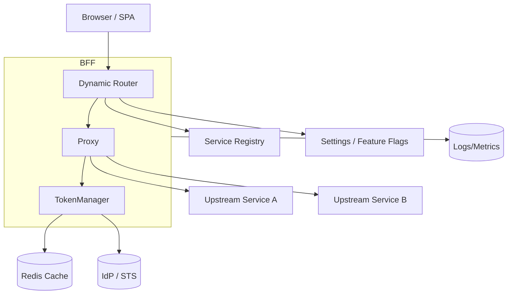
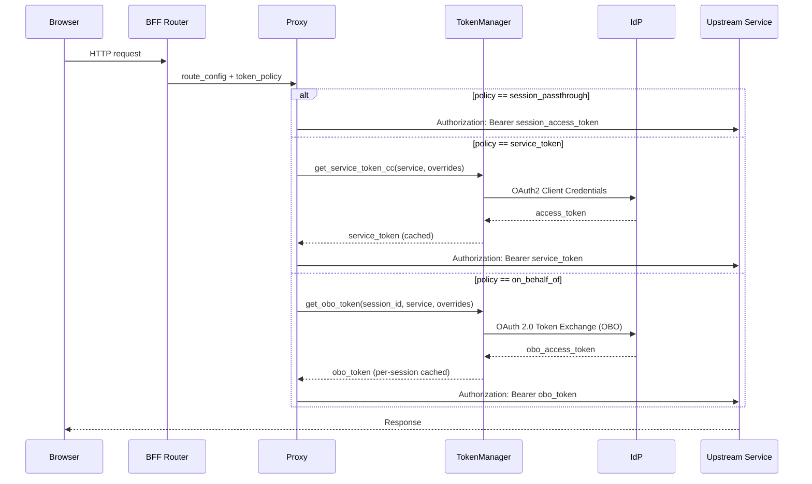
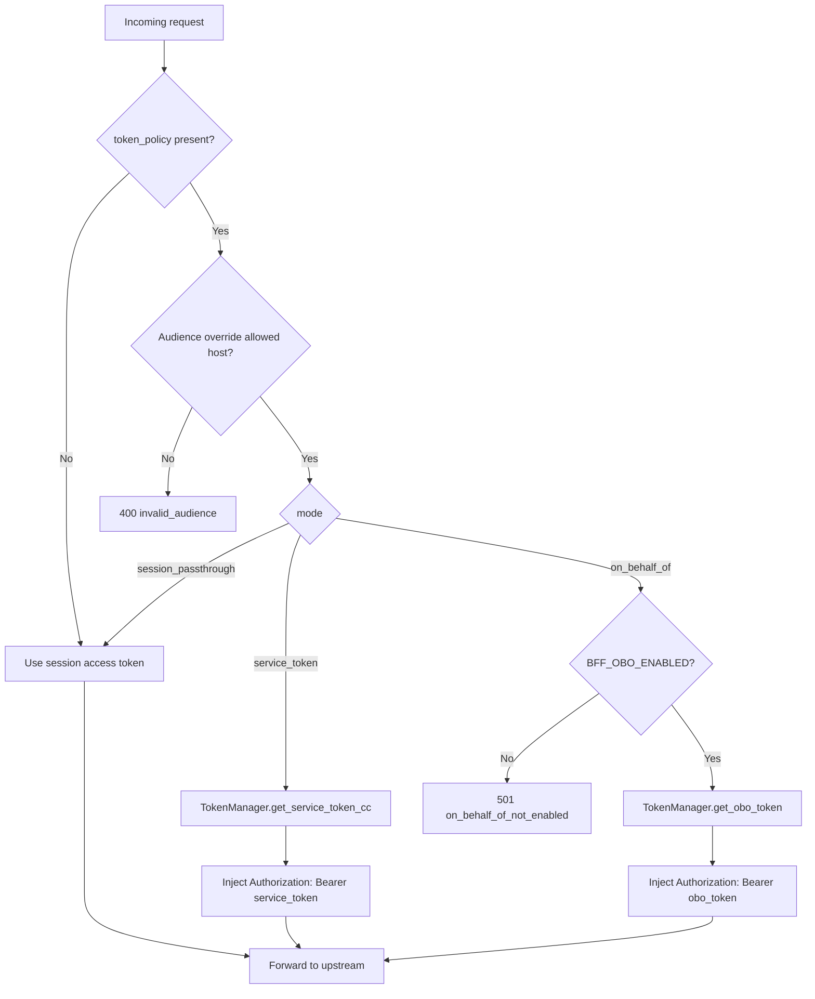

### ARIA Shield Per Route Token Policies

This document describes the ARIA Shield's per-route token policy feature: how it works, why it matters, how to configure it, and where it fits relative to industry practices and competing products.

## Why this matters

- **Least privilege by route**: Each upstream call uses the minimal token needed (client credentials or on-behalf-of), reducing blast radius and eliminating over‑privileged browser tokens.
- **Server-side token minting**: Tokens are minted/managed on the server only. The browser holds only a minimal session token.
- **Deterministic upstream access**: Per-route audience/scope is enforced at the ARIA Shield boundary, improving predictability for upstream auth.
- **Standards-aligned**: Designed around OAuth 2.0 concepts including Client Credentials and OAuth 2.0 Token Exchange (RFC 8693) patterns for on‑behalf‑of (OBO).

## What we built (high level)

- **Route-level policy** in `routes.yaml` with three modes:
  - `session_passthrough`: forward the user's access token (legacy/default)
  - `service_token`: mint and attach a service token via client_credentials
  - `on_behalf_of`: exchange the end-user token for a constrained upstream token (OBO)
- **Service registry**: Central config for per‑service defaults (audience, scopes, client, token URL, cache TTL).
- **TokenManager**: Centralized mint/refresh/cache for service and OBO tokens with singleflight, early refresh, and Redis-backed storage.
- **Dynamic Router + Proxy integration**: Router reads policy from `routes.yaml`, proxy obtains the correct token per request and sets `Authorization: Bearer` accordingly. Fail‑closed on issuance errors.
- **Security guardrails**: Audience allow‑list, header protections (cannot override `Authorization`), secrets from Docker/Vault, no tokens in logs.

## Where this fits in the ecosystem

Modern identity and API platforms commonly support patterns we implement here:
- **Identity servers**: Curity (OAuth 2.0 Token Exchange), Keycloak (token exchange/OBO patterns), Ping (STS/gateway token exchange), SecureAuth (token exchange).
- **API gateways**: Apigee/Google Cloud, Azure API Management, Kong, and Tyk offer per‑route policies/plugins that can acquire tokens (e.g., client credentials) and inject `Authorization` for upstream calls.

Our ARIA Shield builds these capabilities directly into the app layer with strong typing, centralized caching, observability, and tight integration with our routing config and service registry.

## Core architecture

- **Dynamic Router** reads `routes.yaml` → builds `RouteConfig` with an optional `token_policy`.
- **Proxy** executes the per‑route policy before forwarding.
- **TokenManager** issues and caches tokens:
  - Service tokens (client_credentials) are globally cached.
  - OBO tokens are cached per session (and by audience/scope).
  - Early refresh window (~60s) avoids edge expirations.
  - Singleflight ensures only one mint per cache key under concurrency.
- **Storage**: Redis namespace for service tokens and per‑session OBO tokens.
- **Observability**: Metrics for issuance, cache hits, and latency; structured logs for audits (never include token values).

### Architecture (Mermaid)



### Sequence: per-route token acquisition (Mermaid)



## Configuration

### Route schema additions (`routes.yaml`)

```yaml
- id: idp-admin
  path: /api/idp/admin/*
  target_service: idp_service
  upstream_path: /api/admin/{path}
  methods: [GET, POST, PUT, DELETE, OPTIONS]
  auth: session
  token_policy:
    mode: service_token                  # session_passthrough | service_token | on_behalf_of
    service: idp_admin                   # key in service registry
    audience: https://idp.../api/admin   # optional override; default from registry
    scopes: [admin.api]                  # optional override; default from registry
    cache_ttl: 300                       # optional hint
```

```yaml
- id: idp-user-v1
  path: /api/idp/v1/*
  target_service: idp_service
  upstream_path: /api/v1/{path}
  methods: [GET, POST, PUT, DELETE, OPTIONS]
  auth: session
  token_policy:
    mode: on_behalf_of
    service: idp_user
    audience: https://idp.../api/v1
    scopes: [user:read]
    cache_ttl: 300
```

### Service registry (per‑service defaults)

Defines: `base_url`, `token_url`, `client_id`, credential method (secret/private_key_jwt/mTLS), `token_audience`, `required_scopes`, `cache_ttl`.

### Settings

- `bff.allowed_aud_hosts`: e.g., `["idp.ocg.labs.empowernow.ai","crud.ocg.labs.empowernow.ai","authz.ocg.labs.empowernow.ai"]`
- `cache.redis_url`: non‑localhost for containers (use service DNS)
- Feature flags:
  - `BFF_TOKEN_POLICY_ENABLED=true`
  - `BFF_OBO_ENABLED=false` (enable to turn on OBO acquisition)

## TokenManager API (internal)

```python
async def get_service_token_cc(
    session_id: str | None,
    service_key: str,
    overrides: dict | None = None,
) -> str: ...

async def get_obo_token(
    session_id: str,
    service_key: str,
    overrides: dict | None = None,
) -> str: ...
```

- Service token cache key: `bff:svc:token:cc:{service}:{aud_hash}:{scope_hash}`
- OBO cache key: `bff:obo:{session_id}:{service}:{aud_hash}:{scope_hash}`

## Request flow (simplified)

```python
# Router (adds debug header)
extra_headers = {"X-Route-ID": route_config.id}
if route_config.token_policy:
  extra_headers["X-Token-Policy"] = json.dumps({"m": policy.mode, "s": policy.service})

# Proxy
policy = parse_token_policy_from_headers(request)
if policy and policy.mode != "session_passthrough":
  tm = request.app.state.token_manager
  if policy.mode == "service_token":
    token = await tm.get_service_token_cc(None, policy.service or infer, overrides=policy)
  else:  # on_behalf_of
    token = await tm.get_obo_token(session_id, policy.service or infer, overrides=policy)
  headers["Authorization"] = f"Bearer {token}"
else:
  headers["Authorization"] = f"Bearer {session_access_token}"
```

### Flow: issuance and caching lifecycle (Mermaid)

```mermaid
flowchart TD
    A[Incoming request] --> B{token_policy present?}
    B -- No --> P[Use session access token]
    P --> U[Forward to upstream]
    B -- Yes --> G{Audience allowed?}
    G -- No --> E400[400 invalid_audience]
    G -- Yes --> C{mode}
    C -- service_token --> K1[Build global cache key]
    C -- on_behalf_of --> K2[Build per-session cache key]
    K1 --> H{Cache hit & fresh?}
    K2 --> H
    H -- Yes --> I1[Use cached token]
    H -- No --> S[Acquire singleflight lock]
    S --> N{Near expiry?}
    N -- Yes --> R[Early refresh]
    N -- No --> M[Mint new token]
    R --> M
    M --> X{OBO enabled (if OBO)?}
    X -- No --> E501[501 on_behalf_of_not_enabled]
    X -- Yes --> TIDP[Request token from IdP/STS]
    TIDP --> TOK[Token issued]
    TOK --> CSH[Store in Redis cache]
    CSH --> I1
    I1 --> I2[Inject Authorization header]
    I2 --> U
    M -->|failure| E502[502 upstream_auth_failed]
```

### Flow: token policy decision (Mermaid)



## Security

- **Audience allow‑list**: Reject `token_policy.audience` hosts not in `settings.bff.allowed_aud_hosts` with `400 invalid_audience`.
- **Header guard**: Client cannot set/override `Authorization` (applies to streaming proxy too).
- **Secret management**: Credentials (client secret, private keys, mTLS, PATs) come from Docker secrets or Vault. No secrets in repo or browser.
- **No token data in logs**: Only metadata (mode, audience host, scopes count, correlation id).
- **Key management**: If using private_key_jwt, publish JWKS and rotate keys (~90 days) with overlapping `kid`s.

## Error handling

- `on_behalf_of` disabled: If `BFF_OBO_ENABLED=false` → `501 on_behalf_of_not_enabled`.
- Issuance failure: Return `502 upstream_auth_failed` with structured details `{mode, service, audience, scope_count, reason}`.
- 401 from upstream:
  - Verify forwarded token audience/scopes.
  - Retry once if token near expiry and cache miss.

## Observability

- Metrics:
  - `bff_tokens_minted_total{mode="cc|obo",service}`
  - `bff_tokens_cache_hit_total{mode,service}`
  - `bff_token_mint_latency_seconds{mode,service}`
  - `bff_proxy_upstream_auth_failed_total{mode,service,reason}`
- Logs: Route id, mode, service, audience host, scopes count, cache hit, correlation id.
- Dashboards: Token mint success rate, cache hit ratio, latency, 401/502 counts per route.

## Typical use cases

- **Admin APIs (service token)**: Lock admin endpoints to a dedicated service audience/scope, never leaking admin scopes to browser tokens.
- **User-bound upstreams (OBO)**: When upstream requires a user-context token but with a different audience/scope than the SPA's session.
- **Vendor APIs (PAT or custom creds)**: Acquire and cache non‑OIDC credentials server-side and attach per route.
- **Multi‑tenant hints**: Optionally use `session_id` for per‑tenant cache partitioning.

## Rollout and compatibility

- Phase 1: Add `token_policy` schema; default remains `session_passthrough`.
- Phase 2: Enable on admin routes with `service_token`; validate success.
- Phase 3: Optionally enable OBO for specific endpoints.

## Test plan (high level)

- Unit: Route parsing/validation; allow‑list; header guards; TokenManager cache correctness; singleflight; early refresh.
- Integration: End‑to‑end with IdP for client_credentials and token exchange; validate `Authorization` carries configured audience.
- Security: No secrets/tokens in logs; deny on issuance failure.
- Load: Cache hit ratio and singleflight behavior under concurrency.

## Quick start

1) Enable feature flags:
```bash
BFF_TOKEN_POLICY_ENABLED=true
BFF_OBO_ENABLED=false  # enable later for OBO
```

2) Add a service-token route in `routes.yaml`:
```yaml
- id: idp-admin
  path: /api/idp/admin/*
  target_service: idp_service
  upstream_path: /api/admin/{path}
  methods: [GET, POST]
  auth: session
  token_policy:
    mode: service_token
    service: idp_admin
```

3) Verify in logs/metrics: cache hits/misses, minted tokens, upstream 2xx.

4) (Optional) Enable OBO for a user API:
```yaml
- id: idp-user-v1
  path: /api/idp/v1/*
  target_service: idp_service
  upstream_path: /api/v1/{path}
  methods: [GET]
  auth: session
  token_policy:
    mode: on_behalf_of
    service: idp_user
    scopes: [user:read]
```

## FAQ

- **When should I use service tokens vs session passthrough?** Use service tokens when the upstream is a backend/admin API that must never see browser-scoped tokens and expects a dedicated client audience/scope.
- **When should I use OBO?** When the upstream requires a user-bound token with a different audience/scope than the one issued to the SPA.
- **Can I override audience/scopes per route?** Yes. Route `token_policy` can override the service registry defaults, subject to the audience allow‑list.
- **Do we log token contents?** No. Only metadata.

## Related industry patterns and offerings (brief)

- **Identity Servers**: Curity, Keycloak, Ping, SecureAuth support token exchange/OBO patterns aligned with RFC 8693.
- **API Gateways**: Apigee, Azure API Management, Kong, and Tyk allow per‑route policies/plugins to obtain client_credentials tokens and inject `Authorization` to upstreams.

This feature brings those capabilities into our BFF with typed configuration, first‑class caching, and opinionated security defaults.


