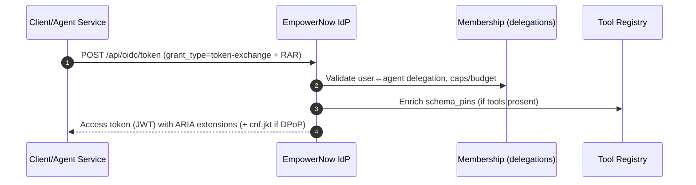
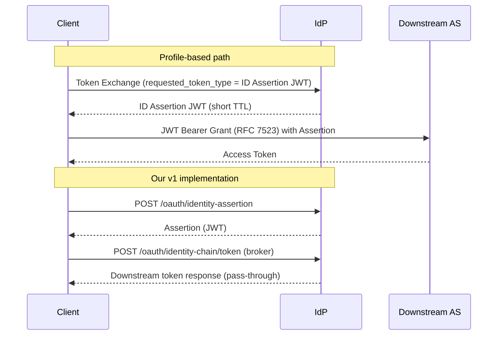
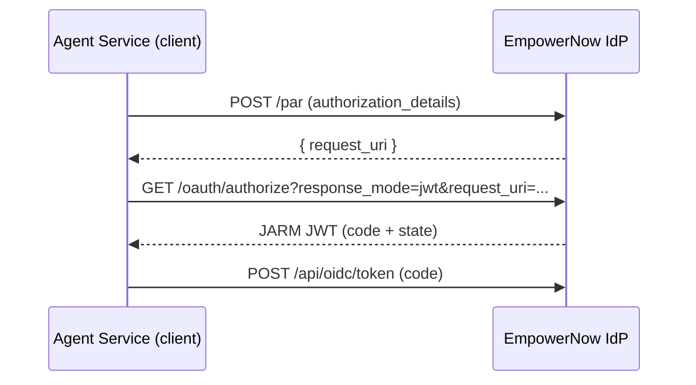
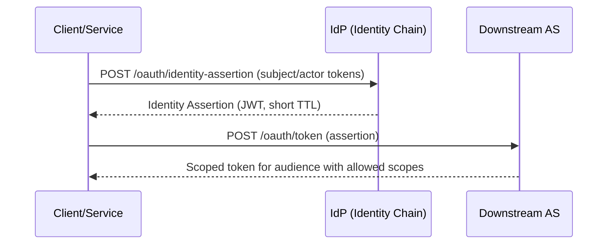

## IdP Reviewer's Guide – ARIA extensions for AI agents

Last updated: {{DATE}}

### Who this is for
Security reviewers and IdP engineers evaluating how the EmpowerNow IdP implements ARIA v1 for AI agents: token exchange (RFC 8693), RAR/PAR/JARM interop, DPoP binding, ARIA claims, pairwise subjects, schema pins, plan contracts, and identity chaining.

---

## 0) Executive overview (read me first)

ARIA (Agent Risk & Identity Authorization System) is an agent security and authorization platform that sits between AI agents and enterprise tools/APIs. It gives enterprises provable control over what agents can do, for whom, with which tools, under which limits—without changing existing identity or API standards.

What the IdP adds (fact‑checked in code), explained:

- RFC 8693 Token Exchange → ARIA JWTs
  - What it is: Standards‑based token exchange that returns a JWT carrying `aria_extensions` (budget, plan, schema pins, etc.). Implemented in `src/services/token_exchange_service.py`.
  - Why it matters: Lets agents act on behalf of users with enforceable context and without custom protocols. Centralizes policy in the IdP and keeps PEPs consistent.

- Discovery advertises ARIA and RAR
  - What it is: OIDC discovery includes ARIA helper endpoints and `authorization_details_types_supported`. See `src/api/oidc/endpoints/discovery.py`.
  - Why it matters: Clients auto‑discover capabilities and types; reduces misconfiguration and eases vendor interop.

- DPoP binding + replay defense
  - What it is: Accepts DPoP proofs, caches `jti` (TTL), and emits `cnf.jkt` in tokens when bound. See `token_exchange_service.py`, settings, and `test_dpop_verification.py`.
  - Why it matters: Prevents token theft/replay and aligns with FAPI guidance; raises assurance for agent flows.

- PAR + JARM (optional)
  - What it is: Pushed Authorization Requests and JWT‑secured authorization responses are advertised/used when enabled. Discovery wiring in `discovery.py`.
  - Why it matters: More secure front‑channel, fewer leaks, and smoother consent UX for interactive delegation.

- Pairwise subject/actor
  - What it is: Feature flag `feature_flags.aria_pairwise_sub` issues per‑audience pairwise `sub` and `act.sub`.
  - Why it matters: Minimizes cross‑RP correlation; improves privacy without changing relying apps.

- Schema pins + Plan JWS
  - What it is: Aggregates tool schema pins from the Tool Registry and can attach a signed plan contract JWS. See `token_exchange_service.py` and `plan_contract_service.py`.
  - Why it matters: Prevents “shape drift” and enforces step discipline; enables deterministic receipts and audits.

- Identity chaining (Cross‑App Access)
  - What it is: `/oauth/identity-assertion` mints a short‑TTL assertion; `/oauth/identity-chain/token` brokers a downstream exchange. PDP enforces `identity_chain.allowed_audiences/scopes`. See `src/api/oidc/endpoints/identity_chain.py`, `src/services/identity_assertion_service.py`.
  - Why it matters: Enables non‑interactive app→app/AI→app access governed by enterprise policy, with the IdP in the middle.

- ARIA docs endpoints
  - What it is: `GET /aria-metadata` and `GET /aria-claims` return live capability and claims docs. See `src/api/oidc/endpoints/aria.py`.
  - Why it matters: Self‑describing IdP; reviewers and clients can verify capabilities and claims shapes at runtime.

Market context – Cross‑App Access (identity chaining):

- Recent industry momentum (identity vendors and specs authors) centers on “Identity and Authorization Chaining Across Domains” and the “Identity Assertion Authorization Grant” profile (built on RFC 8693 + RFC 7523). Our IdP implements the same security value in v1 via dedicated endpoints for minting Identity Assertions and brokering downstream exchanges, while remaining compatible with AuthZEN + ARIA v1 across the stack.

---

## 1) Why the IdP matters for AI

- Tokens are the root of trust for agents; IdP must carry enforceable context (budget, plan, schema pins, pairwise binding, DPoP confirmation).
- Delegation needs guardrails: who may delegate to which agent, for which tools, under what spend/steps.
- Interop must remain standard: RFC 8693 Token Exchange, RAR/PAR/JARM, DPoP (RFC 9449).

---

## 2) Capabilities (what you can test)

- Token Exchange (RFC 8693) with ARIA extensions under the standard token endpoint (no new grant path required).
- Authorization Details (RAR, RFC 9396) with supported types: `aria_agent_delegation`, `urn:aria:params:oauth:authorization-details:ai:agent`, `urn:aria:params:oauth:authorization-details:delegation`.
- PAR + JARM (optional; discovery advertises when enabled).
- DPoP binding: verify proof; emit `cnf.jkt` and enforce replay TTL (feature flags).
- Pairwise subject/actor issuance (feature flag `aria_pairwise_sub`).
- Schema pins aggregation from Tool Registry; plan contract JWS (`PlanContractService`).
- Identity chaining APIs: Assertion mint and brokered exchange with PDP enforcement of `identity_chain` constraints.
- ARIA discovery helpers: `GET /aria-metadata`, `GET /aria-claims`.

---

## 3) Endpoints (IdP)

- Token endpoint: `POST /api/oidc/token` (supports `grant_type=urn:ietf:params:oauth:grant-type:token-exchange`)
- ARIA metadata: `GET /aria-metadata`
- ARIA claims: `GET /aria-claims`
- PAR (optional): `POST /par`
- Authorize + JARM (optional): `GET /oauth/authorize` (response_mode=jwt as configured)
- Identity chaining: `POST /oauth/identity-assertion`, `POST /oauth/identity-chain/token`

---

### 3.1 UserInfo (OIDC/OAuth compliance)

- Implements OIDC UserInfo at `/userinfo` with `GET`, `POST`, plus `HEAD/OPTIONS` for ergonomics.
- Accepts OAuth 2.0 Bearer access tokens (RFC 6750). Missing/invalid tokens return 401 with `WWW-Authenticate: Bearer`. Insufficient scope returns 403 with `WWW-Authenticate: Bearer error="insufficient_scope" ...`.
- Returns `sub` and only the claims permitted by granted scopes (e.g., `profile`, `email`).
- Audience enforcement is not required by OIDC for UserInfo; we skip `aud` checks unless a route explicitly supplies an audience to the validator.
- Optional strictness: if you want to enforce that the token includes the `openid` scope for UserInfo requests, add a scope dependency to the route (not enabled by default):

```python
from fastapi import Depends
from src.auth.dependencies import requires_scope_dependency

# Inside userinfo route signature
token_claims = Depends(requires_scope_dependency(["openid"]))
```

Implementation: `src/api/oidc/endpoints/userinfo.py` (uses `Depends(validate_token)` and builds claims based on scopes).


## 4) Visuals (Mermaid)

### 4.1 Token Exchange → ARIA Passport (back‑channel)



### 4.1.1 Cross‑App Access (profile) vs our v1 mapping



### 4.2 Interactive delegation (PAR + JARM)



### 4.3 Identity chaining



---

## 5) Quickstart

### 5.1 cURL – Token Exchange (RAR inline)

```bash
curl -s -X POST "$IDP_BASE/api/oidc/token" \
  -H "content-type: application/x-www-form-urlencoded" \
  -d "grant_type=urn:ietf:params:oauth:grant-type:token-exchange" \
  -d "subject_token=$USER_AT" \
  -d "actor_token=$SERVICE_AT" \
  -d "authorization_details=$(jq -c '. ' << 'JSON'
[{"type":"aria_agent_delegation","tools":["mcp:flights:search"],"schema_pins":{}}]
JSON
)"
```

Expected: JWT `access_token` with `aria_extensions` and optionally `cnf.jkt` if DPoP was used.

### 5.2 PowerShell – Identity Assertion

```powershell
$body = @{ subject_token = $userAT; actor_token = $svcAT; audience = "https://graph.microsoft.com"; scope = "User.Read" } | ConvertTo-Json -Depth 5
Invoke-RestMethod -Uri "$IDP_BASE/oauth/identity-assertion" -Method Post -ContentType "application/json" -Body $body
```

Profile equivalence note: The assertion returned by `/oauth/identity-assertion` is the same artifact you would use as a JWT Authorization Grant (RFC 7523) to a downstream AS. Our broker endpoint `/oauth/identity-chain/token` wraps that exchange to simplify client work and centralize PDP enforcement.

### 5.3 Discovery helpers

```bash
curl -s "$IDP_BASE/.well-known/openid-configuration" | jq '.aria_metadata_endpoint, .authorization_details_types_supported'
curl -s "$IDP_BASE/aria-metadata" | jq '.'
curl -s "$IDP_BASE/aria-claims" | jq '.'
```

---

## 6) ARIA claims (IdP JWT shape)

Key places:
- `aria_extensions` object: `call_id`, `schema_pins`, `plan_jws` (or `plan_contract_jws`), `budget`, `max_steps`, `user_bound_instance`, optional `pairwise_subject` (see `token_exchange_service.py`, `plan_contract_service.py`).
- DPoP confirmation: `cnf.jkt` when DPoP present (see `token_exchange_service.py`, `settings.feature_flags.feature_dpop_jti_cache`).
- Actor claim: `act.sub` set for delegation (RFC 8693).

Doc endpoint: `GET /aria-claims` returns a machine‑readable description of ARIA claim fields.

---

## 7) Identity chaining

- Mint: `POST /oauth/identity-assertion` → short‑TTL JWT (default ≤ 300s via `settings.identity_chain.assertion_ttl`).
- Broker: `POST /oauth/identity-chain/token` → exchanges assertion at a downstream AS; supports multiple client auth methods.
- Enforcement: both endpoints consult PDP and enforce `constraints.identity_chain.allowed_audiences` and `allowed_scopes` (see `src/api/oidc/endpoints/identity_chain.py`).
- Rate limiting: enforced via `RateLimiterService` (429 on exceed).

---

## 8) DPoP and token binding

- DPoP verification supported; replay protection via JTI cache (TTL configurable). See settings in `src/config/settings.py` and metrics in `src/metrics/prometheus.py`.
- On successful binding, tokens include `cnf.jkt` (per RFC 9449). Emission handled in `token_exchange_service.py`.

---

## 9) RAR, PAR, JARM

- Supported RAR types are advertised in discovery; mapping from RAR → capabilities occurs in `TokenExchangeService._capabilities_from_rar`.
- Optional PAR and JARM are exposed in discovery when enabled (`discovery.py`).

---

## 10) Output anatomy (Token Exchange)

Trimmed example response:

```json
{
  "access_token": "<JWT>",
  "token_type": "DPoP",
  "expires_in": 3600
}
```

JWT payload (selected fields):

```json
{
  "act": {"sub": "agent:svc-123:for:pairwise"},
  "aria_extensions": {
    "call_id": "...",
    "schema_pins": {"mcp:flights:search": {"schema_version": "1.2.0", "schema_hash": "sha256:..."}},
    "plan_jws": "...",
    "budget": {"initial": 100.0, "currency": "USD"},
    "max_steps": 20
  },
  "cnf": {"jkt": "..."}
}
```

---

## 11) Troubleshooting and tips

- Missing ARIA fields: verify RAR provided (or PAR used) and Tool Registry reachable.
- `cnf.jkt` absent: ensure DPoP proof is sent and binding flags are enabled.
- Identity chaining denies: check PDP policy for `identity_chain.allowed_audiences/scopes`.
- Discovery lacks ARIA metadata: verify discovery wiring and feature flags.

---

## 12) Operations

- Feature flags (YAML/env): `feature_flags.aria_pairwise_sub`, `feature_flags.feature_dpop_jti_cache`, `feature_flags.dpop_jti_ttl_seconds`, `identity_chain.enabled`, `identity_chain.assertion_ttl`, `idp.par_enabled`.
- Tool Registry URL (`settings.tool_registry_url`), Plan signing settings (`settings.plan.*`).
- Metrics: see `src/metrics/prometheus.py` for DPoP replay, identity chain, and RAR batch counters.

---

## 13) Code mapping (for implementers)

| Feature | File(s) | Notes |
|---|---|---|
| Discovery + ARIA metadata in OIDC config | `src/api/oidc/endpoints/discovery.py` | Adds ARIA endpoints, RAR types, DPoP algs, PAR/JARM when enabled |
| ARIA docs endpoints | `src/api/oidc/endpoints/aria.py` | `/aria-metadata`, `/aria-claims` |
| Token Exchange (JWT with ARIA) | `src/services/token_exchange_service.py` | Maps RAR→capabilities, aggregates schema pins, emits ARIA extensions, `cnf.jkt` |
| Plan contract JWS | `src/services/plan_contract_service.py` | Signs plan contracts (referenced by token exchange) |
| Tool Registry client | `src/services/tool_registry_client.py` | Fetches pins for tools referenced in RAR |
| DPoP binding | `src/services/token_binding_service.py`, settings | Extracts JWK thumbprint; replay TTL flags |
| Identity chaining endpoints | `src/api/oidc/endpoints/identity_chain.py` | PDP enforcement + rate limiting |
| Identity Assertion service | `src/services/identity_assertion_service.py` | Mints assertion JWTs |

---

## 14) Tests to try

1) Token Exchange with RAR inline → JWT contains `aria_extensions` and (if DPoP) `cnf.jkt`.
2) Identity Assertion mint and broker: audience/scope outside policy should deny.
3) Discovery: `authorization_details_types_supported` includes ARIA types.
4) DPoP replay: reuse same `jti` should be rejected (see `test_dpop_verification.py`).

---

## 15) References

- ARIA design (IdP): `mcp_gateway/docs/________newdesign10_idp.md`
- ARIA design (overall): `mcp_gateway/docs/________newdesign10.md`
- PDP Reviewer's Guide: `ServiceConfigs/pdp/docs/reviewers_guide_ai_authorization.md`


