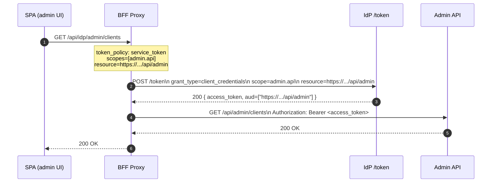
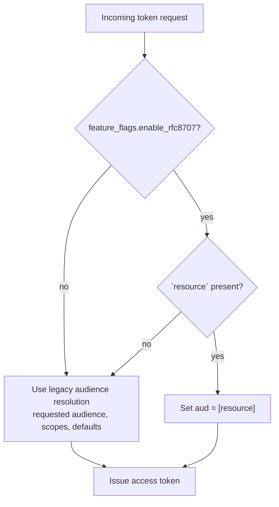
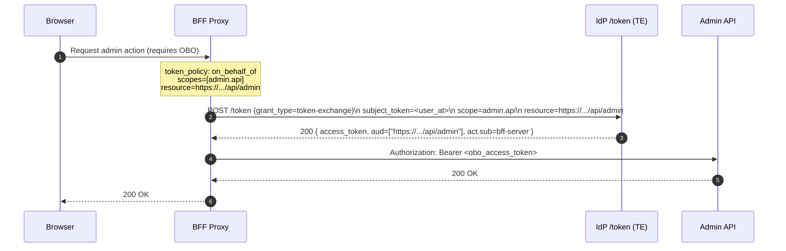

## RFC 8707 Resource Indicators: Support in IdP and BFF

### What we changed

- Added feature‑flagged support for RFC 8707 “Resource Indicators” at the IdP token endpoint and in token issuance logic.
- Taught the BFF IdP client to send `resource` for client_credentials mints (preferred over `audience`) so tokens carry the intended audience for the target resource server (e.g., Admin API).

### Why

- Fix audience mismatches on machine‑to‑machine flows (e.g., Admin API): previously tokens could be minted with a default audience (e.g., `empowernow`) even when a route required `…/api/admin`.
- Make audience assignment explicit and predictable per resource server, aligning with best practices.

### Behavior (IdP)

- Feature flag: `feature_flags.enable_rfc8707: bool` (default false)
- Token endpoint (`/api/oidc/token`):
  - When the flag is enabled and a `resource` parameter is present, it is passed through to handlers and treated as the authoritative audience indicator.
  - If both `resource` and `audience` are provided, `resource` takes precedence.
- Token broker service:
  - When the flag is enabled and `request.resource` is present, issuance sets `aud` to `[resource]`.
  - Otherwise, existing audience resolution logic applies (requested `audience`, scope mapping, defaults).
- Admin auth gate:
  - Requires `settings.token.admin_audience` to be configured explicitly. No implicit fallback.

### Behavior (BFF)

- The IdP client method for client_credentials mints now accepts `resource` and `audience`.
- By default, the BFF prefers sending `resource` for CC grants (env‑gated), which the IdP maps to the final `aud` in the access token when the IdP flag is enabled.

### Configuration

IdP (environment variables)
- Enable RFC 8707 handling:
  - `FEATURE_FLAGS__ENABLE_RFC8707=true`
- Set canonical admin audience enforced by admin API:
  - `TOKEN__ADMIN_AUDIENCE=https://idp.ocg.labs.empowernow.ai/api/admin`

BFF (environment variables)
- Prefer RFC 8707 resource for CC:
  - `BFF_CC_USE_RESOURCE=true` (default behavior in client code)

### Rollout plan

1) Decide canonical audience strings per resource server (e.g., `https://idp…/api/admin`).
2) Configure IdP: set `FEATURE_FLAGS__ENABLE_RFC8707=true` and the corresponding `TOKEN__*_AUDIENCE` values (e.g., admin audience).
3) Ensure BFF sends `resource` for CC mints (default) and that route token policies reference the same canonical audience.
4) Validate end‑to‑end: access tokens for admin requests should show `aud` containing the canonical admin audience; 401s due to audience mismatch should disappear.

### Compatibility

- If the flag is off or `resource` is omitted, behavior remains unchanged (existing audience resolution, including defaults, still applies).
- OBO/TE flows can also supply `resource`; the same precedence rules apply when present.

### Troubleshooting

- Admin call returns 401 and token debug shows `aud=["empowernow"]`:
  - Ensure IdP flag is on and `resource` is being sent by BFF.
  - Confirm `TOKEN__ADMIN_AUDIENCE` matches the Admin API’s expected audience and that your route policy uses the same value.
- DPoP related 401s:
  - Not caused by RFC 8707. Check whether tokens are sender‑constrained (`cnf.jkt`) and whether a `DPoP` proof is attached to resource calls.

### Files changed (implementation)

- `src/config/settings.py`: added `feature_flags.enable_rfc8707`.
- `src/api/oidc/endpoints/token.py`: pass `resource` through when the flag is enabled; prefer over `audience`.
- `src/services/token_broker_service.py`: when enabled and `request.resource` is set, issue tokens with `aud=[resource]`.
- BFF `ms_bff_spike/ms_bff/src/services/idp_client.py`: CC mint supports `resource` (preferred) and `audience`.

### Example

Client credentials request (BFF → IdP):

```
grant_type=client_credentials
scope=admin.api
resource=https://idp.ocg.labs.empowernow.ai/api/admin
```

Resulting access token claim excerpt:

```
{
  "aud": ["https://idp.ocg.labs.empowernow.ai/api/admin"],
  "scope": "admin.api",
  "iss": "https://idp.ocg.labs.empowernow.ai/api/oidc"
}
```

### Diagrams

Client Credentials with RFC 8707 resource (happy path)



Audience resolution (IdP) with feature flag



OBO (Token Exchange) with resource (optional)




