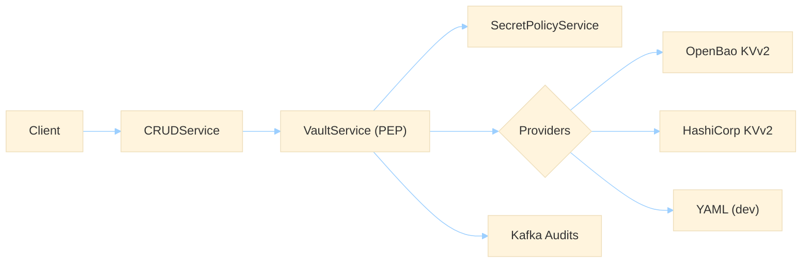

import Link from '@docusaurus/Link';

# Solutions

Explore how EmpowerNow solves identity, policy, CRUD/workflow, analytics, and observability.

- Identity & IdP: <Link to="/docs/services/idp/">IdP</Link>
- Authorization & PDP: <Link to="/docs/services/pdp/backend">PDP</Link>
- BFF for SPAs: <Link to="/docs/services/bff/explanation/executive-overview">BFF</Link>
- Hybrid connectivity: <Link to="/docs/services/nowconnect/explanation/ha-v2-architecture">NowConnect HA</Link>
- CRUD Service: <Link to="/docs/services/crud-service/">CRUD</Link>

  <Link className="button button--primary" to="/docs/intro">Read the docs</Link>

## Secrets Platform

Short‑lived, sender‑bound grants ("use, not read"), strict canonical URIs, OpenBao/Vault parity, and non‑leaky audits.

  

    
Central PEP in <code>VaultService</code> authorizes with PDP, fetches from configured providers, and returns redacted secret slots to callers.

    

      <Link className="button button--secondary" to="/docs/services/crud-service/explanation/secrets-executive-overview">Secrets Executive Overview</Link>
      
      <Link className="button button--outline" to="/docs/services/crud-service/how-to/secrets-api-openbao">OpenBao/Vault Integration</Link>
      
      <Link className="button button--outline" to="/docs/services/crud-service/how-to/secrets-canonical-uris">Canonical URIs</Link>
    

  

  

  

